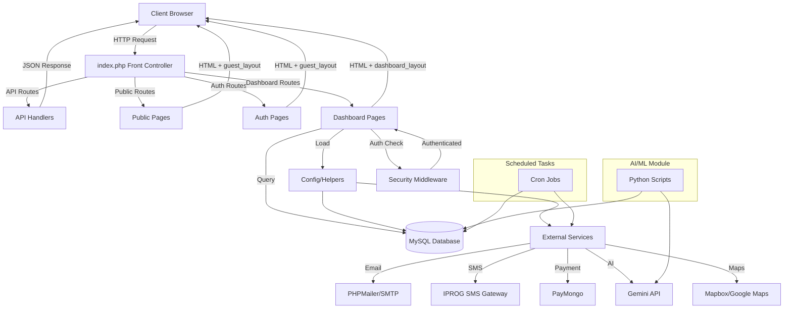
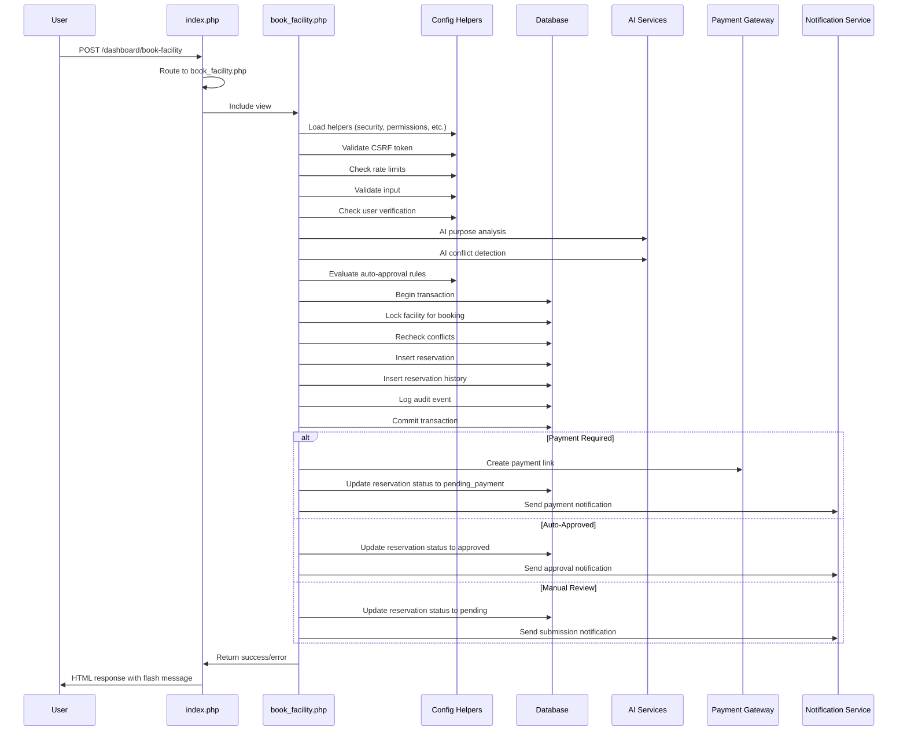
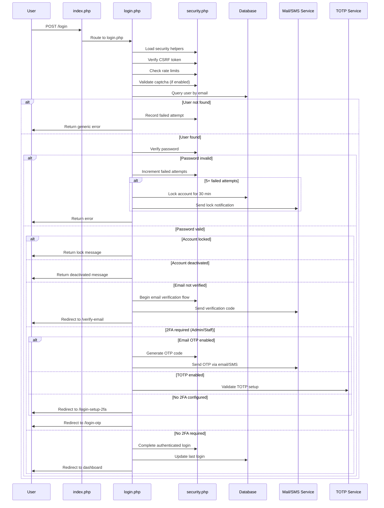
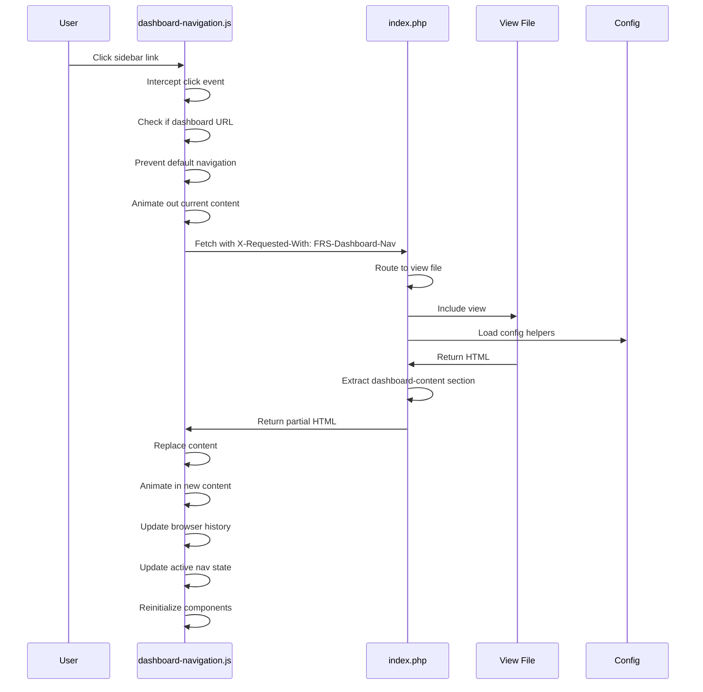
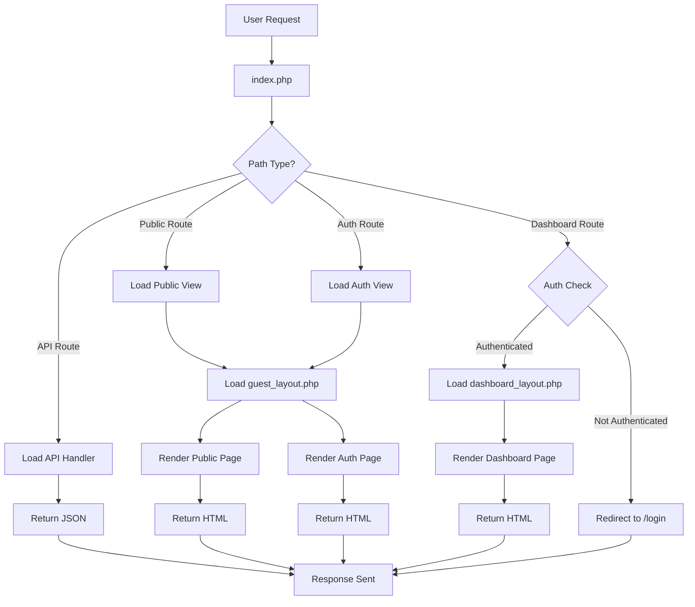
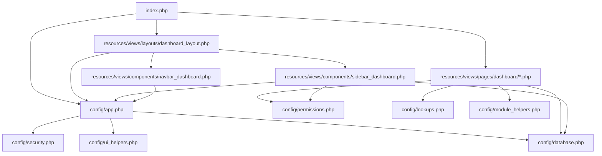
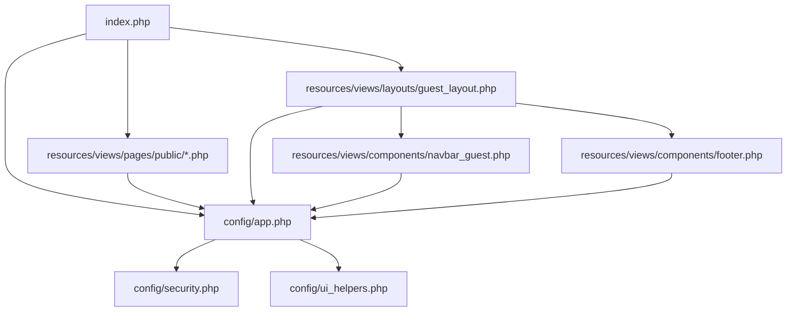
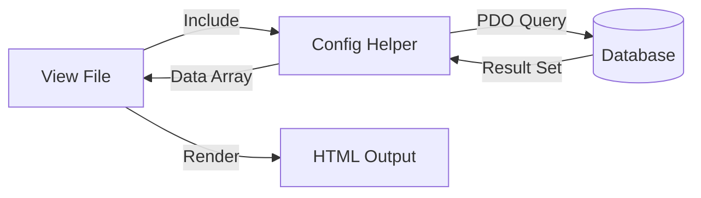
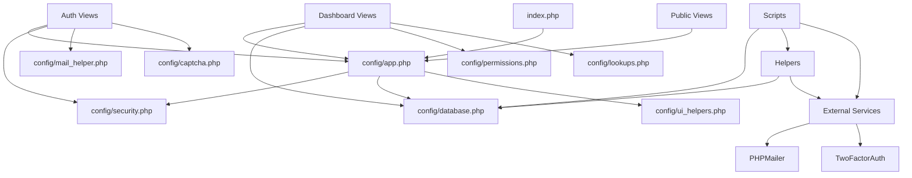
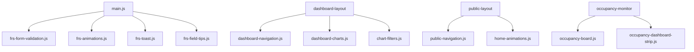

# Architecture Documentation

## High-Level Architecture

## Folder Responsibilities

### Root Directory
- **index.php**: Front controller, routes all requests
- **.htaccess**: Apache configuration, URL rewriting
- **composer.json**: PHP dependencies
- **package.json**: Node.js dependencies (TailwindCSS)
- **run_migrations.php**: Database migration runner
- **.env**: Environment configuration (gitignored)

### config/
**Purpose**: Application configuration and business logic helpers

**Key Files**:
- `app.php`: Core helpers (URL, paths, environment loading)
- `database.php`: Database connection (PDO singleton)
- `security.php`: Security headers, CSRF, rate limiting, session management
- `permissions.php`: RBAC system implementation
- `lookups.php**: Configurable lookup values (facility status, etc.)
- `*_helper.php`: Module-specific business logic
- `*.php`: Module configuration (mail, sms, payments, etc.)

**Responsibilities**:
- Centralized business logic
- Database abstraction layer
- Security enforcement
- Permission checking
- External service integration

### database/
**Purpose**: Database schema and migrations

**Key Files**:
- `schema.sql`: Base database schema
- `migration_*.sql`: Incremental schema changes
- `performance_indexes.sql`: Performance optimization indexes

**Responsibilities**:
- Schema versioning
- Incremental updates
- Performance tuning

### resources/views/
**Purpose**: All view templates

**Subdirectories**:
- `layouts/`: Page layout templates (dashboard_layout.php, guest_layout.php)
- `components/`: Reusable UI components (sidebar, navbar, footer)
- `pages/`: Page-specific views
  - `auth/`: Authentication pages
  - `dashboard/`: Dashboard pages
  - `public/`: Public pages
  - `dashboard/includes/`: Dashboard sub-views

**Responsibilities**:
- HTML rendering
- UI composition
- Reusable component library

### public/
**Purpose**: Publicly accessible assets

**Subdirectories**:
- `css/`: Stylesheets
- `js/`: JavaScript files
- `img/`: Images
- `uploads/`: User-uploaded files

**Responsibilities**:
- Static asset serving
- User file storage
- Client-side code

### scripts/
**Purpose**: Scheduled tasks and maintenance scripts

**Key Files**:
- `auto_decline_expired.php`: Decline stale reservations
- `send_booking_reminders.php`: Send booking reminders
- `process_expired_reservations.php`: Clean up expired reservations
- `archive_documents.php`: Archive old documents
- `sync_cimm_maintenance.php`: Sync maintenance from CIMM

**Responsibilities**:
- Background job execution
- Data maintenance
- External system sync

### ai/
**Purpose**: AI/ML integration

**Subdirectories**:
- `api/`: AI API endpoints
- `scripts/`: Training and utility scripts
- `src/`: ML model source code

**Responsibilities**:
- ML model training
- AI feature implementation
- Python-PHP integration

### services/
**Purpose**: External service integrations

**Note**: This directory exists but external service integrations are primarily in config/

**Responsibilities**:
- Third-party API clients
- Service abstraction layer

### storage/
**Purpose**: Application storage

**Responsibilities**:
- Log files
- Cache storage
- Temporary files

### tests/
**Purpose**: Unit tests

**Responsibilities**:
- PHPUnit test cases
- Test fixtures

## Data Flow

### Booking Creation Flow

### Authentication Flow

### Dashboard AJAX Navigation Flow

## Page Navigation Flow

## PHP Include Hierarchy

### Dashboard Page Include Chain

### Public Page Include Chain

## Shared Components

### Layout Components

**dashboard_layout.php**
- Sidebar navigation (role-based)
- Top navbar with user info
- Dashboard content area
- AI chatbot widget
- Session timeout modal
- Confirmation modal
- Toast notification stack
- Global JavaScript variables

**guest_layout.php**
- Public navigation
- Footer
- Content area
- No authentication required

### UI Components

**sidebar_dashboard.php**
- Role-based menu rendering
- Collapsible sections
- Active state highlighting
- User profile display
- Permission-aware links

**navbar_dashboard.php**
- User information
- Notification bell
- Logout button
- Mobile menu toggle

**footer.php**
- Copyright information
- Quick links
- Contact information

**occupancy_board.php**
- Real-time occupancy display
- Facility status indicators
- Live updates via AJAX

**occupancy_dashboard_strip.php**
- Compact occupancy display
- Quick status overview

## AJAX Endpoints

### Dashboard AJAX Endpoints

**POST /dashboard/ai-chatbot**
- Purpose: AI chatbot interaction
- Authentication: Required
- Returns: JSON with reply and optional actions
- File: `resources/views/pages/dashboard/ai_chatbot.php`

**POST /dashboard/session-keepalive**
- Purpose: Keep session alive
- Authentication: Required
- Returns: JSON with success and remaining seconds
- File: `resources/views/pages/dashboard/session_keepalive.php`

**POST /dashboard/ai-recommendations-api**
- Purpose: Get AI facility recommendations
- Authentication: Required
- Returns: JSON with recommended facilities
- File: `resources/views/pages/dashboard/ai_recommendations_api.php`

**POST /dashboard/ai-conflict-check**
- Purpose: Check booking conflicts using AI
- Authentication: Required
- Returns: JSON with conflict analysis
- File: `resources/views/pages/dashboard/ai_conflict_check.php`

**POST /dashboard/notifications-api**
- Purpose: Get user notifications
- Authentication: Required
- Returns: JSON with notifications
- File: `resources/views/pages/dashboard/notifications_api.php`

**POST /dashboard/occupancy-live**
- Purpose: Get live occupancy data
- Authentication: Required
- Returns: JSON with occupancy stats
- File: `resources/views/pages/dashboard/occupancy_live_api.php`

**POST /dashboard/geocode-api**
- Purpose: Geocode address to coordinates
- Authentication: Required
- Returns: JSON with coordinates
- File: `resources/views/pages/dashboard/geocode_api.php`

### Public AJAX Endpoints

**GET /api/public/availability**
- Purpose: Get facility availability for public calendar
- Authentication: Not required
- Returns: JSON with available slots
- File: `resources/views/pages/public/api/availability.php`

**POST /paymongo-webhook**
- Purpose: PayMongo payment webhook
- Authentication: Not required (signature verification)
- Returns: JSON acknowledgment
- File: `resources/views/pages/public/api/paymongo_webhook.php`

**POST /contact-handler**
- Purpose: Handle contact form submissions
- Authentication: Not required
- Returns: JSON with success/error
- File: `resources/views/pages/public/contact_handler.php`

## Controller/Model Relationships

### Traditional MVC vs FRS Architecture

The FRS system does not follow traditional MVC pattern. Instead, it uses:

**Controllers**: View files (`resources/views/pages/*.php`) handle both presentation and logic
**Models**: Config helpers (`config/*.php`) contain business logic and data access
**Views**: Same as controllers (monolithic view files)

### Data Access Pattern

### Key Helper-View Relationships

**Reservation Operations**
- View: `resources/views/pages/dashboard/book_facility.php`
- Helpers: `config/reservation_helpers.php`, `config/auto_approval.php`, `config/ai_helpers.php`
- Tables: `reservations`, `reservation_history`, `facilities`, `users`

**User Management**
- View: `resources/views/pages/dashboard/user_management.php`
- Helpers: `config/user_admin.php`, `config/security.php`
- Tables: `users`, `user_documents`, `role_permissions`

**Facility Management**
- View: `resources/views/pages/dashboard/facility_management.php`
- Helpers: `config/upload_helper.php`, `config/lookups.php`
- Tables: `facilities`, `facility_blackout_dates`

**Reports**
- View: `resources/views/pages/dashboard/reports.php`
- Helpers: `config/analytics_chart_filters.php`, `config/ai_ml_integration.php`
- Tables: `reservations`, `facilities`, `users`, `audit_log`

## Dependency Graph

### PHP File Dependencies

### JavaScript File Dependencies

## Reusable Components

### PHP Helpers

**Security Functions** (`config/security.php`)
- `generateCSRFToken()`: Generate CSRF token
- `verifyCSRFToken()`: Verify CSRF token
- `csrf_token()`: Get CSRF token for forms
- `csrf_field()`: Output CSRF hidden input
- `checkRateLimit()`: Check and record rate limit
- `validatePassword()`: Validate password strength
- `secureSession()`: Configure secure session
- `getClientIP()`: Get client IP address
- `sanitizeInput()`: Sanitize user input

**Database Functions** (`config/database.php`)
- `db()`: Get PDO instance (singleton)
- Connection configuration from environment variables

**Permission Functions** (`config/permissions.php`)
- `frs_has_permission()`: Check role permission
- `frs_can_create()`: Check create permission
- `frs_can_read()`: Check read permission
- `frs_can_update()`: Check update permission
- `frs_can_delete()`: Check delete permission
- `frs_get_role_permissions()`: Get all permissions for role

**Lookup Functions** (`config/lookups.php`)
- `frs_lookup_values()`: Get lookup values for category
- `frs_lookup_label()`: Get label for a value
- `frs_lookup_metadata()`: Get metadata for a value
- `frs_lookup_add_value()`: Add new lookup value
- `frs_lookup_update_value()`: Update lookup value
- `frs_lookup_delete_value()`: Delete lookup value

**URL/Path Functions** (`config/app.php`)
- `base_path()`: Get base path relative to web root
- `base_url()`: Get full base URL
- `app_root_path()`: Get absolute filesystem path
- `env_value()`: Get environment variable

**Notification Functions** (`config/notifications.php`)
- `createNotification()`: Create database notification
- `markNotificationAsRead()`: Mark notification as read
- `getUserNotifications()`: Get user notifications

**Email Functions** (`config/mail_helper.php`)
- `sendEmail()`: Send email via PHPMailer
- `sendBookingConfirmation()`: Send booking confirmation email
- `sendBookingReminder()`: Send booking reminder email

**SMS Functions** (`config/sms_helper.php`)
- `sendSms()`: Send SMS via configured provider
- `sendBookingConfirmationSms()`: Send booking confirmation SMS
- `sendLoginOtpSms()`: Send login OTP SMS

### JavaScript Modules

**Form Validation** (`frs-form-validation.js`)
- `frsFocusFirstInvalid()`: Focus first invalid field
- `frsFocusBySelector()`: Focus field by selector
- `frsFocusByFieldKey()`: Focus field by key

**Animations** (`frs-animations.js`)
- `frsAnim.pageOut()`: Page exit animation
- `frsAnim.pageIn()`: Page enter animation
- `frsAnim.staggerCards()`: Stagger card animations

**Toast Notifications** (`frs-toast.js`)
- `frsShowToast()`: Show toast notification
- `frsHideToast()`: Hide toast notification

**Dashboard Navigation** (`dashboard-navigation.js`)
- SPA-like navigation for dashboard
- Progress indicator
- History management
- Active state highlighting

**Field Tips** (`frs-field-tips.js`)
- Contextual field help
- Tooltips
- Field descriptions

### CSS Components

**Layout Classes**
- `.dashboard`: Dashboard page wrapper
- `.dashboard-content`: Main content area
- `.sidebar`: Sidebar navigation
- `.dashboard-main`: Main area (content + navbar)

**Utility Classes**
- `.frs-field-error-highlight`: Error highlight animation
- `.dashboard-fade-in`: Fade in animation
- `.dashboard-fade-out`: Fade out animation

**Component Classes**
- `.frs-toast-stack`: Toast notification container
- `.modal-confirm`: Confirmation modal
- `.chatbot-panel`: AI chatbot panel
- `.session-timeout-overlay`: Session timeout modal
