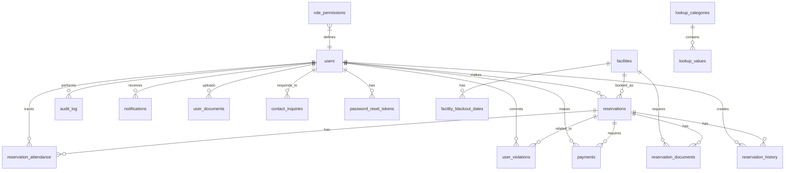

# Database Documentation

## Database Overview

**Database Name**: `facilities_reservation`  
**Character Set**: `utf8mb4`  
**Collation**: `utf8mb4_unicode_ci`  
**Engine**: InnoDB (transactional, foreign key support)

## Entity Relationship Diagram

## Table Documentation

**Note**: The table documentation below reflects the CURRENT database schema after all migrations have been applied. The base schema in `schema.sql` contains only the core tables and columns. Additional columns and tables were added via migration files in the `database/` directory.

### users

**Purpose**: Store user accounts and authentication data

**Primary Key**: `id` (INT UNSIGNED AUTO_INCREMENT)

**Columns**:
| Column | Type | Nullable | Default | Description |
|--------|------|----------|---------|-------------|
| id | INT UNSIGNED | NO | AUTO_INCREMENT | Primary key |
| name | VARCHAR(150) | NO | | User full name |
| email | VARCHAR(190) | NO | | User email (unique) |
| password_hash | VARCHAR(255) | NO | | Bcrypt password hash |
| role | ENUM('Admin','Staff','Resident') | NO | 'Resident' | User role |
| status | ENUM('pending','active','locked') | NO | 'pending' | Account status (base schema - 'deactivated' added via migration if needed) |
| mobile | VARCHAR(20) | YES | NULL | Mobile number (added via migration_add_user_documents.sql) |
| is_verified | BOOLEAN | YES | NULL | Email verification status |
| verified_by | INT UNSIGNED | YES | NULL | Admin who verified user |
| profile_picture | VARCHAR(255) | YES | NULL | Profile picture path |
| enable_otp | BOOLEAN | YES | 1 | Email OTP enabled |
| totp_enabled | BOOLEAN | YES | 0 | TOTP (Google Authenticator) enabled |
| totp_secret | VARCHAR(255) | YES | NULL | TOTP secret key |
| failed_login_attempts | INT UNSIGNED | YES | 0 | Failed login attempt count |
| locked_until | DATETIME | YES | NULL | Account lock expiration |
| last_login_ip | VARCHAR(45) | YES | NULL | Last login IP address |
| email_verification_code_hash | VARCHAR(255) | YES | NULL | Email verification code hash |
| email_verification_expires_at | DATETIME | YES | NULL | Email verification expiry |
| email_verified | BOOLEAN | YES | NULL | Email verified flag |
| otp_code_hash | VARCHAR(255) | YES | NULL | Login OTP code hash |
| otp_expires_at | DATETIME | YES | NULL | Login OTP expiry |
| otp_attempts | INT UNSIGNED | YES | 0 | Login OTP attempt count |
| otp_last_sent_at | DATETIME | YES | NULL | Last OTP sent timestamp |
| lock_reason | VARCHAR(255) | YES | NULL | Account lock reason |
| created_at | TIMESTAMP | NO | CURRENT_TIMESTAMP | Record creation time |
| updated_at | TIMESTAMP | NO | CURRENT_TIMESTAMP ON UPDATE | Record update time |

**Indexes**:
- PRIMARY KEY (`id`)
- UNIQUE KEY `email` (`email`)

**Foreign Keys**: None

**Relationships**:
- One-to-many with `reservations` (user_id)
- One-to-many with `reservation_history` (created_by)
- One-to-many with `audit_log` (user_id)
- One-to-many with `notifications` (user_id)
- One-to-many with `user_documents` (user_id)
- One-to-many with `user_violations` (user_id)
- One-to-many with `contact_inquiries` (responded_by)
- One-to-many with `password_reset_tokens` (user_id)
- One-to-many with `payments` (user_id)
- One-to-many with `reservation_attendance` (user_id)

**Accessed By**:
- `config/security.php` - Authentication, 2FA
- `config/user_admin.php` - User management
- `resources/views/pages/auth/*.php` - Login, register
- `resources/views/pages/dashboard/user_management.php` - User CRUD
- `resources/views/pages/dashboard/book_facility.php` - User lookup

---

### facilities

**Purpose**: Store facility information and booking rules

**Primary Key**: `id` (INT UNSIGNED AUTO_INCREMENT)

**Columns**:
| Column | Type | Nullable | Default | Description |
|--------|------|----------|---------|-------------|
| id | INT UNSIGNED | NO | AUTO_INCREMENT | Primary key |
| name | VARCHAR(150) | NO | | Facility name |
| description | TEXT | YES | NULL | Facility description |
| base_rate | VARCHAR(100) | YES | NULL | Base rate/rate info |
| image_path | VARCHAR(255) | YES | NULL | Facility image path |
| location | VARCHAR(190) | YES | NULL | Facility location |
| capacity | VARCHAR(100) | YES | NULL | Maximum capacity |
| amenities | TEXT | YES | NULL | Available amenities |
| rules | TEXT | YES | NULL | Facility rules |
| status | VARCHAR(64) | NO | 'available' | Operational status (base: ENUM; changed to VARCHAR via migration_add_system_lookups.sql for configurable values) |
| operating_hours | VARCHAR(50) | YES | NULL | Operating hours (HH:MM-HH:MM) (added via migration_add_operating_hours.sql) |
| auto_approve | BOOLEAN | NO | FALSE | Enable auto-approval |
| capacity_threshold | INT UNSIGNED | YES | NULL | Max attendees for auto-approval |
| max_duration_hours | DECIMAL(4,2) | YES | NULL | Max duration for auto-approval |
| is_free | BOOLEAN | NO | TRUE | Free facility (no payment) (added via migration_add_facility_free_flag.sql) |
| created_at | TIMESTAMP | NO | CURRENT_TIMESTAMP | Record creation time |
| updated_at | TIMESTAMP | NO | CURRENT_TIMESTAMP ON UPDATE | Record update time |

**Indexes**:
- PRIMARY KEY (`id`)

**Foreign Keys**: None

**Relationships**:
- One-to-many with `reservations` (facility_id)
- One-to-many with `facility_blackout_dates` (facility_id)
- One-to-many with `reservation_documents` (via reservations)

**Accessed By**:
- `resources/views/pages/dashboard/facility_management.php` - Facility CRUD
- `resources/views/pages/dashboard/book_facility.php` - Facility selection
- `resources/views/pages/public/facilities.php` - Public listing
- `config/reservation_helpers.php` - Availability checking
- `config/auto_approval.php` - Auto-approval rules

---

### reservations

**Purpose**: Store facility reservation requests

**Primary Key**: `id` (INT UNSIGNED AUTO_INCREMENT)

**Columns**:
| Column | Type | Nullable | Default | Description |
|--------|------|----------|---------|-------------|
| id | INT UNSIGNED | NO | AUTO_INCREMENT | Primary key |
| user_id | INT UNSIGNED | NO | | User who made reservation |
| facility_id | INT UNSIGNED | NO | | Facility being reserved |
| reservation_date | DATE | NO | | Reservation date |
| time_slot | VARCHAR(50) | NO | | Time slot (HH:MM - HH:MM) |
| purpose | TEXT | NO | | Purpose of reservation |
| status | ENUM('pending_payment','pending','approved','denied','cancelled','on_hold','postponed') | NO | 'pending_payment' | Reservation status (base: pending,approved,denied,cancelled; expanded via migration_add_payment_module.sql) |
| reschedule_count | INT UNSIGNED | NO | 0 | Number of reschedules |
| expected_attendees | INT UNSIGNED | YES | NULL | Expected number of attendees |
| is_commercial | BOOLEAN | NO | FALSE | Commercial use flag |
| auto_approved | BOOLEAN | NO | FALSE | Auto-approved by system |
| priority_level | INT UNSIGNED | YES | NULL | Priority level (1-5) |
| expires_at | DATETIME | YES | NULL | Reservation expiry |
| payment_due_at | DATETIME | YES | NULL | Payment due date/time |
| created_at | TIMESTAMP | NO | CURRENT_TIMESTAMP | Record creation time |
| updated_at | TIMESTAMP | NO | CURRENT_TIMESTAMP ON UPDATE | Record update time |

**Indexes**:
- PRIMARY KEY (`id`)
- KEY `idx_reservation_user` (`user_id`)
- KEY `idx_reservation_facility` (`facility_id`)
- KEY `idx_reservation_date` (`reservation_date`)
- KEY `idx_reservation_status` (`status`)

**Foreign Keys**:
- `fk_res_user` → `users(id)` ON DELETE CASCADE
- `fk_res_facility` → `facilities(id)` ON DELETE CASCADE

**Relationships**:
- Many-to-one with `users` (user_id)
- Many-to-one with `facilities` (facility_id)
- One-to-many with `reservation_history` (reservation_id)
- One-to-many with `reservation_documents` (reservation_id)
- One-to-many with `payments` (reservation_id)
- One-to-many with `reservation_attendance` (reservation_id)
- One-to-many with `user_violations` (reservation_id)

**Accessed By**:
- `resources/views/pages/dashboard/book_facility.php` - Create reservations
- `resources/views/pages/dashboard/reservations_manage.php` - Manage reservations
- `resources/views/pages/dashboard/my_reservations.php` - View own reservations
- `config/reservation_helpers.php` - Reservation logic
- `config/auto_approval.php` - Auto-approval logic
- `config/ai_helpers.php` - AI conflict detection

---

### reservation_history

**Purpose**: Track status changes for reservations

**Primary Key**: `id` (INT UNSIGNED AUTO_INCREMENT)

**Columns**:
| Column | Type | Nullable | Default | Description |
|--------|------|----------|---------|-------------|
| id | INT UNSIGNED | NO | AUTO_INCREMENT | Primary key |
| reservation_id | INT UNSIGNED | NO | | Related reservation |
| status | ENUM('pending_payment','pending','approved','denied','cancelled','on_hold','postponed') | NO | | Status value (base: pending,approved,denied,cancelled; expanded via migration_add_payment_module.sql) |
| note | VARCHAR(255) | YES | NULL | Change note/reason |
| created_at | TIMESTAMP | NO | CURRENT_TIMESTAMP | Record creation time |
| created_by | INT UNSIGNED | YES | NULL | User who made change |

**Indexes**:
- PRIMARY KEY (`id`)
- KEY `idx_hist_reservation` (`reservation_id`)
- KEY `idx_hist_created` (`created_at`)

**Foreign Keys**:
- `fk_hist_reservation` → `reservations(id)` ON DELETE CASCADE
- `fk_hist_user` → `users(id)` ON DELETE SET NULL

**Relationships**:
- Many-to-one with `reservations` (reservation_id)
- Many-to-one with `users` (created_by)

**Accessed By**:
- `resources/views/pages/dashboard/book_facility.php` - Log booking creation
- `resources/views/pages/dashboard/reservations_manage.php` - Log status changes
- `config/reservation_helpers.php` - History logging

---

### audit_log

**Purpose**: Track system-wide actions for security and compliance

**Primary Key**: `id` (INT UNSIGNED AUTO_INCREMENT)

**Columns**:
| Column | Type | Nullable | Default | Description |
|--------|------|----------|---------|-------------|
| id | INT UNSIGNED | NO | AUTO_INCREMENT | Primary key |
| user_id | INT UNSIGNED | YES | NULL | User who performed action |
| action | VARCHAR(100) | NO | | Action performed |
| module | VARCHAR(50) | NO | | Module affected |
| details | TEXT | YES | NULL | Action details |
| ip_address | VARCHAR(45) | YES | NULL | User IP address |
| user_agent | VARCHAR(255) | YES | NULL | Browser user agent |
| created_at | TIMESTAMP | NO | CURRENT_TIMESTAMP | Record creation time |

**Indexes**:
- PRIMARY KEY (`id`)
- KEY `idx_audit_module` (`module`)
- KEY `idx_audit_created` (`created_at`)
- KEY `idx_audit_user` (`user_id`)

**Foreign Keys**:
- `fk_audit_user` → `users(id)` ON DELETE SET NULL

**Relationships**:
- Many-to-one with `users` (user_id)

**Accessed By**:
- `config/audit.php` - Audit logging function
- `config/security.php` - Security event logging
- `resources/views/pages/dashboard/audit_trail.php` - View audit log

---

### notifications

**Purpose**: Store in-app notifications for users

**Primary Key**: `id` (INT UNSIGNED AUTO_INCREMENT)

**Columns**:
| Column | Type | Nullable | Default | Description |
|--------|------|----------|---------|-------------|
| id | INT UNSIGNED | NO | AUTO_INCREMENT | Primary key |
| user_id | INT UNSIGNED | YES | NULL | Recipient user (NULL = system-wide) |
| type | ENUM('booking','system','reminder') | NO | 'system' | Notification type |
| title | VARCHAR(150) | NO | | Notification title |
| message | TEXT | NO | | Notification message |
| link | VARCHAR(255) | YES | NULL | Related link |
| is_read | BOOLEAN | NO | FALSE | Read status |
| created_at | TIMESTAMP | NO | CURRENT_TIMESTAMP | Record creation time |

**Indexes**:
- PRIMARY KEY (`id`)
- KEY `idx_notif_user` (`user_id`)
- KEY `idx_notif_read` (`is_read`)
- KEY `idx_notif_created` (`created_at`)

**Foreign Keys**:
- `fk_notif_user` → `users(id)` ON DELETE CASCADE

**Relationships**:
- Many-to-one with `users` (user_id)

**Accessed By**:
- `config/notifications.php` - Notification functions
- `resources/views/pages/dashboard/notifications.php` - View notifications
- `resources/views/pages/dashboard/book_facility.php` - Create booking notifications

---

### facility_blackout_dates

**Purpose**: Block facility availability for specific dates

**Primary Key**: `id` (INT UNSIGNED AUTO_INCREMENT)

**Columns**:
| Column | Type | Nullable | Default | Description |
|--------|------|----------|---------|-------------|
| id | INT UNSIGNED | NO | AUTO_INCREMENT | Primary key |
| facility_id | INT UNSIGNED | NO | | Related facility |
| blackout_date | DATE | NO | | Blocked date |
| reason | VARCHAR(255) | YES | NULL | Reason for blackout |
| created_at | TIMESTAMP | NO | CURRENT_TIMESTAMP | Record creation time |
| created_by | INT UNSIGNED | YES | NULL | Admin who created blackout |

**Indexes**:
- PRIMARY KEY (`id`)
- UNIQUE KEY `unique_facility_date` (`facility_id`, `blackout_date`)
- KEY `idx_blackout_facility_date` (`facility_id`, `blackout_date`)

**Foreign Keys**:
- `fk_blackout_facility` → `facilities(id)` ON DELETE CASCADE
- `fk_blackout_user` → `users(id)` ON DELETE SET NULL

**Relationships**:
- Many-to-one with `facilities` (facility_id)
- Many-to-one with `users` (created_by)

**Accessed By**:
- `resources/views/pages/dashboard/blackout_dates.php` - Manage blackouts
- `config/reservation_helpers.php` - Check availability
- `scripts/sync_cimm_maintenance.php` - Sync from CIMM

---

### user_violations

**Purpose**: Track user violations (no-shows, policy violations, etc.)

**Primary Key**: `id` (INT UNSIGNED AUTO_INCREMENT)

**Columns**:
| Column | Type | Nullable | Default | Description |
|--------|------|----------|---------|-------------|
| id | INT UNSIGNED | NO | AUTO_INCREMENT | Primary key |
| user_id | INT UNSIGNED | NO | | User who committed violation |
| reservation_id | INT UNSIGNED | YES | NULL | Related reservation |
| violation_type | ENUM('no_show','late_cancellation','policy_violation','damage','other') | NO | | Type of violation |
| description | TEXT | YES | NULL | Violation description |
| severity | ENUM('low','medium','high','critical') | NO | 'medium' | Violation severity |
| created_at | TIMESTAMP | NO | CURRENT_TIMESTAMP | Record creation time |
| created_by | INT UNSIGNED | YES | NULL | Admin who recorded violation |

**Indexes**:
- PRIMARY KEY (`id`)
- KEY `idx_violations_user` (`user_id`)
- KEY `idx_violations_created` (`created_at`)

**Foreign Keys**:
- `fk_violation_user` → `users(id)` ON DELETE CASCADE
- `fk_violation_reservation` → `reservations(id)` ON DELETE NULL
- `fk_violation_creator` → `users(id)` ON DELETE SET NULL

**Relationships**:
- Many-to-one with `users` (user_id)
- Many-to-one with `reservations` (reservation_id)
- Many-to-one with `users` (created_by)

**Accessed By**:
- `config/violations.php` - Violation functions
- `resources/views/pages/dashboard/user_management.php` - View user violations

---

### user_documents

**Purpose**: Store user-uploaded verification documents

**Primary Key**: `id` (INT UNSIGNED AUTO_INCREMENT)

**Columns**:
| Column | Type | Nullable | Default | Description |
|--------|------|----------|---------|-------------|
| id | INT UNSIGNED | NO | AUTO_INCREMENT | Primary key |
| user_id | INT UNSIGNED | NO | | Document owner |
| document_type | ENUM('birth_certificate','valid_id','brgy_id','other') | NO | | Document type |
| file_path | VARCHAR(255) | NO | | File storage path |
| file_name | VARCHAR(255) | NO | | Original file name |
| file_size | INT UNSIGNED | NO | | File size in bytes |
| uploaded_at | TIMESTAMP | NO | CURRENT_TIMESTAMP | Upload timestamp |
| is_archived | BOOLEAN | YES | 0 | Archived flag |

**Indexes**:
- PRIMARY KEY (`id`)
- KEY `idx_user_documents` (`user_id`)

**Foreign Keys**:
- `fk_doc_user` → `users(id)` ON DELETE CASCADE

**Relationships**:
- Many-to-one with `users` (user_id)

**Accessed By**:
- `resources/views/pages/dashboard/book_facility.php` - Upload ID during booking
- `config/secure_documents.php` - Document storage
- `resources/views/pages/dashboard/user_management.php` - View user documents

---

### reservation_documents

**Purpose**: Store supporting documents for reservations

**Primary Key**: `id` (INT UNSIGNED AUTO_INCREMENT)

**Columns**:
| Column | Type | Nullable | Default | Description |
|--------|------|----------|---------|-------------|
| id | INT UNSIGNED | NO | AUTO_INCREMENT | Primary key |
| reservation_id | INT UNSIGNED | NO | | Related reservation |
| document_type | ENUM('event_permit','barangay_resolution','letter_request','other') | NO | 'event_permit' | Document type |
| file_path | VARCHAR(500) | NO | | File storage path |
| file_name | VARCHAR(255) | NO | | Original file name |
| file_size | INT UNSIGNED | NO | 0 | File size in bytes |
| uploaded_by | INT UNSIGNED | YES | NULL | User who uploaded |
| created_at | TIMESTAMP | NO | CURRENT_TIMESTAMP | Upload timestamp |

**Indexes**:
- PRIMARY KEY (`id`)
- KEY `idx_res_doc_reservation` (`reservation_id`)

**Foreign Keys**:
- `fk_res_doc_reservation` → `reservations(id)` ON DELETE CASCADE
- `fk_res_doc_uploader` → `users(id)` ON DELETE SET NULL

**Relationships**:
- Many-to-one with `reservations` (reservation_id)
- Many-to-one with `users` (uploaded_by)

**Accessed By**:
- `config/reservation_documents.php` - Document functions
- `resources/views/pages/dashboard/book_facility.php` - Upload documents

---

### payments

**Purpose**: Track payment transactions for reservations

**Primary Key**: `id` (INT UNSIGNED AUTO_INCREMENT)

**Columns**:
| Column | Type | Nullable | Default | Description |
|--------|------|----------|---------|-------------|
| id | INT UNSIGNED | NO | AUTO_INCREMENT | Primary key |
| reservation_id | INT UNSIGNED | NO | | Related reservation |
| user_id | INT UNSIGNED | NO | | Payer user |
| provider | VARCHAR(30) | NO | 'paymongo' | Payment provider |
| provider_checkout_id | VARCHAR(120) | YES | NULL | Provider checkout ID |
| provider_payment_intent_id | VARCHAR(120) | YES | NULL | Provider payment intent ID |
| provider_event_id | VARCHAR(120) | YES | NULL | Provider event ID |
| amount | DECIMAL(10,2) | NO | | Payment amount |
| currency | VARCHAR(10) | NO | 'PHP' | Currency code |
| status | ENUM('pending','paid','failed','expired','cancelled','refunded') | NO | 'pending' | Payment status |
| reference_no | VARCHAR(60) | YES | NULL | Reference number |
| paid_at | DATETIME | YES | NULL | Payment timestamp |
| expires_at | DATETIME | YES | NULL | Payment expiry |
| payload_json | LONGTEXT | YES | NULL | Provider payload |
| created_at | TIMESTAMP | NO | CURRENT_TIMESTAMP | Record creation time |
| updated_at | TIMESTAMP | NO | CURRENT_TIMESTAMP ON UPDATE | Record update time |

**Indexes**:
- PRIMARY KEY (`id`)
- KEY `idx_payment_reservation` (`reservation_id`)
- KEY `idx_payment_status` (`status`)
- KEY `idx_payment_checkout` (`provider_checkout_id`)
- KEY `idx_payment_event` (`provider_event_id`)

**Foreign Keys**:
- `fk_payment_reservation` → `reservations(id)` ON DELETE CASCADE
- `fk_payment_user` → `users(id)` ON DELETE CASCADE

**Relationships**:
- Many-to-one with `reservations` (reservation_id)
- Many-to-one with `users` (user_id)

**Accessed By**:
- `config/paymongo_helper.php` - Payment processing
- `resources/views/pages/dashboard/pay_now.php` - Payment page
- `resources/views/pages/public/api/paymongo_webhook.php` - Webhook handler

---

### reservation_attendance

**Purpose**: Track check-in/check-out for reservations

**Primary Key**: `id` (INT UNSIGNED AUTO_INCREMENT)

**Columns**:
| Column | Type | Nullable | Default | Description |
|--------|------|----------|---------|-------------|
| id | INT UNSIGNED | NO | AUTO_INCREMENT | Primary key |
| reservation_id | INT UNSIGNED | NO | | Related reservation |
| user_id | INT UNSIGNED | NO | | User attending |
| time_in_at | DATETIME | YES | NULL | Check-in timestamp |
| time_in_proof_path | VARCHAR(255) | YES | NULL | Check-in proof photo |
| time_out_at | DATETIME | YES | NULL | Check-out timestamp |
| time_out_proof_path | VARCHAR(255) | YES | NULL | Check-out proof photo |
| created_at | TIMESTAMP | NO | CURRENT_TIMESTAMP | Record creation time |
| updated_at | TIMESTAMP | NO | CURRENT_TIMESTAMP ON UPDATE | Record update time |

**Indexes**:
- PRIMARY KEY (`id`)
- UNIQUE KEY `uniq_attendance_reservation` (`reservation_id`)
- KEY `idx_attendance_user` (`user_id`, `created_at`)

**Foreign Keys**:
- `fk_attendance_reservation` → `reservations(id)` ON DELETE CASCADE
- `fk_attendance_user` → `users(id)` ON DELETE CASCADE

**Relationships**:
- Many-to-one with `reservations` (reservation_id)
- Many-to-one with `users` (user_id)

**Accessed By**:
- `resources/views/pages/dashboard/time_tracking.php` - Attendance tracking
- `config/attendance.php` - Attendance functions

---

### contact_inquiries

**Purpose**: Store contact form submissions from public

**Primary Key**: `id` (INT UNSIGNED AUTO_INCREMENT)

**Columns**:
| Column | Type | Nullable | Default | Description |
|--------|------|----------|---------|-------------|
| id | INT UNSIGNED | NO | AUTO_INCREMENT | Primary key |
| name | VARCHAR(150) | NO | | Contact name |
| email | VARCHAR(190) | NO | | Contact email |
| organization | VARCHAR(255) | YES | NULL | Organization name |
| message | TEXT | NO | | Inquiry message |
| status | ENUM('new','in_progress','resolved','closed') | NO | 'new' | Inquiry status |
| admin_notes | TEXT | YES | NULL | Admin notes |
| responded_by | INT UNSIGNED | YES | NULL | Admin who responded |
| responded_at | DATETIME | YES | NULL | Response timestamp |
| created_at | TIMESTAMP | NO | CURRENT_TIMESTAMP | Record creation time |
| updated_at | TIMESTAMP | NO | CURRENT_TIMESTAMP ON UPDATE | Record update time |

**Indexes**:
- PRIMARY KEY (`id`)
- KEY `idx_inquiry_status` (`status`)
- KEY `idx_inquiry_created` (`created_at`)

**Foreign Keys**:
- `fk_inquiry_admin` → `users(id)` ON DELETE SET NULL

**Relationships**:
- Many-to-one with `users` (responded_by)

**Accessed By**:
- `resources/views/pages/public/contact_handler.php` - Handle submissions
- `resources/views/pages/dashboard/contact_inquiries.php` - Manage inquiries

---

### password_reset_tokens

**Purpose**: Store password reset tokens

**Primary Key**: `id` (INT UNSIGNED AUTO_INCREMENT)

**Columns**:
| Column | Type | Nullable | Default | Description |
|--------|------|----------|---------|-------------|
| id | INT UNSIGNED | NO | AUTO_INCREMENT | Primary key |
| user_id | INT UNSIGNED | NO | | User requesting reset |
| token_hash | VARCHAR(255) | NO | | Token hash |
| expires_at | DATETIME | NO | | Token expiry |
| used_at | DATETIME | YES | NULL | When token was used |
| created_at | TIMESTAMP | NO | CURRENT_TIMESTAMP | Record creation time |

**Indexes**:
- PRIMARY KEY (`id`)
- KEY `idx_reset_token` (`token_hash`)
- KEY `idx_reset_user` (`user_id`)
- KEY `idx_reset_expires` (`expires_at`)

**Foreign Keys**:
- `fk_reset_user` → `users(id)` ON DELETE CASCADE

**Relationships**:
- Many-to-one with `users` (user_id)

**Accessed By**:
- `resources/views/pages/auth/forgot_password.php` - Create token
- `resources/views/pages/auth/reset_password.php` - Verify token

---

### role_permissions

**Purpose**: Store granular permissions per role per module

**Primary Key**: Composite (role, permission_key)

**Columns**:
| Column | Type | Nullable | Default | Description |
|--------|------|----------|---------|-------------|
| role | VARCHAR(50) | NO | | Role name |
| permission_key | VARCHAR(64) | NO | | Module/resource key |
| can_create | BOOLEAN | NO | FALSE | Create permission |
| can_read | BOOLEAN | NO | FALSE | Read permission |
| can_update | BOOLEAN | NO | FALSE | Update permission |
| can_delete | BOOLEAN | NO | FALSE | Delete permission |

**Indexes**:
- PRIMARY KEY (`role`, `permission_key`)

**Foreign Keys**: None (logical relationship to users.role)

**Relationships**:
- Logical relationship with `users.role`

**Accessed By**:
- `config/permissions.php` - Permission checking
- `resources/views/pages/dashboard/system_settings.php` - Manage permissions

---

### lookup_categories

**Purpose**: Define configurable lookup categories

**Primary Key**: `id` (INT UNSIGNED AUTO_INCREMENT)

**Columns**:
| Column | Type | Nullable | Default | Description |
|--------|------|----------|---------|-------------|
| id | INT UNSIGNED | NO | AUTO_INCREMENT | Primary key |
| slug | VARCHAR(64) | NO | | Category slug |
| name | VARCHAR(128) | NO | | Category name |
| description | TEXT | YES | NULL | Category description |
| created_at | TIMESTAMP | NO | CURRENT_TIMESTAMP | Record creation time |

**Indexes**:
- PRIMARY KEY (`id`)
- UNIQUE KEY `uk_lookup_categories_slug` (`slug`)

**Foreign Keys**: None

**Relationships**:
- One-to-many with `lookup_values` (category_id)

**Accessed By**:
- `config/lookups.php` - Lookup functions
- `resources/views/pages/dashboard/system_settings.php` - Manage lookups

---

### lookup_values

**Purpose**: Define configurable lookup values

**Primary Key**: `id` (INT UNSIGNED AUTO_INCREMENT)

**Columns**:
| Column | Type | Nullable | Default | Description |
|--------|------|----------|---------|-------------|
| id | INT UNSIGNED | NO | AUTO_INCREMENT | Primary key |
| category_id | INT UNSIGNED | NO | | Parent category |
| slug | VARCHAR(64) | NO | | Value slug |
| label | VARCHAR(128) | NO | | Display label |
| sort_order | INT | NO | 0 | Display order |
| is_active | BOOLEAN | NO | 1 | Active status |
| is_system | BOOLEAN | NO | 0 | System default |
| metadata | JSON | YES | NULL | Additional metadata |
| created_at | TIMESTAMP | NO | CURRENT_TIMESTAMP | Record creation time |
| updated_at | TIMESTAMP | YES | NULL | Record update time |

**Indexes**:
- PRIMARY KEY (`id`)
- UNIQUE KEY `uk_lookup_values_cat_slug` (`category_id`, `slug`)
- KEY `idx_lookup_values_category_active` (`category_id`, `is_active`, `sort_order`)

**Foreign Keys**:
- `fk_lookup_values_category` → `lookup_categories(id)` ON DELETE CASCADE

**Relationships**:
- Many-to-one with `lookup_categories` (category_id)

**Accessed By**:
- `config/lookups.php` - Lookup functions
- `resources/views/pages/dashboard/system_settings.php` - Manage lookups

---

### rate_limits

**Purpose**: Track rate limit attempts for security

**Primary Key**: `id` (INT UNSIGNED AUTO_INCREMENT)

**Columns**:
| Column | Type | Nullable | Default | Description |
|--------|------|----------|---------|-------------|
| id | INT UNSIGNED | NO | AUTO_INCREMENT | Primary key |
| action | VARCHAR(50) | NO | | Action type (login, register, etc.) |
| identifier | VARCHAR(255) | NO | | Identifier (email, IP, etc.) |
| expires_at | DATETIME | NO | | Record expiry |
| created_at | TIMESTAMP | NO | CURRENT_TIMESTAMP | Record creation time |

**Indexes**:
- PRIMARY KEY (`id`)
- KEY `idx_ratelimit_action_ident` (`action`, `identifier`)
- KEY `idx_ratelimit_expires` (`expires_at`)

**Foreign Keys**: None

**Relationships**: None

**Accessed By**:
- `config/security.php` - Rate limiting functions

---

### login_attempts

**Purpose**: Log login attempts for security monitoring

**Primary Key**: `id` (INT UNSIGNED AUTO_INCREMENT)

**Columns**:
| Column | Type | Nullable | Default | Description |
|--------|------|----------|---------|-------------|
| id | INT UNSIGNED | NO | AUTO_INCREMENT | Primary key |
| email | VARCHAR(190) | NO | | Email used |
| ip_address | VARCHAR(45) | NO | | IP address |
| success | BOOLEAN | NO | FALSE | Login success |
| created_at | TIMESTAMP | NO | CURRENT_TIMESTAMP | Attempt timestamp |

**Indexes**:
- PRIMARY KEY (`id`)
- KEY `idx_login_email` (`email`)
- KEY `idx_login_ip` (`ip_address`)
- KEY `idx_login_created` (`created_at`)

**Foreign Keys**: None

**Relationships**: None

**Accessed By**:
- `config/security.php` - Login logging

---

## Indexes Summary

### Performance Indexes

**reservation_attendance**
- `idx_attendance_user (user_id, created_at)` - Query user attendance history

**audit_log**
- `idx_audit_module (module)` - Filter by module
- `idx_audit_created (created_at)` - Time-based queries
- `idx_audit_user (user_id)` - User audit trail

**notifications**
- `idx_notif_user (user_id)` - User notifications
- `idx_notif_read (is_read)` - Filter read/unread
- `idx_notif_created (created_at)` - Time-based queries

**facility_blackout_dates**
- `idx_blackout_facility_date (facility_id, blackout_date)` - Availability checking

**user_violations**
- `idx_violations_user (user_id)` - User violation history
- `idx_violations_created (created_at)` - Time-based queries

**payments**
- `idx_payment_reservation (reservation_id)` - Reservation payments
- `idx_payment_status (status)` - Filter by status
- `idx_payment_checkout (provider_checkout_id)` - PayMongo webhook lookup
- `idx_payment_event (provider_event_id)` - Event deduplication

**contact_inquiries**
- `idx_inquiry_status (status)` - Filter by status
- `idx_inquiry_created (created_at)` - Time-based queries

**password_reset_tokens**
- `idx_reset_token (token_hash)` - Token lookup
- `idx_reset_user (user_id)` - User tokens
- `idx_reset_expires (expires_at)` - Cleanup expired tokens

**rate_limits**
- `idx_ratelimit_action_ident (action, identifier)` - Rate limit checking
- `idx_ratelimit_expires (expires_at)` - Cleanup expired records

**login_attempts**
- `idx_login_email (email)` - Email-based analysis
- `idx_login_ip (ip_address)` - IP-based analysis
- `idx_login_created (created_at)` - Time-based cleanup

## Constraints Summary

### Foreign Key Constraints

| Constraint | On Delete | On Update |
|------------|-----------|-----------|
| fk_res_user | CASCADE | CASCADE |
| fk_res_facility | CASCADE | CASCADE |
| fk_hist_reservation | CASCADE | CASCADE |
| fk_hist_user | SET NULL | CASCADE |
| fk_audit_user | SET NULL | CASCADE |
| fk_notif_user | CASCADE | CASCADE |
| fk_blackout_facility | CASCADE | CASCADE |
| fk_blackout_user | SET NULL | CASCADE |
| fk_violation_user | CASCADE | CASCADE |
| fk_violation_reservation | NULL | CASCADE |
| fk_violation_creator | SET NULL | CASCADE |
| fk_doc_user | CASCADE | CASCADE |
| fk_res_doc_reservation | CASCADE | CASCADE |
| fk_res_doc_uploader | SET NULL | CASCADE |
| fk_payment_reservation | CASCADE | CASCADE |
| fk_payment_user | CASCADE | CASCADE |
| fk_attendance_reservation | CASCADE | CASCADE |
| fk_attendance_user | CASCADE | CASCADE |
| fk_inquiry_admin | SET NULL | CASCADE |
| fk_reset_user | CASCADE | CASCADE |
| fk_lookup_values_category | CASCADE | CASCADE |

### Unique Constraints

| Table | Columns |
|-------|---------|
| users | email |
| facility_blackout_dates | facility_id, blackout_date |
| role_permissions | role, permission_key |
| lookup_categories | slug |
| lookup_values | category_id, slug |
| reservation_attendance | reservation_id |

### Check Constraints (Implicit via ENUM)

- `users.role`: Admin, Staff, Resident
- `users.status`: pending, active, locked, deactivated
- `facilities.status': available, maintenance, offline (configurable)
- `reservations.status`: pending_payment, pending, approved, denied, cancelled, on_hold, postponed
- `notifications.type`: booking, system, reminder
- `user_violations.violation_type`: no_show, late_cancellation, policy_violation, damage, other
- `user_violations.severity`: low, medium, high, critical
- `user_documents.document_type`: birth_certificate, valid_id, brgy_id, other
- `reservation_documents.document_type`: event_permit, barangay_resolution, letter_request, other
- `payments.status`: pending, paid, failed, expired, cancelled, refunded
- `contact_inquiries.status`: new, in_progress, resolved, closed
