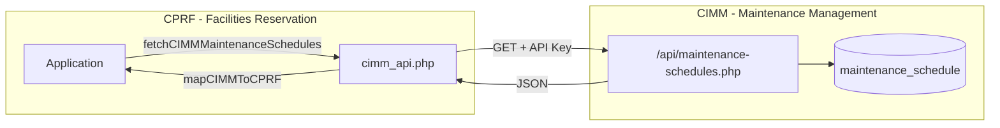
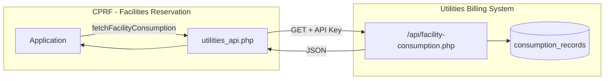
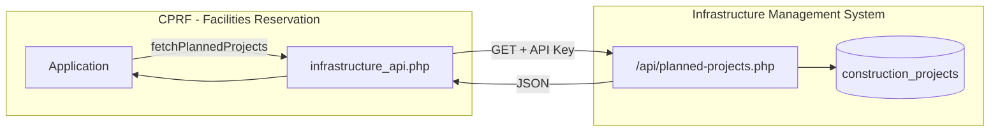
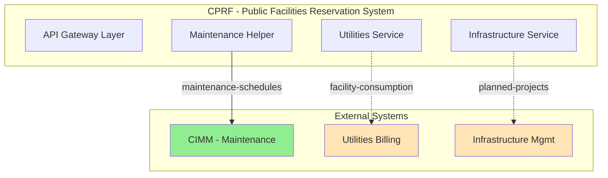

# API Gateway Diagram

## LGU Facilities Reservation System – External Integrations

This document describes the API Gateway architecture for the **CPRF (Public Facilities Reservation System)** and its integrations with external LGU systems under the Infra Gov Services ecosystem.

---

## 1. Overview

```
┌─────────────────────────────────────────────────────────────────────────────────────┐
│                        INFRA GOV SERVICES API GATEWAY                                │
│                                                                                     │
│  ┌──────────────────┐     ┌──────────────────┐     ┌──────────────────┐            │
│  │   CPRF           │     │   External       │     │   Future         │            │
│  │   (This System)  │────▶│   Integrations   │     │   Integrations   │            │
│  │ cprf.infragov    │     │                  │     │                  │            │
│  └──────────────────┘     └──────────────────┘     └──────────────────┘            │
│          │                          │                           │                   │
│          │                          │                           │                   │
│          ▼                          ▼                           ▼                   │
│  ┌──────────────────┐     ┌──────────────────┐     ┌──────────────────┐            │
│  │ CIMM             │     │ Utilities Billing│     │ Infra Mgmt       │            │
│  │ (ACTIVE)         │     │ (PLANNED)        │     │ (PLANNED)        │            │
│  └──────────────────┘     └──────────────────┘     └──────────────────┘            │
└─────────────────────────────────────────────────────────────────────────────────────┘
```

---

## 2. Current Integration: CIMM Maintenance

**Status:** ✅ **ACTIVE**

### Purpose
Fetches maintenance schedules from the **Community Infrastructure Maintenance Management (CIMM)** system to:
- Display upcoming maintenance on the calendar
- Block or warn users when booking during maintenance windows
- Sync facility status (`maintenance`, `available`) with CIMM schedules
- Notify users when their reservations are affected by maintenance

### Architecture



### API Details

| Field | Value |
|-------|-------|
| **Provider** | CIMM (`cimm.infragovservices.com`) |
| **Consumer** | CPRF (`cprf.infragovservices.com`) |
| **Endpoint** | `GET https://cimm.infragovservices.com/lgu-portal/public/api/maintenance-schedules.php` |
| **Auth** | Query parameter `key=CIMM_SECURE_KEY_2025` |
| **Response** | JSON with `data[]` (schedules), `success`, `count` |
| **Data Flow** | One-way: CIMM → CPRF (pull) |

### Data Mapped

| CIMM Field | CPRF Usage |
|------------|------------|
| `location` | Facility name (matched to CPRF facilities) |
| `starting_date` / `estimated_completion_date` | Maintenance window |
| `status` | Scheduled / In Progress / Completed |
| `task` / `category` | Maintenance type |
| `priority` | Low / Medium / High |

---

## 3. Planned Integration: Utilities Billing

**Status:** 📋 **PLANNED**

### Purpose
Fetch **electric and water consumption** per each **Barangay Culiat facility** to:
- Display utility usage per facility
- Support sustainability reporting and energy audits
- Inform facility managers about consumption trends
- Link facility usage (reservations) to utility costs for budgeting

### Scope
- **Facilities:** Barangay Culiat public facilities only (covered court, multipurpose halls, etc.)
- **Data:** Electric (kWh) and water (m³) consumption by facility and period
- **Flow:** Pull consumption data from Utilities Billing system

### Draft API Gateway Diagram



### Proposed Endpoint (Draft)

| Field | Value |
|-------|-------|
| **Provider** | Utilities Billing System |
| **Consumer** | CPRF |
| **Proposed Endpoint** | `GET /api/facility-consumption.php` |
| **Query Params** | `facility_id`, `period_start`, `period_end`, `key` |
| **Response** | `{ electric_kwh, water_cubic_m, facility_id, period }` |

### Example Response (Draft)

```json
{
  "success": true,
  "data": [
    {
      "facility_id": "BC-COURT-01",
      "facility_name": "Barangay Culiat Covered Court",
      "period": "2025-01",
      "electric_kwh": 1250,
      "water_cubic_m": 85,
      "updated_at": "2025-01-15T10:00:00Z"
    }
  ]
}
```

---

## 4. Planned Integration: Infrastructure Management

**Status:** 📋 **PLANNED**

### Purpose
Fetch **planned construction of public facilities** within **Barangay Culiat** to:
- Display upcoming new facilities and expansion projects
- Show construction timelines and expected completion dates
- Block or restrict reservations during construction phases
- Inform users about future facility availability

### Scope
- **Geographic:** Barangay Culiat only
- **Data:** Planned construction projects (new facilities, renovations, expansions)
- **Flow:** Pull project data from Infrastructure Management system

### Draft API Gateway Diagram



### Proposed Endpoint (Draft)

| Field | Value |
|-------|-------|
| **Provider** | Infrastructure Management System |
| **Consumer** | CPRF |
| **Proposed Endpoint** | `GET /api/planned-projects.php` |
| **Query Params** | `barangay=culiat`, `status=planned|in_progress`, `key` |
| **Response** | `{ projects[] }` with name, location, start/end dates, phase |

### Example Response (Draft)

```json
{
  "success": true,
  "data": [
    {
      "project_id": "INFRA-2025-001",
      "project_name": "Sanville Multipurpose Hall Expansion",
      "location": "Barangay Culiat",
      "phase": "planned",
      "planned_start": "2025-03-01",
      "planned_completion": "2025-08-31",
      "affected_facility": "Sanville Covered Court w/ Multipurpose Bldg",
      "description": "Construction of additional function room"
    }
  ]
}
```

---

## 5. Unified API Gateway View



**Legend:**
- Solid line: Active integration
- Dashed line: Planned integration
- Green: Active
- Orange: Planned

---

## 6. Security & Standards

| Aspect | Current (CIMM) | Planned (Utilities, Infra) |
|--------|----------------|----------------------------|
| **Auth** | API key in query string | API key (move to header recommended) |
| **Transport** | HTTPS | HTTPS |
| **CORS** | CPRF domain only | CPRF domain only |
| **Rate Limiting** | Not specified | Recommended |

---

## 7. Next Steps

1. **CIMM (Active):** Continue monitoring and ensure API key is moved to config/env.
2. **Utilities Billing:** Coordinate with Utilities team to define `/api/facility-consumption.php` schema.
3. **Infrastructure Management:** Coordinate with Infra team to define `/api/planned-projects.php` schema.
4. **API Gateway (Optional):** Consider a unified gateway proxy for all outbound API calls (auth, logging, retries).
