# Business Process Architecture (BPA) Diagrams
## LGU Facilities Reservation System

---

## LEVEL 1 BPA - Enterprise Business Domains

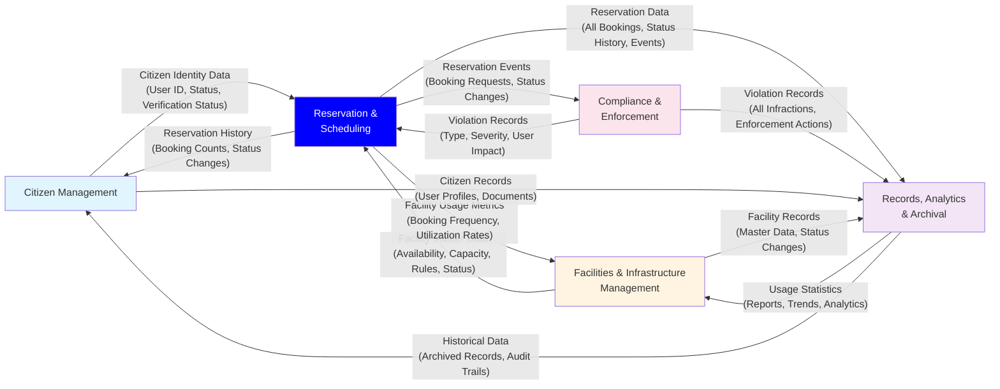

---

## LEVEL 2 BPA - All System Modules

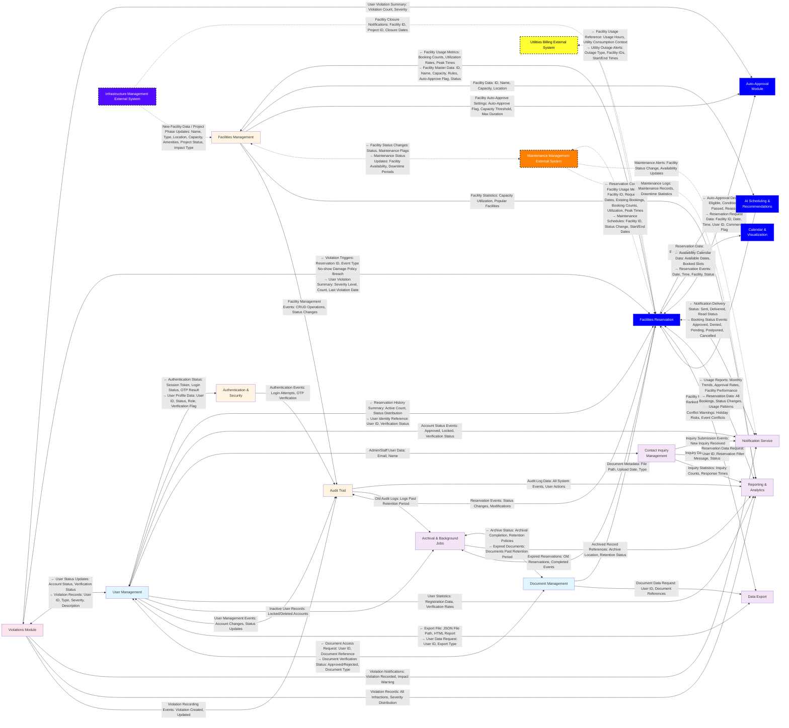

### Level 2 BPA Legend

#### Internal System Modules (Solid Borders)

**🔵 User & Identity Management (Light Blue - #e1f5ff)**
- User Management
- Document Management

**🟡 Facilities & Infrastructure (Light Orange - #fff4e1)**
- Facilities Management
- Authentication & Security
- Audit Trail

**🔵 Facilities Reservation Modules (Blue - #0000FF)**
- Facilities Reservation
- AI Scheduling & Recommendations
- Calendar & Visualization
- Auto-Approval Module

**🔴 Compliance & Enforcement (Light Pink - #fce4ec)**
- Violations Module

**🟣 Services & Analytics (Light Purple - #f3e5f5)**
- Notification Service
- Reporting & Analytics
- Archival & Background Jobs
- Contact Inquiry Management
- Data Export

#### External Integration Systems (Dotted Borders)

**🟠 Maintenance Management System (Orange - #FF8000)**
- External system managing facility maintenance schedules
- Provides maintenance status updates and schedules
- Receives facility usage metrics from reservation system

**🟣 Infrastructure Management System (Purple - #530CFF)**
- External system managing construction/renovation projects
- Provides facility closure notifications and new facility data
- Sends project phase updates

**🟨 Utilities Billing System (Yellow - #FFFF33)**
- External system managing utility services (power, water)
- Provides utility outage alerts
- Receives facility usage reference data

#### Connection Types

- **Solid Lines** (`-->` or `<-->`): Internal system connections within Facilities Reservation System
- **Dotted Lines** (`-.->` or `<-.->`): External system integrations (connections to other LGU systems)
- **Bidirectional Arrows** (`<-->`): Two-way data exchange between modules
- **One-way Arrows** (`-->`): One-way data flow from source to destination

---

## LEVEL 3 BPA - Individual Module Diagrams

### 3.1 Facilities Reservation Module

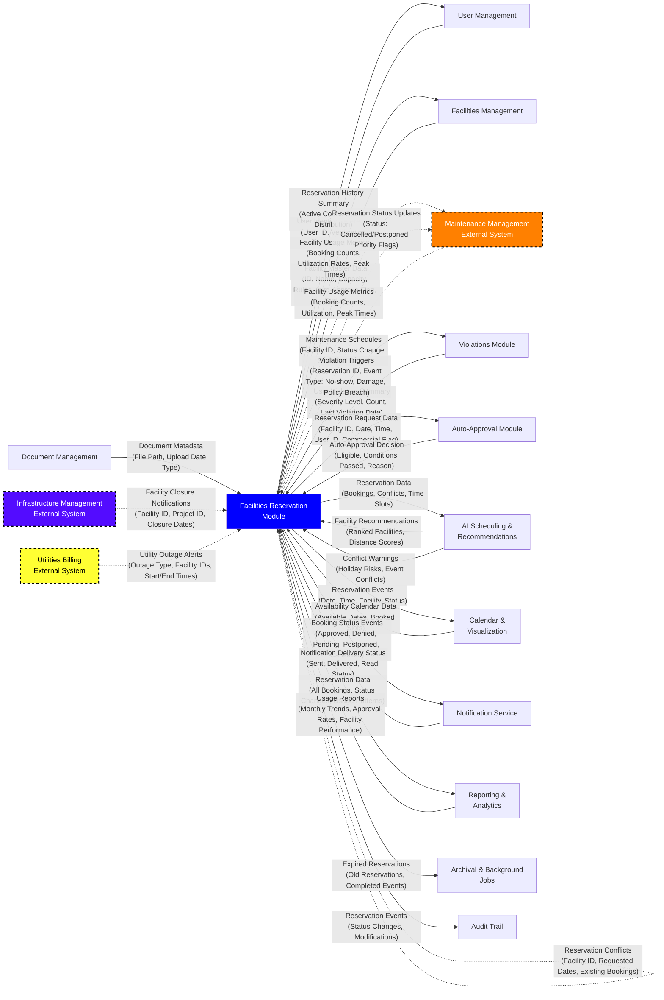

---

### 3.2 Notification Service Module

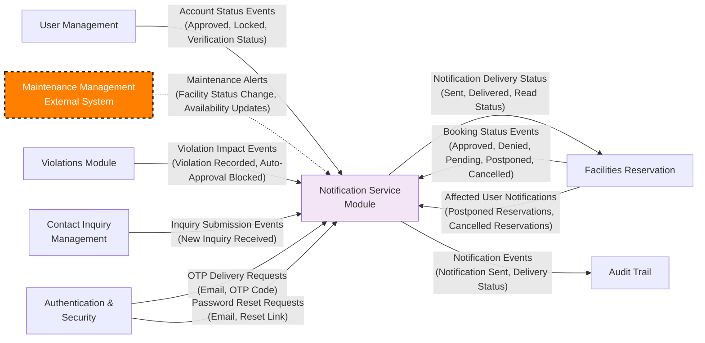

---

### 3.3 User Management Module

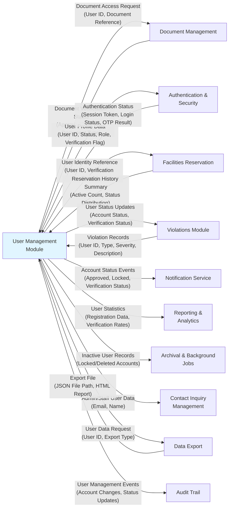

---

### 3.4 Facilities Management Module

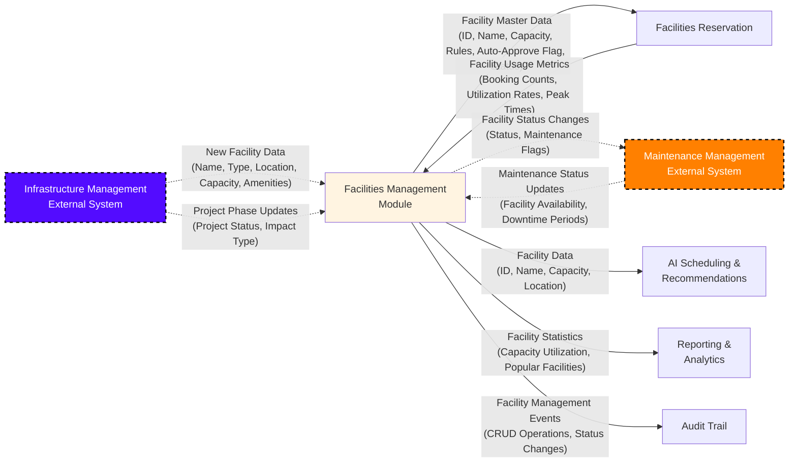

---

### 3.5 Violations Module

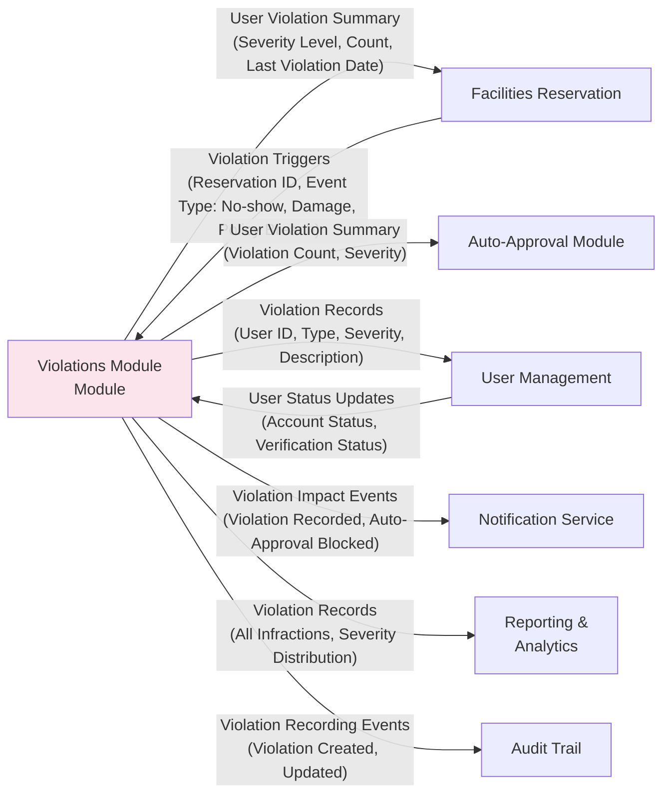

---

### 3.6 Auto-Approval Module

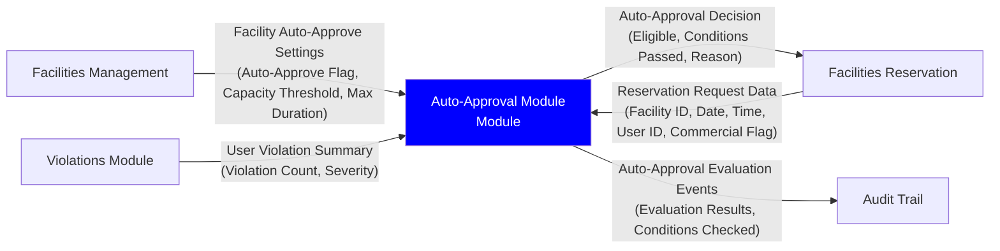

---

### 3.7 AI Scheduling & Recommendations Module

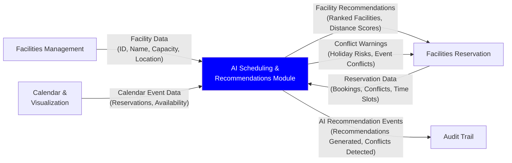

---

### 3.8 Calendar & Visualization Module

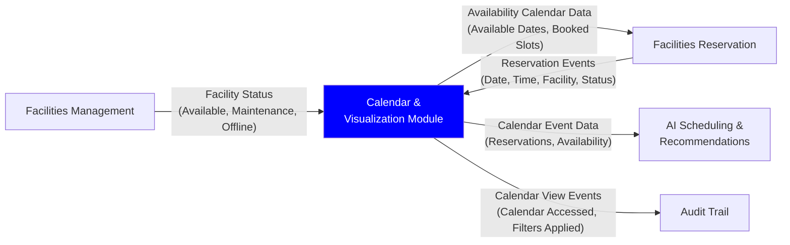

---

### 3.9 Authentication & Security Module

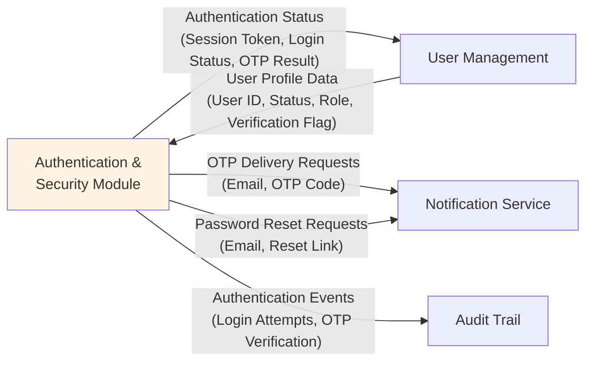

---

### 3.10 Document Management Module

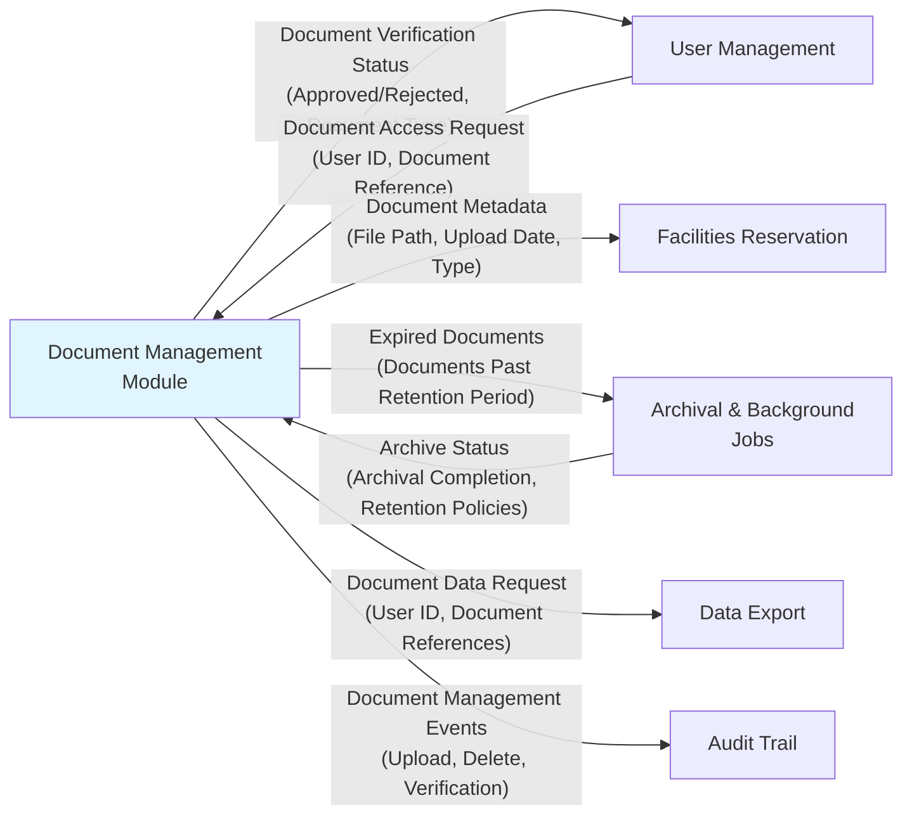

---

### 3.11 Reporting & Analytics Module

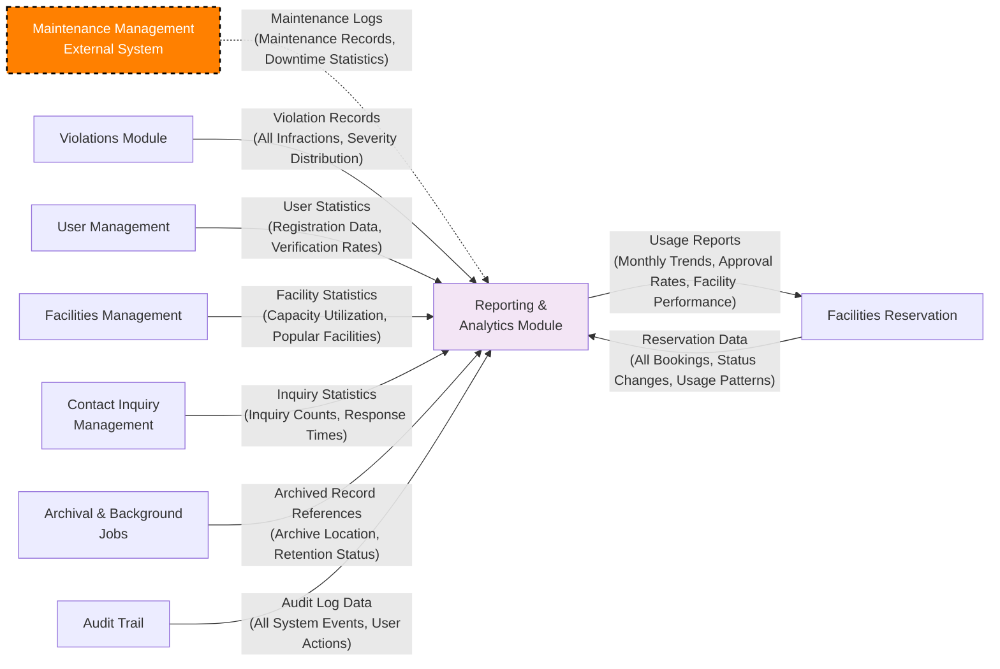

---

### 3.12 Archival & Background Jobs Module

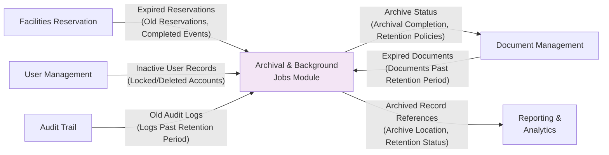

---

### 3.13 Contact Inquiry Management Module

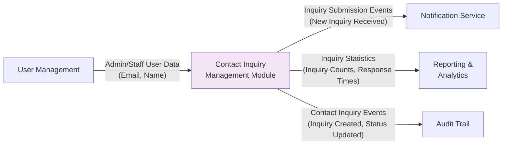

---

### 3.14 Audit Trail Module

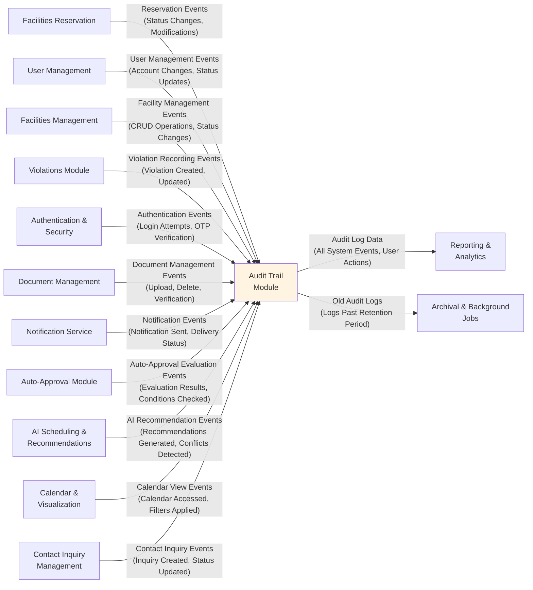

---

### 3.15 Data Export Module

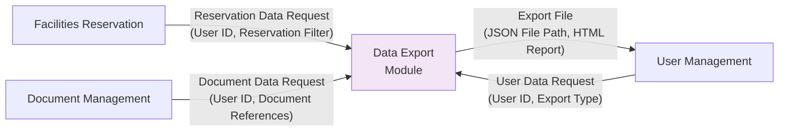

---

## Notes

### Level 1 BPA
- **Purpose**: Enterprise-level view of major business domains
- **Focus**: High-level data exchanges between organizational domains
- **Data Labels**: Represent business information flows (citizen identity, facility data, reservation outcomes, violations, usage statistics)

### Level 2 BPA
- **Purpose**: Complete system architecture showing all modules (internal + external integrations)
- **Focus**: Technical data exchanges between all system components
- **Data Labels**: Specific data payloads (User ID, Facility Status, Violation Summary, etc.)
- **Dotted Lines**: External integration modules (Maintenance Management, Infrastructure Management, Utilities Billing from other systems)
- **Includes**: All 15 internal modules + 3 external integration modules

### Level 3 BPA
- **Purpose**: Individual module diagrams showing what connects to each module
- **Focus**: Module-centric view of data exchanges for each system component
- **Structure**: One diagram per module (15 total diagrams)
- **Dotted Lines**: External integration modules shown with dotted connections
- **Excludes**: Modules not directly connected (only shows relevant connections)

---

## General Legend

### Connection Types
- **Solid Lines** (`-->` or `<-->`): Internal system connections (within Facilities Reservation System)
- **Dotted Lines** (`-.->` or `<-.->`): External system integrations (connections to other LGU systems)
- **Bidirectional Arrows** (`<-->`): Two-way data exchange between modules
- **One-way Arrows** (`-->`): One-way data flow from source to destination

### Color Coding (Level 2 Diagram)

**🔵 User & Identity Management (Light Blue - #e1f5ff)**
- User Management
- Document Management

**🟡 Facilities & Infrastructure (Light Orange - #fff4e1)**
- Facilities Management
- Authentication & Security
- Audit Trail

**🔵 Facilities Reservation Modules (Blue - #0000FF)**
- Facilities Reservation
- AI Scheduling & Recommendations
- Calendar & Visualization
- Auto-Approval Module

**🔴 Compliance & Enforcement (Light Pink - #fce4ec)**
- Violations Module

**🟣 Services & Analytics (Light Purple - #f3e5f5)**
- Notification Service
- Reporting & Analytics
- Archival & Background Jobs
- Contact Inquiry Management
- Data Export

**External Integration Systems (Dotted Borders)**
- **MM**: Maintenance Management System (Orange - #FF8000, External)
- **IM**: Infrastructure Management System (Purple - #530CFF, External)
- **UB**: Utilities Billing System (Yellow - #FFFF33, External)

### External System Descriptions

**Maintenance Management System (MM) - Orange (#FF8000)**
- Manages facility maintenance schedules and downtime
- Provides maintenance status updates to block facilities during maintenance periods
- Receives facility usage metrics for maintenance planning

**Infrastructure Management System (IM) - Purple (#530CFF)**
- Manages construction/renovation projects
- Provides facility closure notifications during projects
- Sends new facility data when projects complete

**Utilities Billing System (UB) - Yellow (#FFFF33)**
- Manages utility services (power, water)
- Provides utility outage alerts that affect facility availability
- Receives facility usage reference data for billing purposes
