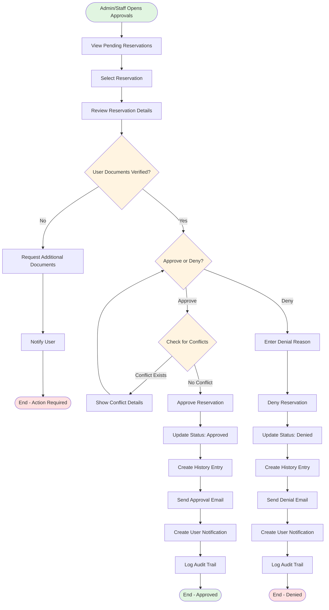
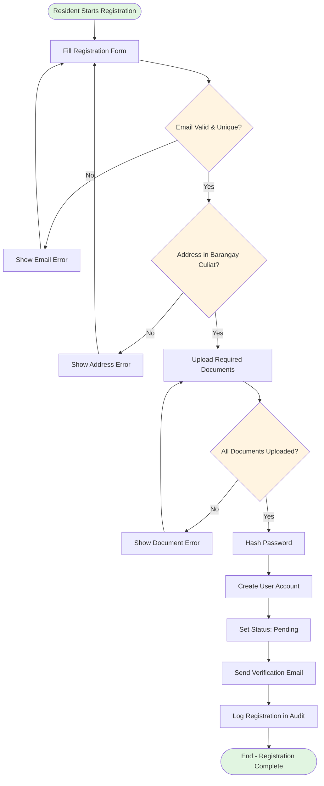
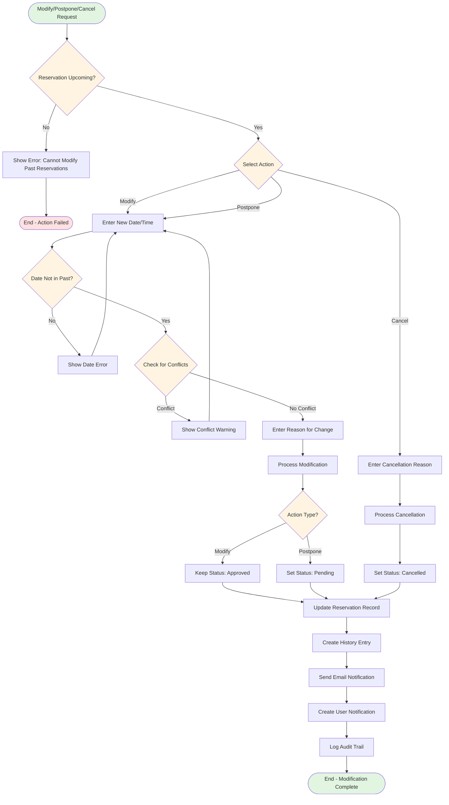
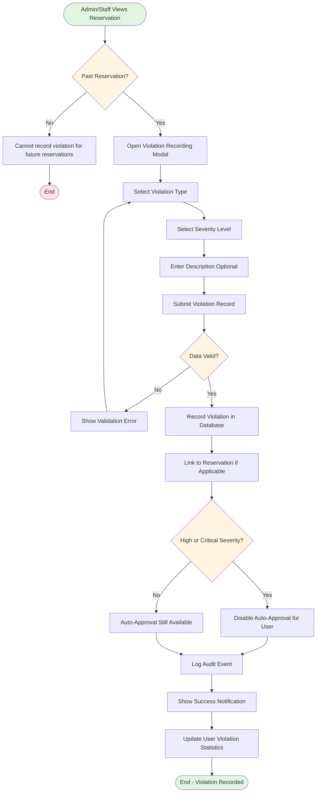
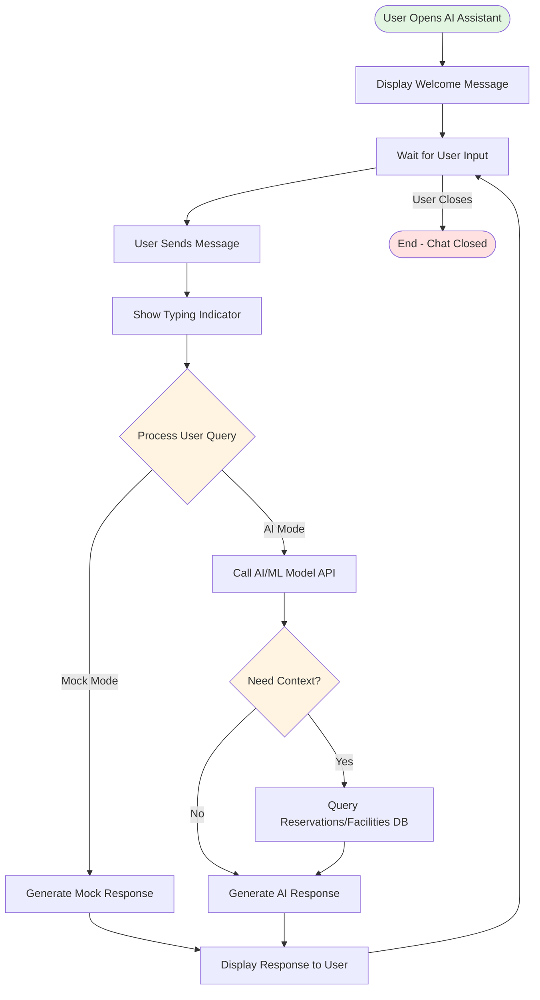
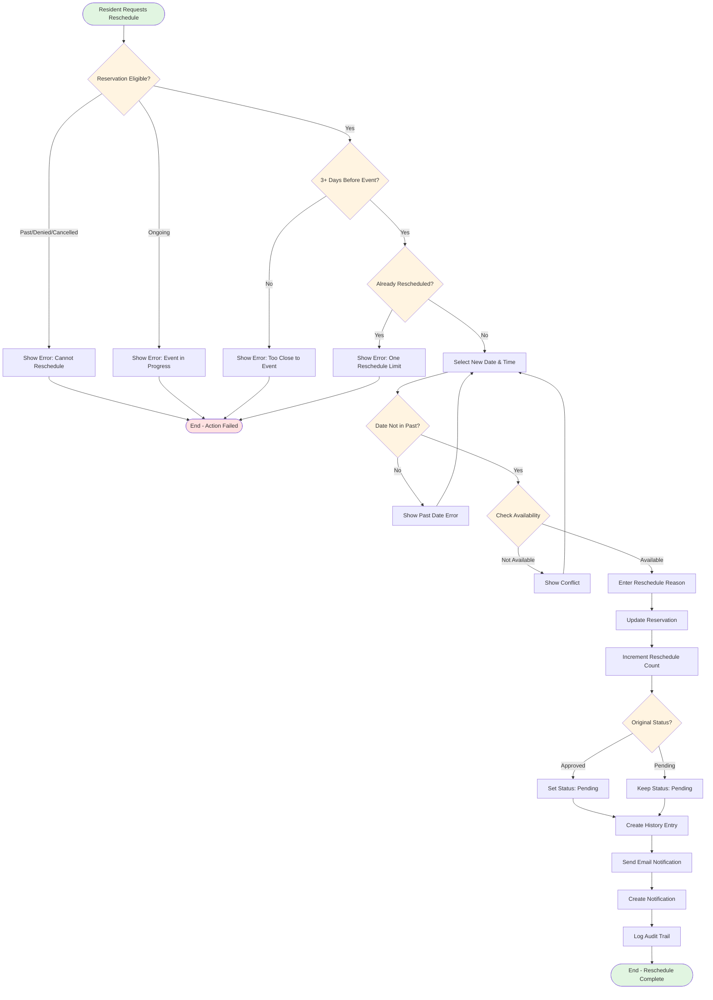

# Business Process Model and Notation (BPMN)
## Public Facilities Reservation System

## Document Information
- **System Name**: Public Facilities Reservation System
- **Document Type**: Business Process Model and Notation (BPMN)
- **Version**: 1.0
- **Date**: 2025
- **Author**: System Documentation

---

## Table of Contents
1. [BPMN Symbols & Notation](#1-bpmn-symbols--notation)
2. [Reservation Booking Process](#2-reservation-booking-process)
3. [Reservation Approval Process](#3-reservation-approval-process)
4. [User Registration Process](#4-user-registration-process)
5. [Reservation Modification Process](#5-reservation-modification-process)
6. [AI Chatbot Interaction Process](#6-ai-chatbot-interaction-process)

---

## 1. BPMN Symbols & Notation

### Standard BPMN Symbols

| Symbol | Name | Description |
|--------|------|-------------|
| ⭕ | **Start Event** | Process initiation point |
| ⏹️ | **End Event** | Process completion point |
| ⬜ | **Task/Activity** | Work performed in the process |
| 🔷 | **Gateway** | Decision point (diamond shape) |
| ➡️ | **Sequence Flow** | Order of activities |
| 📋 | **Data Object** | Data used or produced |
| 👤 | **Lane** | Participant/role in the process |

### Gateway Types
- **Exclusive Gateway (XOR)**: Only one path is taken
- **Parallel Gateway (AND)**: All paths are taken simultaneously
- **Inclusive Gateway (OR)**: One or more paths are taken

---

## 2. Reservation Booking Process

```mermaid
flowchart TD
    Start([Resident Starts Booking]) --> Login{User Logged In?}
    Login -->|No| LoginPage[Redirect to Login]
    LoginPage --> OTP[Enter OTP]
    OTP --> Login
    Login -->|Yes| SelectFacility[Select Facility]
    SelectFacility --> SelectDate[Select Date & Time Slot]
    SelectDate --> CheckAvailability{Check Availability}
    CheckAvailability -->|Not Available| ShowConflict[Show Conflict Warning]
    ShowConflict --> SuggestAlternatives[Suggest Alternative Workflows/Facilities]
    SuggestAlternatives --> SelectDate
    CheckAvailability -->|Available| CheckLimits{Check Booking Limits}
    CheckLimits -->|Limit Exceeded| ShowLimitError[Show Limit Error Message]
    ShowLimitError --> End1([End - Booking Failed])
    CheckLimits -->|Within Limits| EnterPurpose[Enter Purpose]
    EnterPurpose --> AICheck[AI Risk Scoring & Analysis]
    AICheck --> RiskCheck{Risk Score High?}
    RiskCheck -->|Yes| ShowRiskWarning[Show Risk Warning]
    ShowRiskWarning --> ConfirmRisk{User Confirms?}
    ConfirmRisk -->|No| SelectDate
    ConfirmRisk -->|Yes| SubmitBooking
    RiskCheck -->|No|     SubmitBooking[Submit Booking Request]
    SubmitBooking --> ValidateData[Validate Booking Data]
    ValidateData --> CheckAutoApproval{Evaluate Auto-Approval Conditions}
    
    CheckAutoApproval -->|Check Facility| CheckFacility[Facility auto_approve = true?]
    CheckAutoApproval -->|Check Blackout| CheckBlackout[Date not in blackout dates?]
    CheckAutoApproval -->|Check Duration| CheckDuration[Duration ≤ max_duration_hours?]
    CheckAutoApproval -->|Check Capacity| CheckCapacity[Attendees ≤ capacity_threshold?]
    CheckAutoApproval -->|Check Commercial| CheckCommercial[Non-commercial purpose?]
    CheckAutoApproval -->|Check Conflicts| CheckConflicts[No time conflicts?]
    CheckAutoApproval -->|Check Violations| CheckViolations[User has no high-severity violations?]
    CheckAutoApproval -->|Check Window| CheckWindow[Within advance booking window?]
    
    CheckFacility --> AllConditions{All Conditions Met?}
    CheckBlackout --> AllConditions
    CheckDuration --> AllConditions
    CheckCapacity --> AllConditions
    CheckCommercial --> AllConditions
    CheckConflicts --> AllConditions
    CheckViolations --> AllConditions
    CheckWindow --> AllConditions
    
    AllConditions -->|Yes| AutoApprove[Set Status: Approved]
    AllConditions -->|No| SetPending[Set Status: Pending]
    
    AutoApprove --> CreateReservationApproved[Create Reservation Record (approved, auto_approved=true)]
    SetPending --> CreateReservationPending[Create Reservation Record (pending, auto_approved=false)]
    
    CreateReservationApproved --> CreateHistoryAuto[Create History: Auto-Approved]
    CreateReservationPending --> CreateHistoryPending[Create History: Pending Review]
    
    CreateHistoryAuto --> NotifyUser[Send Notification to User: Approved]
    CreateHistoryPending --> NotifyStaff[Send Notification to Admin/Staff: Pending Review]
    
    NotifyUser --> EndApproved([End - Booking Auto-Approved])
    NotifyStaff --> EndPending([End - Booking Pending Review])
    
    style Start fill:#e1f5e1
    style End1 fill:#ffe1e1
    style End2 fill:#e1f5e1
    style CheckAvailability fill:#fff4e1
    style CheckLimits fill:#fff4e1
    style RiskCheck fill:#fff4e1
    style ConfirmRisk fill:#fff4e1
```

### Process Description
1. **Start**: Resident initiates booking process
2. **Authentication**: Verify user is logged in (OTP if needed)
3. **Facility Selection**: User selects facility, date, and time slot
4. **Availability Check**: System checks for conflicts (OPTIMIZED: combined queries, ~60% faster)
5. **Limit Validation**: Enforces booking limits (max 3 active/30 days, 60-day advance, 1 per day)
6. **AI Risk Assessment**: Fast rule-based conflict risk score calculation (no ML overhead)
7. **Submission**: Creates reservation with "pending" status
8. **Notification**: Alerts admin/staff for approval

**Performance Notes (Jan 2025):**
- Conflict detection uses optimized single query (combined approved + pending)
- Client-side debouncing (500ms) reduces API calls by ~70%
- Database indexes improve query performance by 50-80%

---

## 3. Reservation Approval Process



### Process Description
1. **Review**: Admin/Staff reviews pending reservations
2. **Document Verification**: Ensures user documents are verified
3. **Decision**: Approve or deny reservation
4. **Conflict Check**: For approvals, verify no conflicts exist
5. **Status Update**: Update reservation status
6. **Notification**: Send email and in-app notification
7. **Audit**: Log all actions in audit trail

---

## 4. User Registration Process



### Process Description
1. **Form Entry**: User fills registration form
2. **Validation**: Email uniqueness and Barangay Culiat address verification
3. **Document Upload**: Required documents (Birth Cert, Valid ID, Barangay ID, Resident ID)
4. **Account Creation**: Creates user with "pending" status
5. **Verification**: Admin/Staff must approve account

---

## 5. Reservation Modification Process



### Process Description
1. **Validation**: Ensures reservation is upcoming (not past)
2. **Action Selection**: Modify, Postpone, or Cancel
3. **Date Validation**: New dates cannot be in the past
4. **Conflict Check**: Verify no conflicts for new date/time
5. **Status Update**: 
   - Modify: Keep "approved" status
   - Postpone: Change to "pending" (requires re-approval)
   - Cancel: Set to "cancelled"
6. **Notification**: Email and in-app notification to user
7. **Audit**: Log all modifications

---

## 7. Violation Recording Process



## 6. AI Chatbot Interaction Process



### Process Description
1. **Initialization**: Display welcome message with capabilities
2. **Message Input**: User types message or clicks quick action
3. **Processing**: 
   - **Mock Mode**: Generate predefined responses based on keywords
   - **AI Mode**: Send query to AI/ML model API endpoint
4. **Context Retrieval**: Query database for facility/reservation data if needed
5. **Response Generation**: AI model generates contextual response
6. **Display**: Show response in chat interface
7. **Loop**: Continue conversation until user closes chat

### Integration Points
- **API Endpoint**: `POST /api/ai/chat` (ready for implementation)
- **Request**: `{ "message": "user query", "user_id": 123, "context": {...} }`
- **Response**: `{ "response": "AI generated response", "confidence": 0.95 }`
- **Database Queries**: Facilities (D4), Reservations (D3) for context
- **Status**: UI implemented with floating widget, mock responses active, AI/ML model integration pending
- **Future**: Connect to OpenAI API, custom LLM, or hosted AI service with safety/allow-listing

---

## 7. Resident Reschedule Process



### Process Description
1. **Eligibility Check**: Reservation must be upcoming, not denied/cancelled
2. **Time Constraint**: Must be at least 3 days before event
3. **Reschedule Limit**: Only one reschedule per reservation
4. **Date Validation**: New date cannot be in the past
5. **Availability**: Check for conflicts
6. **Status Update**: Approved reservations become "pending" (require re-approval)
7. **Notification**: Email and in-app notification
8. **Audit**: Full audit trail maintained

---

## 8. Process Summary

### Key Business Processes

| Process | Participants | Key Activities | Outcomes |
|---------|-------------|---------------|----------|
| **Reservation Booking** | Resident | Select facility, check availability, submit request | Reservation created (pending) |
| **Reservation Approval** | Admin/Staff | Review, verify documents, approve/deny | Status updated, notifications sent |
| **User Registration** | Resident | Fill form, upload documents, verify address | Account created (pending approval) |
| **Reservation Modification** | Admin/Staff, Resident | Modify/Postpone/Cancel with reason | Reservation updated, re-approval if needed |
| **Resident Reschedule** | Resident | Reschedule own reservation (within limits) | Reservation updated, status may change |
| **AI Chatbot** | Resident, AI System | Query processing, context retrieval, response generation | Helpful responses to user queries |

### Process Metrics

- **Booking Process**: Average 2-3 minutes
- **Approval Process**: Average 24-48 hours (admin review)
- **Registration Process**: Average 5-10 minutes (pending admin approval)
- **Modification Process**: Immediate (if within constraints)
- **Chatbot Response**: < 2 seconds (mock), < 5 seconds (AI)

---

## End of Document

