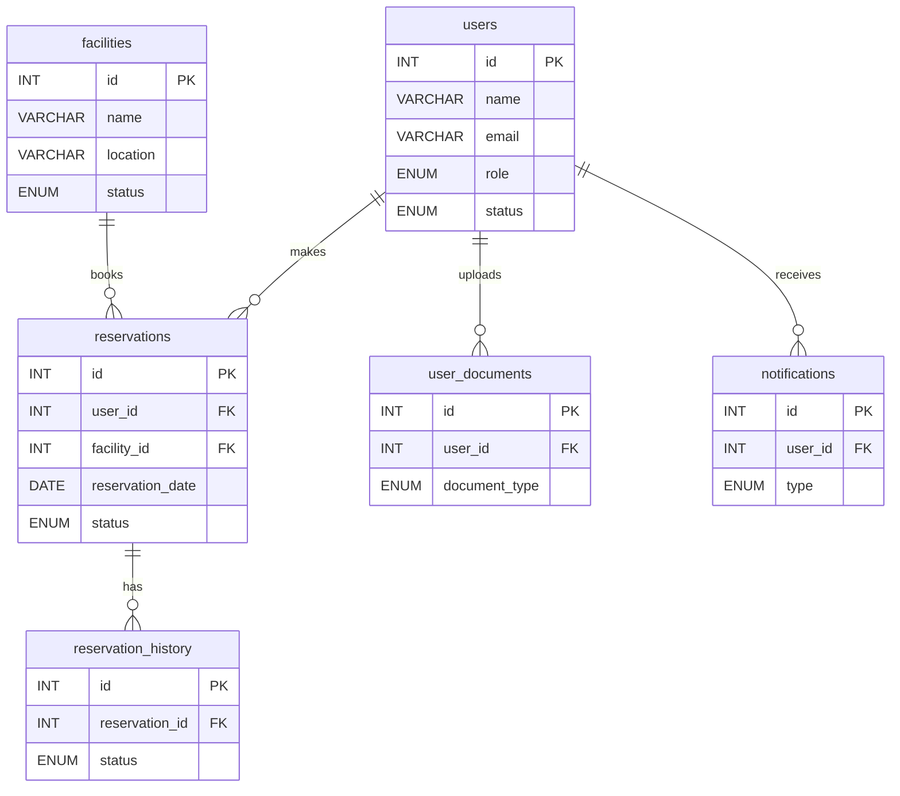

# Entity Relationship Diagram (ERD)

## Mermaid ERD for Public Facilities Reservation System

### Complete ERD Diagram

```mermaid
erDiagram
    users ||--o{ reservations : "makes"
    users ||--o{ user_documents : "uploads"
    users ||--o{ reservation_history : "creates"
    users ||--o{ notifications : "receives"
    users ||--o{ audit_log : "performs"
    users ||--o{ contact_inquiries : "responds"
    users ||--o{ password_reset_tokens : "has"
    users ||--o{ security_logs : "generates"
    
    facilities ||--o{ reservations : "books"
    
    reservations ||--o{ reservation_history : "has"
    
    users {
        INT id PK "AUTO_INCREMENT"
        VARCHAR name "NOT NULL"
        VARCHAR email "UNIQUE, NOT NULL"
        VARCHAR password_hash "NOT NULL"
        VARCHAR mobile "NULL"
        VARCHAR profile_picture "NULL"
        VARCHAR address "NULL"
        DECIMAL latitude "NULL"
        DECIMAL longitude "NULL"
        ENUM role "Admin|Staff|Resident, DEFAULT Resident"
        ENUM status "pending|active|locked, DEFAULT pending"
        TEXT lock_reason "NULL"
        INT failed_login_attempts "DEFAULT 0"
        DATETIME locked_until "NULL"
        DATETIME last_login_at "NULL"
        VARCHAR last_login_ip "NULL"
        VARCHAR otp_code_hash "NULL"
        DATETIME otp_expires_at "NULL"
        INT otp_attempts "DEFAULT 0"
        DATETIME otp_last_sent_at "NULL"
        TIMESTAMP created_at "DEFAULT CURRENT_TIMESTAMP"
        TIMESTAMP updated_at "ON UPDATE CURRENT_TIMESTAMP"
    }
    
    facilities {
        INT id PK "AUTO_INCREMENT"
        VARCHAR name "NOT NULL"
        TEXT description "NULL"
        VARCHAR base_rate "NULL"
        VARCHAR image_path "NULL"
        VARCHAR image_citation "NULL"
        VARCHAR location "NULL"
        DECIMAL latitude "NULL"
        DECIMAL longitude "NULL"
        VARCHAR capacity "NULL"
        TEXT amenities "NULL"
        TEXT rules "NULL"
        ENUM status "available|maintenance|offline, DEFAULT available"
        TIMESTAMP created_at "DEFAULT CURRENT_TIMESTAMP"
        TIMESTAMP updated_at "ON UPDATE CURRENT_TIMESTAMP"
    }
    
    reservations {
        INT id PK "AUTO_INCREMENT"
        INT user_id FK "NOT NULL"
        INT facility_id FK "NOT NULL"
        DATE reservation_date "NOT NULL"
        VARCHAR time_slot "NOT NULL"
        TEXT purpose "NOT NULL"
        ENUM status "pending|approved|denied|cancelled, DEFAULT pending"
        TIMESTAMP created_at "DEFAULT CURRENT_TIMESTAMP"
        TIMESTAMP updated_at "ON UPDATE CURRENT_TIMESTAMP"
    }
    
    reservation_history {
        INT id PK "AUTO_INCREMENT"
        INT reservation_id FK "NOT NULL, ON DELETE CASCADE"
        ENUM status "pending|approved|denied|cancelled, NOT NULL"
        VARCHAR note "NULL"
        INT created_by FK "NULL"
        TIMESTAMP created_at "DEFAULT CURRENT_TIMESTAMP"
    }
    
    notifications {
        INT id PK "AUTO_INCREMENT"
        INT user_id FK "NULL, ON DELETE CASCADE"
        ENUM type "booking|system|reminder, DEFAULT system"
        VARCHAR title "NOT NULL"
        TEXT message "NOT NULL"
        VARCHAR link "NULL"
        BOOLEAN is_read "DEFAULT FALSE"
        TIMESTAMP created_at "DEFAULT CURRENT_TIMESTAMP"
    }
    
    audit_log {
        INT id PK "AUTO_INCREMENT"
        INT user_id FK "NULL, ON DELETE SET NULL"
        VARCHAR action "NOT NULL"
        VARCHAR module "NOT NULL"
        TEXT details "NULL"
        VARCHAR ip_address "NULL"
        VARCHAR user_agent "NULL"
        TIMESTAMP created_at "DEFAULT CURRENT_TIMESTAMP"
    }
    
    user_documents {
        INT id PK "AUTO_INCREMENT"
        INT user_id FK "NOT NULL, ON DELETE CASCADE"
        ENUM document_type "birth_certificate|valid_id|brgy_id|resident_id|other, NOT NULL"
        VARCHAR file_path "NOT NULL"
        VARCHAR file_name "NOT NULL"
        INT file_size "NOT NULL"
        TIMESTAMP uploaded_at "DEFAULT CURRENT_TIMESTAMP"
    }
    
    contact_inquiries {
        INT id PK "AUTO_INCREMENT"
        VARCHAR name "NOT NULL"
        VARCHAR email "NOT NULL"
        VARCHAR organization "NULL"
        TEXT message "NOT NULL"
        ENUM status "new|in_progress|resolved|closed, DEFAULT new"
        TEXT admin_notes "NULL"
        INT responded_by FK "NULL, ON DELETE SET NULL"
        DATETIME responded_at "NULL"
        TIMESTAMP created_at "DEFAULT CURRENT_TIMESTAMP"
        TIMESTAMP updated_at "ON UPDATE CURRENT_TIMESTAMP"
    }
    
    password_reset_tokens {
        INT id PK "AUTO_INCREMENT"
        INT user_id FK "NOT NULL, ON DELETE CASCADE"
        VARCHAR token_hash "NOT NULL"
        DATETIME expires_at "NOT NULL"
        DATETIME used_at "NULL"
        TIMESTAMP created_at "DEFAULT CURRENT_TIMESTAMP"
    }
    
    rate_limits {
        INT id PK "AUTO_INCREMENT"
        VARCHAR action "NOT NULL"
        VARCHAR identifier "NOT NULL"
        DATETIME expires_at "NOT NULL"
        TIMESTAMP created_at "DEFAULT CURRENT_TIMESTAMP"
    }
    
    security_logs {
        INT id PK "AUTO_INCREMENT"
        VARCHAR event "NOT NULL"
        TEXT details "NULL"
        ENUM severity "info|warning|error|critical, DEFAULT info"
        VARCHAR ip_address "NULL"
        VARCHAR user_agent "NULL"
        INT user_id FK "NULL, ON DELETE SET NULL"
        TIMESTAMP created_at "DEFAULT CURRENT_TIMESTAMP"
    }
    
    login_attempts {
        INT id PK "AUTO_INCREMENT"
        VARCHAR email "NOT NULL"
        VARCHAR ip_address "NOT NULL"
        TINYINT success "DEFAULT 0"
        TIMESTAMP attempted_at "DEFAULT CURRENT_TIMESTAMP"
    }
```

---

## Simplified ERD (Core Entities Only)

---

## Relationship Summary

### One-to-Many Relationships

1. **users → reservations** (1:N)
   - One user can make multiple reservations
   - Foreign Key: `reservations.user_id → users.id`

2. **facilities → reservations** (1:N)
   - One facility can have multiple reservations
   - Foreign Key: `reservations.facility_id → facilities.id`

3. **reservations → reservation_history** (1:N)
   - One reservation can have multiple status change records
   - Foreign Key: `reservation_history.reservation_id → reservations.id` (ON DELETE CASCADE)

4. **users → reservation_history** (1:N)
   - One user (admin/staff) can create multiple history entries
   - Foreign Key: `reservation_history.created_by → users.id`

5. **users → user_documents** (1:N)
   - One user can upload multiple documents
   - Foreign Key: `user_documents.user_id → users.id` (ON DELETE CASCADE)

6. **users → notifications** (1:N)
   - One user can receive multiple notifications
   - Foreign Key: `notifications.user_id → users.id` (ON DELETE CASCADE, nullable for system-wide)

7. **users → audit_log** (1:N)
   - One user can perform multiple audit actions
   - Foreign Key: `audit_log.user_id → users.id` (ON DELETE SET NULL, nullable)

8. **users → contact_inquiries** (1:N)
    - One admin/staff can respond to multiple inquiries
    - Foreign Key: `contact_inquiries.responded_by → users.id` (ON DELETE SET NULL, nullable)

9. **users → password_reset_tokens** (1:N)
    - One user can have multiple reset tokens (unused tokens)
    - Foreign Key: `password_reset_tokens.user_id → users.id` (ON DELETE CASCADE)

10. **users → security_logs** (1:N)
    - One user can generate multiple security log entries
    - Foreign Key: `security_logs.user_id → users.id` (ON DELETE SET NULL, nullable)

### Standalone Tables (No Foreign Keys)

- **rate_limits**: Tracks rate limiting by action and identifier
- **login_attempts**: Tracks login attempts (email-based, no user FK since attempts may be for non-existent users)

---

## Key Constraints

### Foreign Key Constraints

1. **reservations.user_id** → `users.id` (No CASCADE - prevent orphaned reservations)
2. **reservations.facility_id** → `facilities.id` (No CASCADE - prevent orphaned reservations)
3. **reservation_history.reservation_id** → `reservations.id` **ON DELETE CASCADE** (delete history when reservation deleted)
4. **reservation_history.created_by** → `users.id` (No CASCADE - keep history even if user deleted)
5. **user_documents.user_id** → `users.id` **ON DELETE CASCADE** (delete documents when user deleted)
6. **notifications.user_id** → `users.id` **ON DELETE CASCADE** (nullable for system-wide notifications)
7. **audit_log.user_id** → `users.id` **ON DELETE SET NULL** (keep audit trail, nullify user reference)
8. **contact_inquiries.responded_by** → `users.id` **ON DELETE SET NULL** (keep inquiry, nullify responder)
9. **password_reset_tokens.user_id** → `users.id` **ON DELETE CASCADE** (delete tokens when user deleted)
10. **security_logs.user_id** → `users.id` **ON DELETE SET NULL** (keep logs, nullify user reference)

### Unique Constraints

- `users.email` - Unique email addresses

---

## Indexes

### Primary Indexes
- All tables have `id` as PRIMARY KEY (AUTO_INCREMENT)

### Foreign Key Indexes
- All foreign keys are automatically indexed

### Additional Indexes
- `users.email` (UNIQUE index)
- `audit_log.module` (`idx_audit_module`)
- `audit_log.created_at` (`idx_audit_created`)
- `audit_log.user_id` (`idx_audit_user`)
- `notifications.user_id` (`idx_notif_user`)
- `notifications.is_read` (`idx_notif_read`)
- `notifications.created_at` (`idx_notif_created`)
- `user_documents.user_id` (`idx_user_documents`)
- `users.latitude, users.longitude` (`idx_users_coordinates`)
- `facilities.latitude, facilities.longitude` (`idx_facilities_coordinates`)
- `facilities.status, latitude, longitude` (`idx_facilities_status_location`)
- `contact_inquiries.status` (`idx_inquiry_status`)
- `contact_inquiries.created_at` (`idx_inquiry_created`)
- `password_reset_tokens.token_hash` (`idx_reset_token`)
- `password_reset_tokens.user_id` (`idx_reset_user`)
- `password_reset_tokens.expires_at` (`idx_reset_expires`)
- `rate_limits.action, identifier, expires_at` (`idx_rate_limit`)
- `security_logs.event, severity, created_at` (`idx_security_logs`)
- `security_logs.user_id` (`idx_security_user`)
- `login_attempts.email, attempted_at` (`idx_login_attempts`)
- `login_attempts.ip_address, attempted_at` (`idx_login_ip`)

---

## Entity Descriptions

### Core Entities

1. **users** - System users (Admin, Staff, Residents)
   - Authentication and authorization
   - Profile management
   - Security and OTP handling

2. **facilities** - Public facilities available for reservation
   - Facility details and status
   - Location and capacity information

3. **reservations** - Booking requests and reservations
   - Links users to facilities
   - Tracks reservation status and details

### Supporting Entities

4. **reservation_history** - Audit trail of reservation status changes
   - Tracks who changed status and when
   - Stores notes for status changes

5. **user_documents** - Uploaded user verification documents
   - Registration documents (Valid ID, etc.)
   - Document metadata

6. **notifications** - In-app notification system
   - User-specific and system-wide notifications
   - Booking and system alerts

7. **audit_log** - System-wide audit trail
   - Tracks all system actions
   - User actions and module changes

### Security & Authentication Entities

8. **contact_inquiries** - Public contact form submissions
   - Inquiry management
   - Admin response tracking

9. **password_reset_tokens** - Password reset functionality
    - Token-based password resets
    - Expiration and usage tracking

11. **rate_limits** - Rate limiting for API/actions
    - Prevents abuse
    - Action-based throttling

12. **security_logs** - Security event logging
    - Security-related events
    - Severity classification

13. **login_attempts** - Login attempt tracking
    - Failed/successful login tracking
    - IP-based monitoring

---

## Usage Notes

### For Mermaid Live Editor
1. Copy the complete ERD diagram code
2. Paste into [Mermaid Live Editor](https://mermaid.live)
3. The diagram will render automatically
4. Export as PNG, SVG, or PDF as needed

### For Documentation
- Use the complete ERD for full system documentation
- Use the simplified ERD for high-level overviews
- Relationship summary provides detailed constraint information

### For Database Design
- All foreign key relationships are documented
- Constraint types (CASCADE, RESTRICT, SET NULL) are specified
- Indexes are listed for query optimization reference

