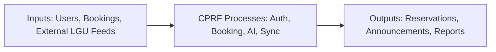

# JOURNAL — Barangay Culiat Facilities Reservation System

**BESTLINK COLLEGE OF THE PHILIPPINES**  
# 1071 Bgy. Kaligayahan, Quirino Hi-Way, Novaliches, Quezon City  

**CENTER FOR RESEARCH AND DEVELOPMENT**

---

## LOCAL GOVERNMENT UNIT 1: AI-DRIVEN FACILITIES RESERVATION SYSTEM WITH PREDICTIVE SCHEDULING FEATURES

**Submitted by:**  
Joricho E. Azuela · Luis Miguel N. Follero · Hajar P. Gili · Daryll Parcia · Gilbert A. Tablac Jr.

**Submitted to:**  
Mr. Ronald G. Roldan Jr. (Capstone Adviser)

**Course:** Bachelor of Science in Information Technology  
**Academic Year:** 2025 – 2026

---

## ABSTRACT

Barangay public facilities in the Philippines are often reserved through manual processes—walk-in requests, phone calls, and informal social media messages—that lead to scheduling conflicts, delayed responses, and poor record-keeping. This study presents the **AI-Driven Facilities Reservation System with Predictive Scheduling Features**, a web-based platform developed for **Barangay Culiat, Quezon City**, to centralize facility booking, staff approvals, attendance tracking, and public communications.

The system implements role-based access for residents, staff, and administrators; AI-assisted conflict detection and facility recommendations; optional auto-approval; integration with **CIMM** (maintenance schedules and blackout dates); connection to the **Quezon City Infrastructure Management System** for barangay-scoped planned construction reports; **UMAN** utilities asset linking; and **Google Gemini** for chatbot assistance and automated public announcements. The application is deployed as a modular PHP/MySQL monolith with optional Python machine-learning services, responsive web UI, and cron-based background jobs for sync, reminders, and compliance archival.

Development followed **Agile Scrum** with iterative sprints. Core modules—authentication, facility management, reservations, attendance, AI scheduling, reports, and LGU integrations—were implemented and verified against the production codebase. This journal documents the project overview, methodology, architecture, testing approach, and preliminary results. **Formal interview and survey data collection is prepared but not yet conducted**; evaluation sections note planned instruments and pending quantitative results.

---

## INTRODUCTION

### Project Overview

This journal documents the capstone project that modernizes facility reservation for Barangay Culiat. The system replaces fragmented manual booking with a single digital platform where residents submit requests online, staff approve or modify bookings, and the public receives timely advisories—including AI-generated announcements when maintenance or staff-declared blackouts affect facilities.

### Background of the Study

Local government units manage shared spaces—covered courts, multipurpose halls, and community venues—that serve daily barangay activities. Without a centralized scheduler, double bookings and unclear availability are common. Digital transformation at barangay level can improve fairness, transparency, and auditability without requiring residents to visit the barangay hall for every inquiry.

Quezon City operates multiple LGU information systems at city scope (e.g., infrastructure project management). Barangay Culiat’s reservation system operates at **barangay scope** but **connects** to city systems where reports are filtered to Culiat-only facilities—particularly planned construction information from Infrastructure Management and maintenance schedules from CIMM.

### Conceptual Framework (IPO Model)

| Input | Process | Output |
|-------|---------|--------|
| Resident registration data, ID documents, booking requests | Validation, AI conflict/risk analysis, approval workflow, integration sync | Approved/denied reservations, notifications, public announcements |
| Staff facility configuration, blackout dates, maintenance feeds | Blackout enforcement, calendar updates, occupancy tracking | Accurate availability, audit logs, operational reports |
| External CIMM/Infrastructure/UMAN feeds | Scheduled sync jobs, dashboard display | Updated facility status, barangay-scoped construction awareness |

### Theoretical Foundation

1. **Digital transformation in local government** — Web self-service reduces friction for residents and staff.  
2. **Agile software development** — Iterative delivery accommodates changing barangay requirements.  
3. **IPO model** — Structures inputs (requests, schedules), processes (validation, AI, approval), and outputs (confirmations, advisories).  
4. **Responsible AI** — ML and Gemini assist decisions; staff retain final approval authority.

### Statement of the Problem

**Main problem:** Barangay Culiat lacks a centralized, intelligent reservation system, causing scheduling conflicts, slow communication, and limited transparency on maintenance and construction impacts.

**Specific problems:**
1. No real-time centralized availability for public facilities  
2. Frequent double bookings and manual conflicts  
3. Delayed or lost reservation requests  
4. Difficulty coordinating maintenance and construction with bookings  
5. Weak audit trail for accountability and reporting  

### Project Objectives

**General:** Develop an AI-driven facility reservation system for Barangay Culiat.

**Specific:**
1. Provide online facility browsing and booking with role-based security  
2. Implement AI conflict detection, recommendations, and risk scoring  
3. Integrate CIMM maintenance and Infrastructure Management (Barangay Culiat scope)  
4. Enable staff workflows for approval, attendance, occupancy, and announcements  
5. Support Data Privacy Act compliance (consent, export, secure documents)  

### Scope and Limitations

**In scope:** Web application, facilities (not equipment inventory module), CIMM sync, integration dashboards, Gemini chatbot, optional PayMongo payments.

**Limitations:**
- No native mobile app (responsive web only)  
- Payments disabled by default for capstone  
- Infrastructure integration: connected for barangay-scoped construction reports; detailed bidirectional automation not yet specified  
- Survey/interview evaluation pending  

---

## METHODOLOGY

### Research Design

A **mixed-methods** design is planned: qualitative stakeholder feedback and quantitative usability metrics. **Interviews and surveys are not yet administered** (see Section “Data Gathering — Status”).

### System Development Model

**Agile Scrum** with sprint planning, daily coordination, sprint review, and backlog refinement.

### System Architecture

**Modular monolith:** PHP front controller (`index.php`), MySQL database, config/service modules, Python ML subprocesses. Logical boundaries mirror microservice domains (auth, booking, facilities, AI, integrations) while deploying as one unit suitable for barangay hosting.

**Integrations:**

| System | Relationship |
|--------|--------------|
| CIMM | Pull maintenance → status + blackouts + optional auto-announcements |
| QC Infrastructure Management | Connected — barangay-filtered planned construction reports |
| UMAN | Asset catalog and facility equipment (when API key set) |
| Google Gemini | Chatbot + announcement text generation |
| PayMongo | Optional payment checkout |

### Data Flow and Process Models

Documented in `docs/SYSTEM_DIAGRAMS_MASTER_COMPLETE.md`:
- DFD Level 0, 1, and 2 (all modules)  
- Work Flow Diagrams (registration, booking, CIMM, blackouts, check-in, archival)  
- BPA Levels 1–3  
- BPMN for registration, booking, approval, reschedule, CIMM, chatbot, attendance, announcements, payments, reports  

### Ethical, Legal, and Security Considerations

**Ethical:** Informed consent at registration; transparent AI assistance; staff override on all approvals.

**Legal:** Data Privacy Act (RA 10173) — privacy policy, user export, retention/archival policies.

**Security:** Bcrypt passwords, OTP/TOTP, CSRF, rate limiting, secure document storage, audit logging, Cloudflare Turnstile on registration.

### Tools and Technologies

| Category | Tools |
|----------|-------|
| Backend | PHP 8.1+, MySQL |
| Frontend | HTML, CSS, JavaScript, Tailwind, Bootstrap |
| AI | Python (scikit-learn), Google Gemini API |
| Email/SMS | SMTP, IPROG/Philsms |
| DevOps | Git, GitHub Actions, cPanel, cron |
| IDE | Visual Studio Code / Cursor |
| Testing | PHPUnit, manual smoke tests |

### Data Gathering Procedures — Status

| Method | Status |
|--------|--------|
| **Interviews with barangay staff** | **Not yet conducted** — question guide prepared (registration workflow, approval pain points, maintenance coordination) |
| **Surveys (Google Forms)** | **Not yet conducted** — Likert-scale instrument prepared per journal template; will include data privacy notice |
| **Document review** | **Conducted** — reviewed manual booking practices, LGU integration requirements (`docs/LGU_INTEGRATIONS.md`) |
| **System testing logs** | **Conducted** — PHPUnit, deployment smoke tests (`docs/DEPLOYMENT_SMOKE_TESTS.md`) |

#### Planned interview themes (when conducted)
- How are reservations handled today?  
- What causes conflicts or delays?  
- How is maintenance communicated to residents?  
- What reports do staff need from the system?  

#### Planned survey sections (when conducted)
- Respondent profile (role, age, experience)  
- Current system assessment (Likert 1–5)  
- CPRF feature evaluation (booking, AI, notifications, integrations)  
- Overall satisfaction and recommendation  

### Stakeholder Power-Interest Matrix (Planned)

| Key | Stakeholder | Power | Interest | Quadrant |
|-----|-------------|-------|----------|----------|
| A | Barangay Admin | 5 | 5 | Manage closely |
| B | Facility Staff | 4 | 5 | Manage closely |
| C | Residents | 2 | 5 | Keep informed |
| D | QC LGU IT (integrations) | 4 | 3 | Keep satisfied |
| E | Capstone adviser | 3 | 4 | Keep informed |

### Testing Procedures

| Level | Activity | Status |
|-------|----------|--------|
| Unit | PHPUnit smoke tests | Implemented in CI |
| Integration | CIMM sync, booking flow, notification delivery | Manual + smoke checklist |
| UAT | Staff/resident walkthrough | Planned post-survey |
| Security | CSRF, auth, document access | Verified in code review |

**Performance observations (development):**
- AI conflict check optimized with debouncing and DB indexes  
- CIMM sync recommended every 15 minutes via cron  

### Statistical Treatment (Planned — Post-Survey)

When surveys are administered, analysis will use:
- **Weighted mean** for Likert items: WM = Σ(f×x) / N  
- **Percentage distribution** for satisfaction responses  
- **Before/after comparison** if pre-implementation baseline collected  

*No survey data is reported in this journal version.*

---

## RESULTS (IMPLEMENTATION OUTCOMES)

### System Functionality

All core modules were implemented in the codebase:

| Module | Result |
|--------|--------|
| Authentication | Registration, OTP, TOTP, TOTP email recovery, reset password |
| User management | Approvals, ID verification tab, violations, create user |
| Public portal | Facilities, announcements, contact, FAQ |
| Booking | Limits, auto-approval, pending/approved tabs, walk-in |
| Facilities | CRUD, blackouts, QR check-in, CIMM sync |
| Attendance | Manual + QR, occupancy monitor, no-show processing |
| AI | Conflict, recommendations, risk, chatbot, Smart Scheduler, Model Lab |
| Communications | Email, SMS, announcements (manual + Gemini auto) |
| Reports & audit | Charts, CSV/PDF, audit export |
| Integrations | CIMM live; Infrastructure connected (thesis); UMAN when configured |

### Operational Efficiency (Development Observations)

- Centralized calendar reduces need for manual ledger cross-checks  
- Auto-decline and booking limits reduce stale pending queue  
- CIMM blackouts block future maintenance dates on booking calendar before facility status flips to “maintenance”  
- Auto-announcements publish maintenance/blackout advisories to public homepage  

### User Feedback

**Pending** — formal survey and interview data not yet collected. Informal developer and adviser walkthroughs informed UI iterations (reservation approval tabs, ID verification queue, upcoming maintenance notices).

### Visual Documentation

Screenshots and diagrams are referenced in:
- `docs/SYSTEM_DIAGRAMS_MASTER_COMPLETE.md`  
- `docs/THESIS_COMPLETE_CH1_TO_CH3.md`  
- Thesis Chapters 4–5 replacement packs  

---

## DISCUSSION

The CPRF system demonstrates that barangay-level LGUs can deploy AI-assisted reservation platforms on affordable LAMP hosting while connecting to city-wide systems at appropriate scope boundaries. CIMM integration shows how maintenance data can flow into availability rules without manual re-entry. The Infrastructure Management connection positions CPRF to receive construction planning awareness for Barangay Culiat even though the city system spans all of Quezon City.

Modular monolith architecture balanced capstone timelines with clear domain separation—important for future extraction of services if the barangay scales to multi-site deployment.

**Limitations:** Evaluation metrics await formal user studies. Infrastructure auto-blocking from construction reports is not yet implemented in code. Payments remain optional.

---

## CONCLUSION

The AI-Driven Facilities Reservation System with Predictive Scheduling Features successfully delivers a centralized, web-based platform for Barangay Culiat facility management. Implemented modules cover the full reservation lifecycle, AI-assisted decision support, attendance and occupancy, LGU integrations (CIMM, Infrastructure connection, UMAN, Gemini), and compliance tooling. The system addresses identified problems of manual booking, conflicts, and poor transparency, with formal user evaluation to follow upon survey and interview completion.

---

## RECOMMENDATIONS

1. **Conduct interviews and surveys** with barangay staff and residents using prepared instruments.  
2. **Complete Infrastructure integration automation** once QC LGU defines report payloads and barangay filtering rules.  
3. **Enable production CIMM cron** and monitor sync metrics on Maintenance Integration page.  
4. **Staff training** on ID verification, approval tabs, blackout announcements, and occupancy monitor.  
5. **Future work:** Filipino UI, PWA, demand forecasting dashboard, health-check endpoint, capacity hard-block.  
6. **Privacy:** Annual review of retention policies and document archival cron logs.  

---

## REFERENCES (Sample — extend for final submission)

- Republic Act No. 10173 (Data Privacy Act of 2012).  
- Quezon City Local Government — digital governance initiatives (contextual).  
- Agile Alliance. (n.d.). *Agile Scrum overview.*  
- Project codebase documentation: `docs/MODULES_LIST.md`, `docs/LGU_INTEGRATIONS.md`, `DATABASE.md`.  

---

## APPENDICES (Reference)

| Appendix | Content |
|----------|---------|
| A | User stories — `docs/USER_STORIES_AND_BACKLOG_COMPLETE.md` |
| B | Product backlog — same document |
| C | DFD/WFD/BPA/BPMN — `docs/SYSTEM_DIAGRAMS_MASTER_COMPLETE.md` |
| D | Thesis Chapters 1–3 — `docs/THESIS_COMPLETE_CH1_TO_CH3.md` |
| E | Deployment smoke tests — `docs/DEPLOYMENT_SMOKE_TESTS.md` |
| F | Survey instrument | **Pending — not administered** |
| G | Interview guide | **Pending — not administered** |

---

*Journal draft aligned to `docs/journal format.txt` structure. Interview/Survey sections marked pending per project status.*
