```mermaid
%% Staff Operations Use Case Diagram (UML-style)
graph LR
    %% Actors (Staff as base, Admin inherits)
    Staff((Staff))
    Admin((Admin))

    %% Simplified inheritance-style link
    %% Interpretation: Admin can do everything Staff can
    Admin -.-> Staff

    %% System boundary as module box
    subgraph StaffBoundary["Facilities Reservation System – Staff Operations Module"]
        UC1([Manage Facilities])
        UC2([Review Reservations])
        UC3([Modify Reservations])
        UC4([Record Violations])
        UC5([View Inquiries])
        UC6([Export Reports])
        UC7([Manage Profile])
    end

    %% Primary actor links
    %% Only draw explicit lines from Staff to keep diagram readable
    Staff --> UC1
    Staff --> UC2
    Staff --> UC3
    Staff --> UC4
    Staff --> UC5
    Staff --> UC6
    Staff --> UC7

    %% Use case relationships
    UC2 -. «include» .- UC2a([Approve or Deny])
    UC3 -. «include» .- UC3a([Add Modification Reason])
    UC4 -. «include» .- UC4a([Set Severity Level])

    %% Styling
    classDef actor fill:#ffffff,stroke:#333,stroke-width:1px;
    classDef usecase fill:#fff9c4,stroke:#666,stroke-width:1px,rx:30,ry:18;

    class Staff,Admin actor;
    class UC1,UC2,UC3,UC4,UC5,UC6,UC7,UC2a,UC3a,UC4a usecase;
```

```mermaid
%% Admin Management Use Case Diagram (UML-style)
graph LR
    %% Actor (primary)
    Admin((Admin))

    %% System boundary as module box
    subgraph AdminBoundary["Facilities Reservation System – Admin Management Module"]
        UC1([Approve/Deny Users])
        UC2([Lock/Unlock Accounts])
        UC3([Full Reservation Oversight])
        UC4([View Audit Trail])
        UC5([Violation Oversight])
        UC6([System Reports])
        UC7([Manage Profile])
    end

    %% Primary actor links (Admin-only capabilities, no labels for cleanliness)
    Admin --> UC1
    Admin --> UC2
    Admin --> UC3
    Admin --> UC4
    Admin --> UC5
    Admin --> UC6
    Admin --> UC7

    %% Use case relationships
    UC1 -. «include» .- UC1a([View User Documents])
    UC2 -. «include» .- UC2a([Provide Lock Reason])
    UC3 -. «include» .- UC3a([Approve/Deny/Modify])
    UC3 -. «include» .- UC3b([Override Auto-Approval])

    %% Styling
    classDef actor fill:#ffffff,stroke:#333,stroke-width:1px;
    classDef usecase fill:#fff9c4,stroke:#666,stroke-width:1px,rx:30,ry:18;

    class Admin actor;
    class UC1,UC2,UC3,UC4,UC5,UC6,UC7,UC1a,UC2a,UC3a,UC3b usecase;
```

# System Diagrams

**Barangay Culiat Public Facilities Reservation System**

This document contains visual diagrams for the system architecture, data flow, use cases, CI/CD pipeline, and infrastructure.

---

## Table of Contents

1. [Data Flow Diagram (DFD)](#1-data-flow-diagram-dfd)
2. [Use Case Diagrams (Modular)](#2-use-case-diagrams-modular)
   - [2.1 Resident Module](#21-resident-module)
   - [2.2 Staff Operations Module](#22-staff-operations-module)
   - [2.3 Admin Management Module](#23-admin-management-module)
3. [CI/CD Pipeline](#3-cicd-pipeline)
4. [Infrastructure Diagram](#4-infrastructure-diagram)

---

## 1. Data Flow Diagram (DFD)

### Context Diagram (Level 0)

```mermaid
graph TB
    Resident[👤 Resident]
    AdminStaff[👨‍💼 Admin/Staff]
    System[🏢 Facilities Reservation System]
    
    Resident -->|Registration Data<br/>Login Credentials<br/>Booking Request| System
    System -->|Confirmation Messages<br/>Session Data<br/>Reservation Status| Resident
    
    AdminStaff -->|Approval Decisions<br/>Management Commands<br/>Reports & Queries| System
    System -->|Approval Notifications<br/>Facility Data<br/>Audit Logs & Reports| AdminStaff
```

### Level 1 DFD - System Overview

---

## 2. Use Case Diagrams (Modular)

### Actor Responsibility Boundaries

| Actor | Responsibility | Primary Scope |
|-------|----------------|---------------|
| **Resident** | End users who register and book barangay facilities. Must be approved before login. Cannot access other users' data or administrative functions. | Self-service: booking, profile, own reservations, notifications, reports |
| **Staff** | LGU/Barangay staff for day-to-day operations. **Inherits Resident capabilities** plus operational privileges. Cannot manage user accounts or view full audit trail. | Operations: facilities, reservations, approvals, violations, inquiries, communications |
| **Admin** | System administrators. **Inherits Staff + Resident capabilities** plus full administrative/security privileges. | Administration: user management, audit trail, security, full system oversight |

---

### 2.1 Resident Module

| Use Case | Description |
|----------|-------------|
| Register Account | Create account with address, documents; pending until approved |
| Login with OTP | Authenticate with email/password + OTP verification |
| Reset Password | Request reset link via email; set new password with token |
| Manage Profile | View/update profile (address, photo, contact info) |
| Browse Facilities | View public facility catalog with details and availability |
| Book Facility | Submit reservation with date, time, purpose; includes conflict check |
| Reschedule | Change date/time of own reservation (within limits) |
| Cancel Reservation | Cancel own reservation |
| View Notifications | View approval/denial/reminder notifications |
| Chat with AI Assistant | Get facility recommendations and booking help via chatbot |
| Export Reports | Export own reservation history (CSV/PDF) |

```mermaid
%% Resident Use Case Diagram (UML-style)
graph LR
    %% Actors (Resident as base, Staff/Admin inherit)
    Resident((Resident))
    Staff((Staff))
    Admin((Admin))
    AI((AI Service))

    %% Simplified inheritance-style links to avoid spaghetti
    %% Interpretation: Staff can do everything Resident can; Admin can do everything Staff can
    Staff -.-> Resident
    Admin -.-> Staff

    %% System boundary as module box
    subgraph SystemBoundary["Facilities Reservation System – Resident Module"]
        UC1([Register Account])
        UC2([Login with OTP])
        UC3([Reset Password])
        UC4([Manage Profile])
        UC5([Browse Facilities])
        UC6([Book Facility])
        UC7([Reschedule Reservation])
        UC8([Cancel Reservation])
        UC9([View Notifications])
        UC10([Chat with AI Assistant])
        UC11([Export Reports])
    end

    %% Primary actor links
    %% Only draw explicit lines from Resident to keep diagram readable
    Resident --> UC1
    Resident --> UC2
    Resident --> UC3
    Resident --> UC4
    Resident --> UC5
    Resident --> UC6
    Resident --> UC7
    Resident --> UC8
    Resident --> UC9
    Resident --> UC10
    Resident --> UC11

    %% Secondary actor link (optional, only where needed)
    AI -.-> UC10

    %% Use case relationships (simplified UML)
    UC2 -. «include» .- UC2a([Verify OTP])
    UC3 -. «include» .- UC3a([Request Reset Link])
    UC3 -. «extend» .- UC3b([Set New Password])
    UC6 -. «include» .- UC6a([Check Availability])
    UC6 -. «include» .- UC6b([Conflict Detection])

    %% Styling to look closer to UML
    classDef actor fill:#ffffff,stroke:#333,stroke-width:1px;
    classDef usecase fill:#fff9c4,stroke:#666,stroke-width:1px,rx:30,ry:18;

    class Resident,Staff,Admin,AI actor;
    class UC1,UC2,UC3,UC4,UC5,UC6,UC7,UC8,UC9,UC10,UC11,UC2a,UC3a,UC3b,UC6a,UC6b usecase;
```

---

### 2.2 Staff Operations Module

| Use Case | Description |
|----------|-------------|
| Manage Facilities | Add, edit, deactivate facilities; set availability and rules |
| Review Reservations | View pending approvals; approve or deny |
| Modify Reservations | Modify/postpone/cancel approved reservations with reason |
| Record Violations | Record no-show, late cancellation, damage with severity |
| View Inquiries | View contact form submissions; respond via email |
| Export Reports | Export facility usage, reservations, operational reports |
| Manage Profile | View/update own profile (same as Resident) |

---

### 2.3 Admin Management Module

| Use Case | Description |
|----------|-------------|
| Approve/Deny Users | Review pending registrations; approve or deny with reason |
| Lock/Unlock Accounts | Lock user accounts; provide lock reason; unlock when resolved |
| Full Reservation Oversight | View all reservations; approve/deny/modify; override auto-approval |
| View Audit Trail | View system audit trail; filter by user, action, date |
| Violation Oversight | View all violations; manage severity; impact on auto-approval |
| System Reports | Export system-wide reports; compliance and analytics |
| Manage Profile | View/update own profile (same as Resident) |

---

### 2.4 Use Case Relationships Summary

| Relationship | Example |
|--------------|---------|
| **«include»** | Login always includes Verify OTP; Book Facility always includes Check Availability and Conflict Detection |
| **«extend»** | Reset Password extends Login (optional path when user forgot password) |
| **Secondary actor** | AI Service supports Chat with AI Assistant; Email supports Reset Password and notifications |

---

## 3. CI/CD Pipeline

### Current Deployment Flow (cPanel)

### Detailed CI/CD Pipeline Steps

---

## 4. Infrastructure Diagram

### Current Infrastructure (cPanel Hosting)

### Infrastructure Components

### Deployment Infrastructure

---

## Diagram Notes

### DFD Notes
- **Processes** are numbered (1.0, 2.0, etc.) and represent major system functions
- **Data Stores** (D1-D10) represent database tables and persistent storage
- **Data Flows** show movement of data between processes, stores, and external entities
- **External Entities** are users and systems outside the application boundary

### Use Case Notes
- **Resident**: Self-service only—booking, profile, own reservations, notifications, reports. AI Assistant is a secondary actor.
- **Staff**: Operations scope—facilities, reservations, approvals, violations, inquiries, reports. No user management or audit trail.
- **Admin**: Full oversight—all Staff capabilities plus user approval/denial, lock/unlock, audit trail, violation oversight, system reports.
- **No System actor**: OTP, notifications, auto-approval, conflict detection are internal behaviors, not actors.

### CI/CD Pipeline Notes
- **Current Setup**: Manual Git-based deployment via cPanel SSH
- **No Automated CI/CD**: Deployment is manual (git pull on server)
- **Config Management**: Git-ignored files (database.php, gemini_config.php) must be manually managed
- **Migrations**: Run manually via phpMyAdmin or command line
- **Rollback**: Manual (git reset or restore from backup)

### Infrastructure Notes
- **Hosting**: IndevFinite cPanel shared hosting
- **Web Server**: Apache with PHP 8.x
- **Database**: MySQL (managed via cPanel phpMyAdmin)
- **File Storage**: Standard file system (public_html directory)
- **External APIs**: Gemini AI (Google AI Studio), SMTP (Gmail/Brevo)
- **No Containerization**: Traditional LAMP stack deployment
- **No Load Balancing**: Single server deployment
- **No CDN**: Static assets served directly from server

---

*Document version: 1.0 | Last updated: January 2025*
