# System Diagrams Master — Complete (DFD, WFD, BPA, BPMN)

**System:** Barangay Culiat Public Facilities Reservation System (CPRF)  
**Version:** 2.0 — July 2026  
**Coverage:** All implemented modules  

---

# TABLE OF CONTENTS

1. [DFD Level 0 — Context](#1-dfd-level-0--context)
2. [DFD Level 1 — System Overview](#2-dfd-level-1--system-overview)
3. [DFD Level 2 — By Module](#3-dfd-level-2--by-module)
4. [Work Flow Diagrams (WFD)](#4-work-flow-diagrams-wfd)
5. [Business Process Architecture (BPA)](#5-business-process-architecture-bpa)
6. [BPMN — Core Processes](#6-bpmn--core-processes)
7. [Data Dictionary (Summary)](#7-data-dictionary-summary)

---

# 1. DFD LEVEL 0 — CONTEXT

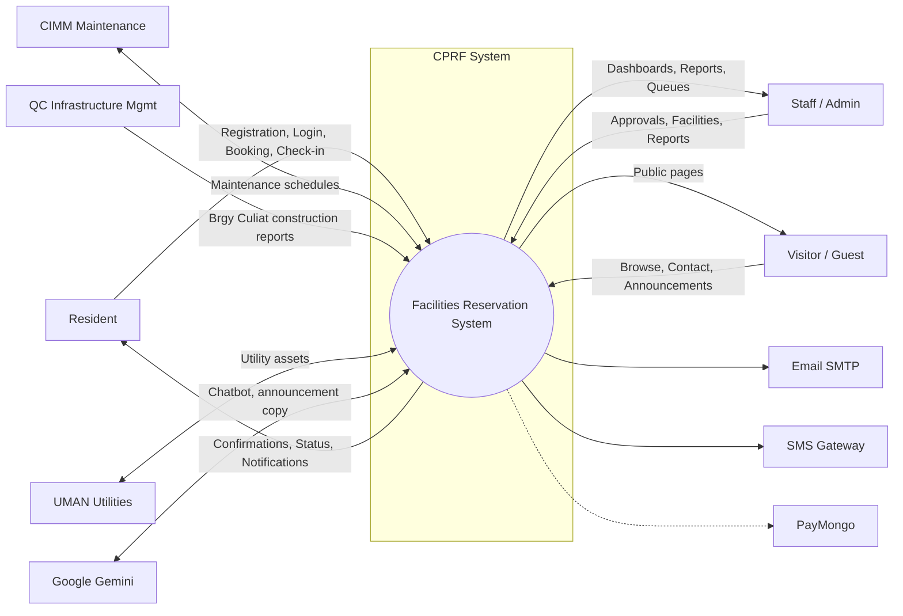
```mermaid
flowchart LR
    RES[Resident]
    STF[Staff / Admin]
    VIS[Visitor / Guest]

    subgraph CPRF["CPRF System"]
        SYS((Facilities Reservation System))
    end

    CIMM[CIMM Maintenance]
    INFRA[QC Infrastructure Mgmt]
    UMAN[UMAN Utilities]
    GEM[Google Gemini]
    SMTP[Email SMTP]
    SMS[SMS Gateway]
    PAY[PayMongo]

    RES -->|Registration, Login, Booking, Check-in| SYS
    STF -->|Approvals, Facilities, Reports| SYS
    VIS -->|Browse, Contact, Announcements| SYS

    SYS -->|Confirmations, Status, Notifications| RES
    SYS -->|Dashboards, Reports, Queues| STF
    SYS -->|Public pages| VIS

    CIMM <-->|Maintenance schedules| SYS
    INFRA -->|Brgy Culiat construction reports| SYS
    UMAN <-->|Utility assets| SYS
    GEM <-->|Chatbot, announcement copy| SYS
    SYS --> SMTP & SMS
    SYS -.-> PAY
```

---

# 2. DFD LEVEL 1 — SYSTEM OVERVIEW

**Processes:**

| # | Process | Description |
|---|---------|-------------|
| 1.0 | Authenticate & Authorize | Login, OTP, TOTP, sessions, RBAC |
| 2.0 | Manage Users | Registration, verification, ID queue, violations |
| 3.0 | Manage Facilities | CRUD, hours, images, QR, blackouts |
| 4.0 | Process Reservations | Book, approve, reschedule, limits, auto-approval |
| 5.0 | Manage Attendance | Check-in/out, occupancy, no-show |
| 6.0 | AI & Scheduling | Conflict, recommendations, risk, chatbot |
| 7.0 | Communicate | Notifications, email, SMS, announcements |
| 8.0 | Report & Audit | Reports, KPIs, audit trail, exports |
| 9.0 | Sync Integrations | CIMM, Infrastructure, UMAN |

**Data stores:**

| Store | Contents |
|-------|----------|
| D1 Users | accounts, roles, verification, preferences |
| D2 Documents | registration IDs, reservation permits (secure) |
| D3 Facilities | facilities, hours, images, equipment links |
| D4 Reservations | bookings, history, violations |
| D5 Blackouts | facility_blackout_dates |
| D6 Notifications | in-app + public announcements |
| D7 Audit | audit_log, security events |
| D8 Sync State | CIMM/announcement JSON state files |

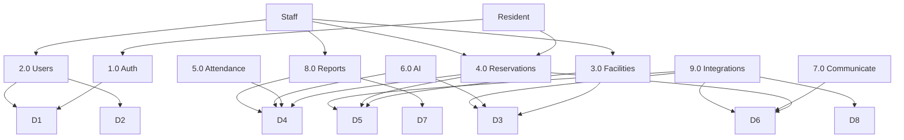
```mermaid
flowchart TB
    RES[Resident] --> P1[1.0 Auth]
    RES --> P4[4.0 Reservations]
    STF[Staff] --> P2[2.0 Users]
    STF --> P3[3.0 Facilities]
    STF --> P4
    STF --> P8[8.0 Reports]

    P1 --> D1
    P2 --> D1 & D2
    P3 --> D3 & D5
    P4 --> D4 & D5 & D6
    P5[5.0 Attendance] --> D4
    P6[6.0 AI] --> D3 & D4
    P7[7.0 Communicate] --> D6
    P8 --> D4 & D7
    P9[9.0 Integrations] --> D3 & D5 & D6
    P9 --> D8
```

---

# 3. DFD LEVEL 2 — BY MODULE

## 3.1 User Management (2.0)

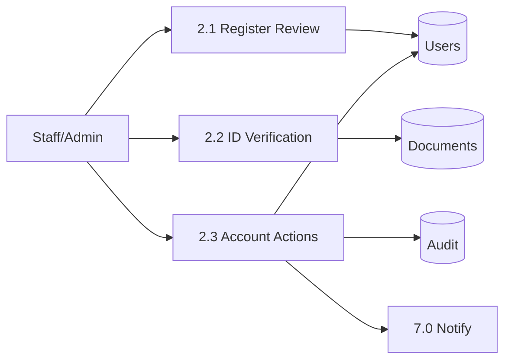
```mermaid
flowchart LR
    STF[Staff/Admin] --> P21[2.1 Register Review]
    STF --> P22[2.2 ID Verification]
    STF --> P23[2.3 Account Actions]
    P21 --> D1[(Users)]
    P22 --> D2[(Documents)]
    P23 --> D1 & D7[(Audit)]
    P23 --> P7[7.0 Notify]
```

## 3.2 Authentication (1.0)

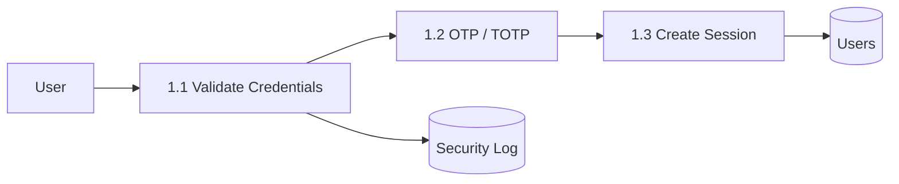
```mermaid
flowchart LR
    U[User] --> P11[1.1 Validate Credentials]
    P11 --> P12[1.2 OTP / TOTP]
    P12 --> P13[1.3 Create Session]
    P13 --> D1[(Users)]
    P11 --> D7[(Security Log)]
```

## 3.3 Facility Management (3.0)

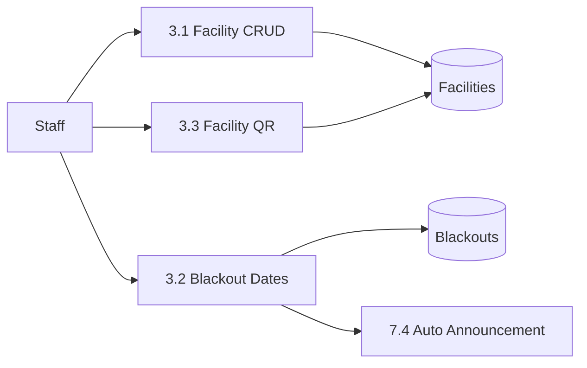
```mermaid
flowchart LR
    STF[Staff] --> P31[3.1 Facility CRUD]
    STF --> P32[3.2 Blackout Dates]
    STF --> P33[3.3 Facility QR]
    P31 --> D3[(Facilities)]
    P32 --> D5[(Blackouts)]
    P32 --> P74[7.4 Auto Announcement]
    P33 --> D3
```

## 3.4 Reservation Management (4.0)

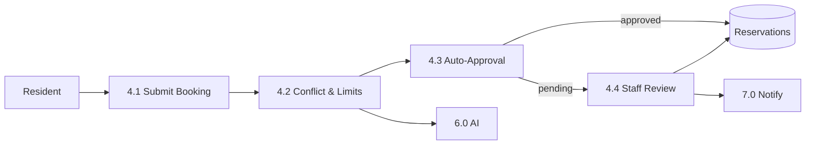
```mermaid
flowchart LR
    RES[Resident] --> P41[4.1 Submit Booking]
    P41 --> P42[4.2 Conflict & Limits]
    P42 --> P43[4.3 Auto-Approval]
    P43 -->|pending| P44[4.4 Staff Review]
    P43 -->|approved| D4[(Reservations)]
    P44 --> D4
    P44 --> P7[7.0 Notify]
    P42 --> P6[6.0 AI]
```

## 3.5 Attendance & Occupancy (5.0)

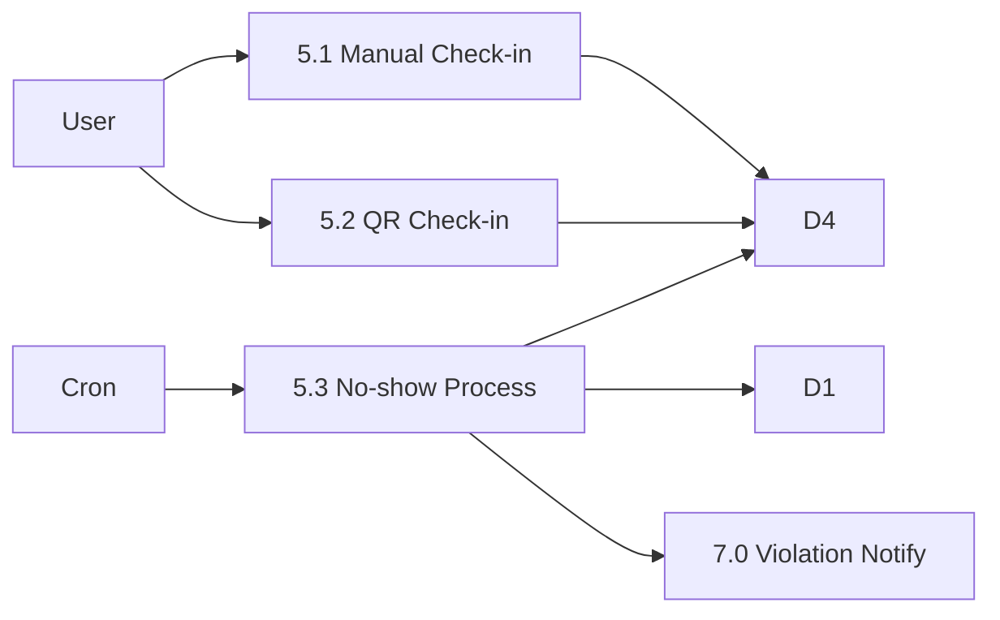
```mermaid
flowchart LR
    RES[User] --> P51[5.1 Manual Check-in]
    RES --> P52[5.2 QR Check-in]
    CRON[Cron] --> P53[5.3 No-show Process]
    P51 & P52 --> D4
    P53 --> D4 & D1
    P53 --> P7[7.0 Violation Notify]
```

## 3.6 AI Module (6.0)

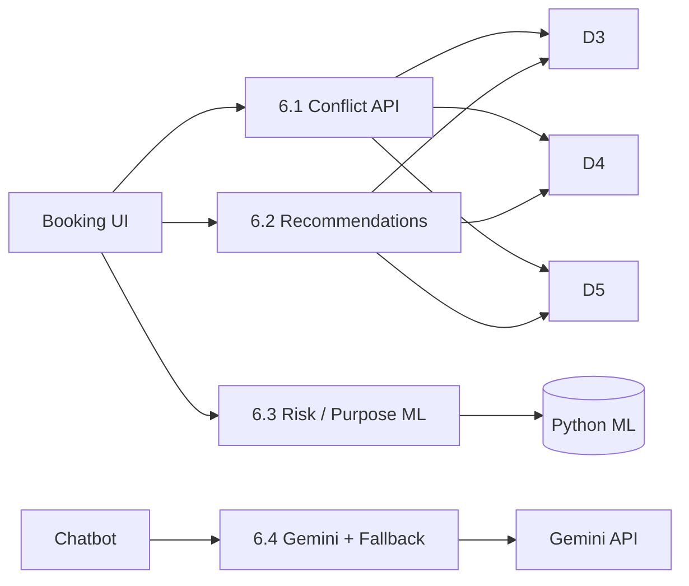
```mermaid
flowchart LR
    UI[Booking UI] --> P61[6.1 Conflict API]
    UI --> P62[6.2 Recommendations]
    UI --> P63[6.3 Risk / Purpose ML]
    CHAT[Chatbot] --> P64[6.4 Gemini + Fallback]
    P61 & P62 --> D3 & D4 & D5
    P63 --> PY[(Python ML)]
    P64 --> GEM[Gemini API]
```

## 3.7 Communications (7.0)

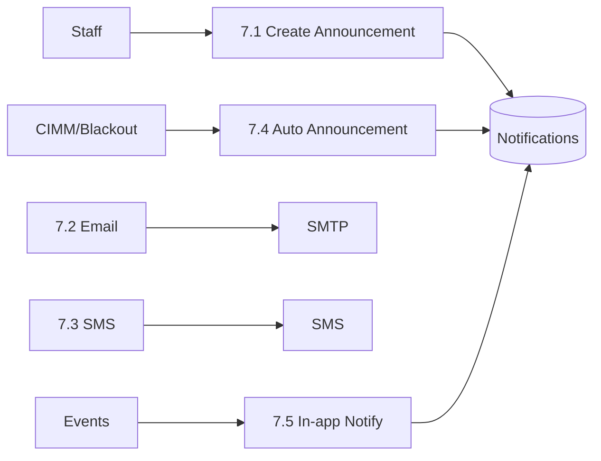
```mermaid
flowchart LR
    STF[Staff] --> P71[7.1 Create Announcement]
    SYNC[CIMM/Blackout] --> P74[7.4 Auto Announcement]
    P71 & P74 --> D6[(Notifications)]
    P72[7.2 Email] --> SMTP[SMTP]
    P73[7.3 SMS] --> SMSGW[SMS]
    EV[Events] --> P75[7.5 In-app Notify]
    P75 --> D6
```

## 3.8 Reports & Audit (8.0)

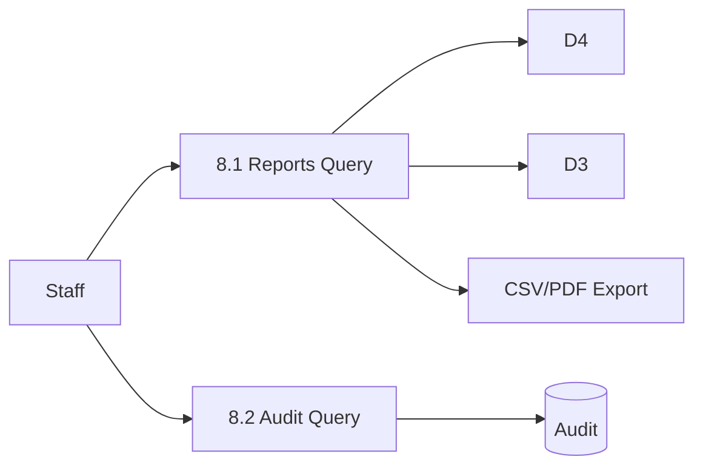
```mermaid
flowchart LR
    STF[Staff] --> P81[8.1 Reports Query]
    STF --> P82[8.2 Audit Query]
    P81 --> D4 & D3
    P82 --> D7[(Audit)]
    P81 --> EXP[CSV/PDF Export]
```

## 3.9 Integrations (9.0)

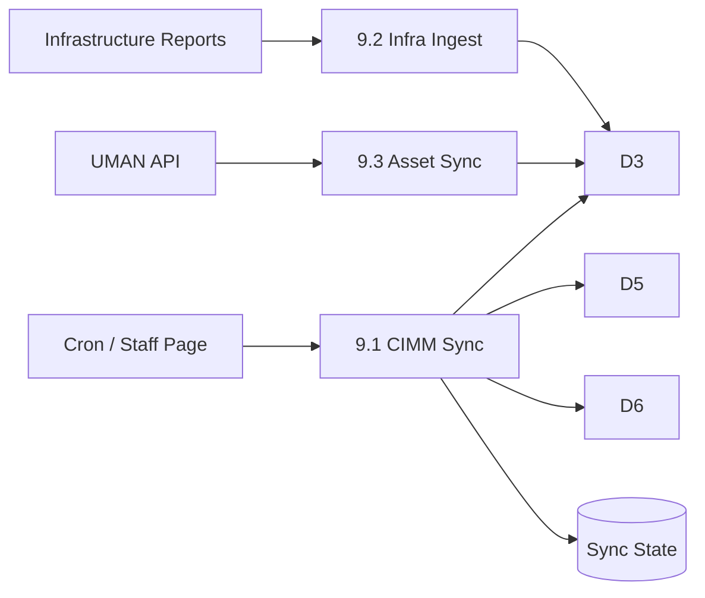
```mermaid
flowchart LR
    CRON[Cron / Staff Page] --> P91[9.1 CIMM Sync]
    P91 --> D3 & D5 & D6
    INFRA[Infrastructure Reports] --> P92[9.2 Infra Ingest]
    P92 --> D3
    UMAN[UMAN API] --> P93[9.3 Asset Sync]
    P93 --> D3
    P91 --> D8[(Sync State)]
```

## 3.10 Public Portal

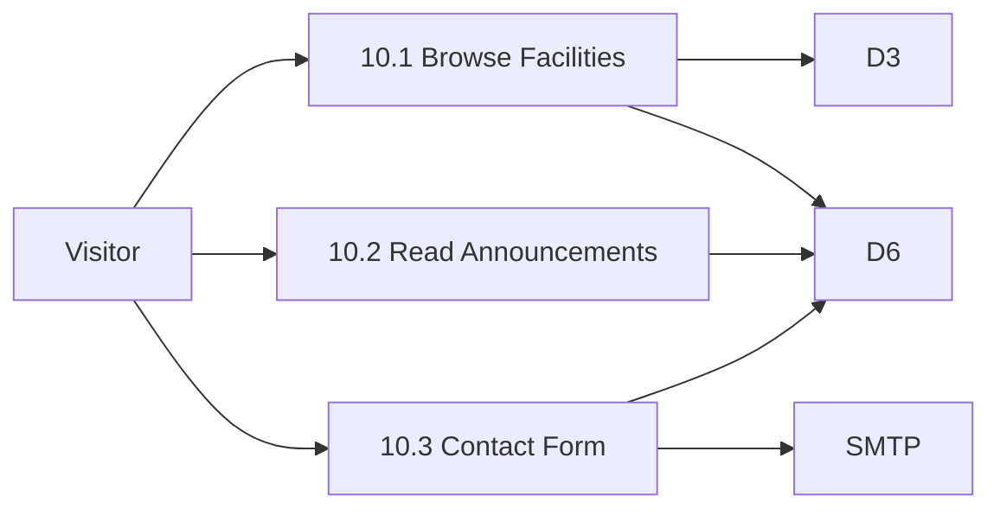
```mermaid
flowchart LR
    VIS[Visitor] --> P101[10.1 Browse Facilities]
    VIS --> P102[10.2 Read Announcements]
    VIS --> P103[10.3 Contact Form]
    P101 --> D3 & D6
    P102 --> D6
    P103 --> D6 & SMTP
```

## 3.11 Calendar

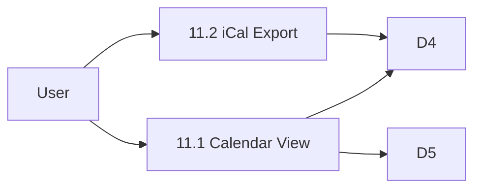
```mermaid
flowchart LR
    U[User] --> P111[11.1 Calendar View]
    P111 --> D4 & D5
    U --> P112[11.2 iCal Export]
    P112 --> D4
```

## 3.12 Document Management

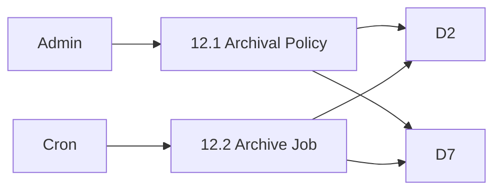
```mermaid
flowchart LR
    ADM[Admin] --> P121[12.1 Archival Policy]
    CRON[Cron] --> P122[12.2 Archive Job]
    P121 & P122 --> D2 & D7
```

## 3.13 System Settings

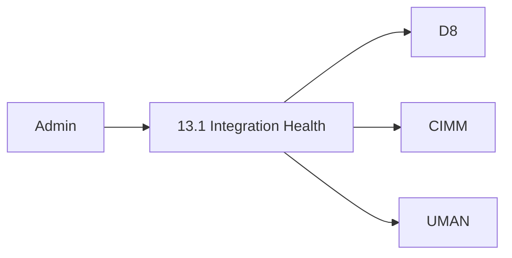
```mermaid
flowchart LR
    ADM[Admin] --> P131[13.1 Integration Health]
    P131 --> D8 & CIMM & UMAN
```

---

# 4. WORK FLOW DIAGRAMS (WFD)

## 4.1 Resident Registration to First Booking

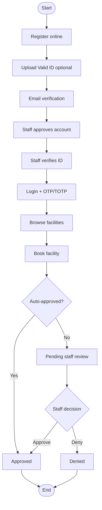
```mermaid
flowchart TD
    A([Start]) --> B[Register online]
    B --> C[Upload Valid ID optional]
    C --> D[Email verification]
    D --> E[Staff approves account]
    E --> F[Staff verifies ID]
    F --> G[Login + OTP/TOTP]
    G --> H[Browse facilities]
    H --> I[Book facility]
    I --> J{Auto-approved?}
    J -->|Yes| K[Approved]
    J -->|No| L[Pending staff review]
    L --> M{Staff decision}
    M -->|Approve| K
    M -->|Deny| N[Denied]
    K --> O([End])
    N --> O
```

## 4.2 Staff Reservation Approval

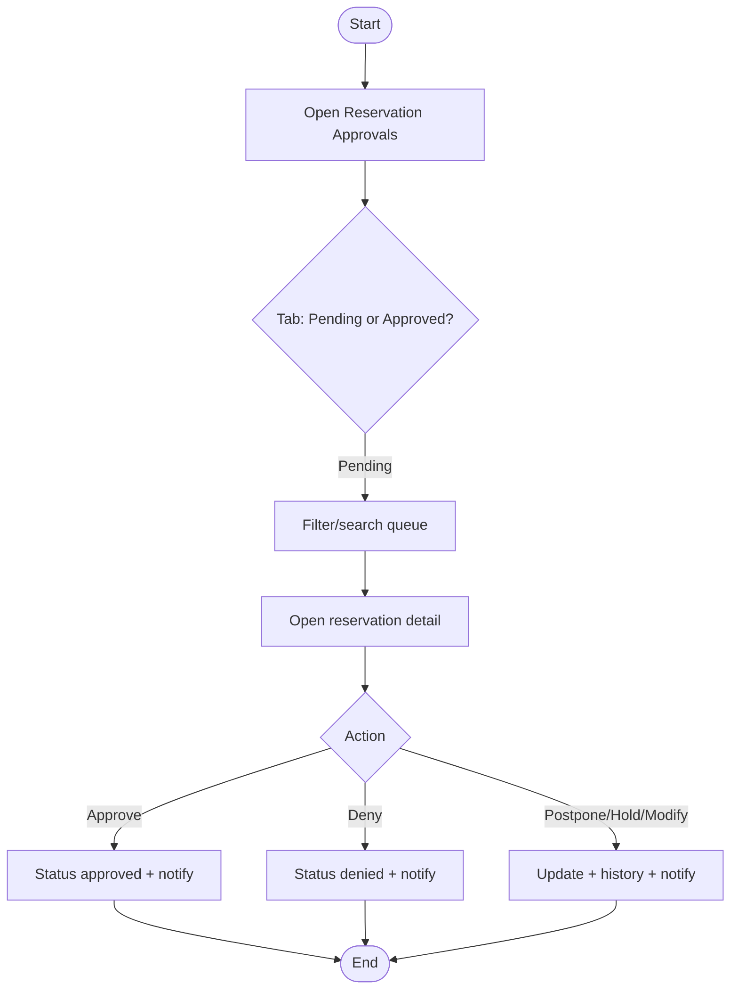
```mermaid
flowchart TD
    A([Start]) --> B[Open Reservation Approvals]
    B --> C{Tab: Pending or Approved?}
    C -->|Pending| D[Filter/search queue]
    D --> E[Open reservation detail]
    E --> F{Action}
    F -->|Approve| G[Status approved + notify]
    F -->|Deny| H[Status denied + notify]
    F -->|Postpone/Hold/Modify| I[Update + history + notify]
    G & H & I --> J([End])
```

## 4.3 CIMM Maintenance Sync

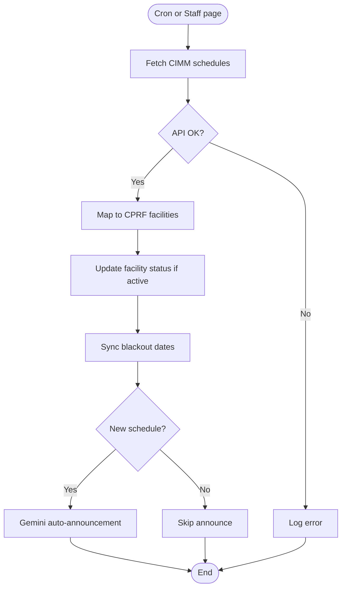
```mermaid
flowchart TD
    A([Cron or Staff page]) --> B[Fetch CIMM schedules]
    B --> C{API OK?}
    C -->|No| D[Log error]
    C -->|Yes| E[Map to CPRF facilities]
    E --> F[Update facility status if active]
    F --> G[Sync blackout dates]
    G --> H{New schedule?}
    H -->|Yes| I[Gemini auto-announcement]
    H -->|No| J[Skip announce]
    I & J --> K([End])
    D --> K
```

## 4.4 CPRF Blackout with Auto-Announcement

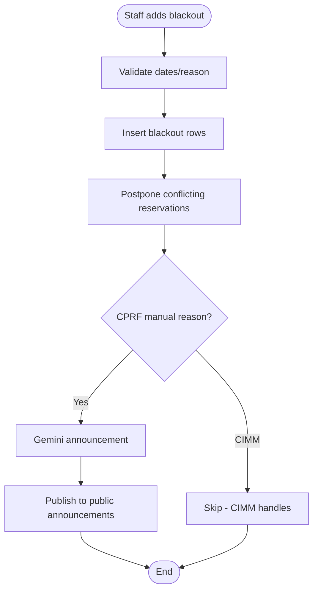
```mermaid
flowchart TD
    A([Staff adds blackout]) --> B[Validate dates/reason]
    B --> C[Insert blackout rows]
    C --> D[Postpone conflicting reservations]
    D --> E{CPRF manual reason?}
    E -->|Yes| F[Gemini announcement]
    E -->|CIMM| G[Skip - CIMM handles]
    F --> H[Publish to public announcements]
    H --> I([End])
    G --> I
```

## 4.5 Facility QR Check-In

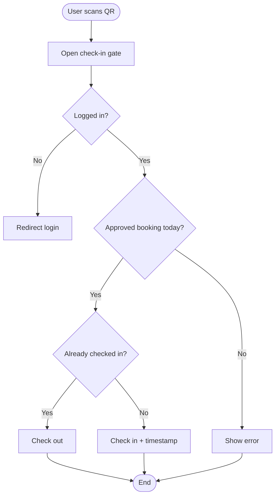
```mermaid
flowchart TD
    A([User scans QR]) --> B[Open check-in gate]
    B --> C{Logged in?}
    C -->|No| D[Redirect login]
    C -->|Yes| E{Approved booking today?}
    E -->|No| F[Show error]
    E -->|Yes| G{Already checked in?}
    G -->|Yes| H[Check out]
    G -->|No| I[Check in + timestamp]
    H & I --> J([End])
    F --> J
```

## 4.6 Document Archival (Cron)

```mermaid
flowchart TD
    A([Daily cron]) --> B[Find documents past retention]
    B --> C[Archive to secure storage]
    C --> D[Log audit entry]
    D --> E([End])
```

---

# 5. BUSINESS PROCESS ARCHITECTURE (BPA)

## 5.1 BPA Level 1 — End-to-End

1. **Citizen Onboarding** — Register → verify email → staff approve → ID verify  
2. **Authentication** — Login → OTP/TOTP → session  
3. **Facility Discovery** — Public browse → details → calendar  
4. **Reservation Request** — Book → AI check → auto-approve or pending  
5. **Staff Governance** — Approve/deny/modify → violations  
6. **Facility Use** — Check-in → occupancy → check-out / no-show  
7. **Maintenance Coordination** — CIMM sync → blackouts → announcements  
8. **Communications** — Notifications, email, SMS, public announcements  
9. **Reporting & Compliance** — Reports, audit, DPA export, archival  

## 5.2 BPA Level 2 — Decomposition

| L1 Process | L2 Sub-processes |
|------------|------------------|
| Onboarding | Capture data, upload ID, validate, staff review, notify |
| Authentication | Credentials, OTP/TOTP, rate limit, session |
| Discovery | List facilities, view details, check availability |
| Reservation | Select slot, validate limits, conflict AI, submit, auto-approve |
| Governance | Queue management, decision, timeline, violations |
| Facility Use | Manual/QR check-in, occupancy, reminders, no-show |
| Maintenance | CIMM pull, map facility, status, blackouts, announce |
| Communications | In-app, email, SMS, announcements manual/auto |
| Compliance | Audit log, reports, export, archive |

## 5.3 BPA Level 3 — Example: Auto-Approval

| Step | Activity | Owner |
|------|----------|-------|
| 3.4.1 | Verify facility auto_approve flag | System |
| 3.4.2 | Check blackout / CIMM dates | System |
| 3.4.3 | Validate duration and capacity | System |
| 3.4.4 | Reject commercial if not allowed | System |
| 3.4.5 | Run conflict detection | AI service |
| 3.4.6 | Check user violations | System |
| 3.4.7 | Verify advance booking window | System |
| 3.4.8 | Set approved or pending | System |
| 3.4.9 | Notify resident and staff | Notification service |

---

# 6. BPMN — CORE PROCESSES

## 6.1 User Registration (BPMN)

```mermaid
flowchart TD
    start((Start)) --> reg[Submit Registration]
    reg --> terms{Terms accepted?}
    terms -->|No| end1((End))
    terms -->|Yes| store[Store user pending]
    store --> email[Send verification email]
    email --> verify{Email verified?}
    verify -->|No| end1
    verify -->|Yes| staff{Staff approves?}
    staff -->|Deny| lock[Lock/deny account]
    staff -->|Approve| active[Activate account]
    active --> end2((End))
    lock --> end2
```

## 6.2 Booking & Auto-Approval (BPMN)

```mermaid
flowchart TD
    start((Start)) --> sel[Select facility/date/time]
    sel --> verified{User verified?}
    verified -->|No| block[Block booking]
    sel --> ai[AI conflict check]
    ai --> conflict{Hard conflict?}
    conflict -->|Yes| alt[Show alternatives]
    alt --> sel
    conflict -->|No| limits{Within limits?}
    limits -->|No| block
    limits -->|Yes| submit[Submit reservation]
    submit --> auto{8 auto-approval rules pass?}
    auto -->|Yes| appr[Set approved]
    auto -->|No| pend[Set pending]
    appr --> notify[Notify user]
    pend --> staff[Staff queue]
    staff --> end((End))
    notify --> end
    block --> end
```

## 6.3 Staff Approval (BPMN)

```mermaid
flowchart TD
    start((Start)) --> open[Open pending tab]
    open --> review[Review reservation]
    review --> dec{Decision}
    dec -->|Approve| a[Update approved]
    dec -->|Deny| d[Update denied]
    dec -->|Modify| m[Update fields + history]
    a & d & m --> log[Audit log]
    log --> n[Notify resident]
    n --> end((End))
```

## 6.4 Reschedule (BPMN)

```mermaid
flowchart TD
    start((Start)) --> req[Resident requests reschedule]
    req --> rules{≥3 days before event and limit OK?}
    rules -->|No| deny[Show error]
    rules -->|Yes| was{Was approved?}
    was -->|Yes| pend[Set pending for re-approval]
    was -->|No| update[Update date/time]
    pend & update --> hist[Add history note]
    hist --> notify[Notify]
    notify --> end((End))
    deny --> end
```

## 6.5 CIMM Integration (BPMN)

```mermaid
flowchart TD
    start((Timer/Staff)) --> fetch[Fetch CIMM API]
    fetch --> ok{Success?}
    ok -->|No| err[Log + show warning]
    ok -->|Yes| map[Match facilities]
    map --> status[Update maintenance status]
    status --> blk[Sync blackout dates]
    blk --> ann{New schedule + Gemini on?}
    ann -->|Yes| pub[Publish announcement]
    ann -->|No| done
    pub --> done((End))
    err --> done
```

## 6.6 AI Chatbot (BPMN)

```mermaid
flowchart TD
    start((User message)) --> key{Gemini key set?}
    key -->|Yes| gem[Call Gemini API]
    key -->|No| ml[ML intent + rules]
    gem --> ok{Response OK?}
    ok -->|No| ml
    ok -->|Yes| reply[Return reply]
    ml --> reply
    reply --> prefill{Prefill booking JSON?}
    prefill -->|Yes| form[Populate booking form]
    prefill -->|No| end((End))
    form --> end
```

## 6.7 Attendance & No-Show (BPMN)

```mermaid
flowchart TD
    start((Event day)) --> remind[Send reminders]
    remind --> grace[Wait grace period]
    grace --> checked{Checked in?}
    checked -->|Yes| end((End))
    checked -->|No| noshow[Mark no-show risk]
    noshow --> viol[Record violation optional]
    viol --> end
```

## 6.8 Announcement Publishing (BPMN)

```mermaid
flowchart TD
    start((Trigger)) --> src{Source}
    src -->|Staff manual| manual[Form: title/message/image]
    src -->|CIMM sync| cimm[Gemini from schedule]
    src -->|CPRF blackout| blk[Gemini from blackout]
    manual & cimm & blk --> insert[Insert public notification]
    insert --> home[Show on home + /announcements]
    home --> end((End))
```

## 6.9 PayMongo Payment (BPMN) — Optional

```mermaid
flowchart TD
    start((Approved + paid facility)) --> en{PAYMENTS_ENABLED?}
    en -->|No| free[Stay approved]
    en -->|Yes| checkout[Create PayMongo session]
    checkout --> pay{Payment success?}
    pay -->|Yes| confirm[Confirm booking]
    pay -->|No| expire[Expire/cancel]
    free & confirm & expire --> end((End))
```

## 6.10 Document Archival (BPMN)

```mermaid
flowchart TD
    start((Cron)) --> find[Find expired documents]
    find --> any{Any found?}
    any -->|No| end((End))
    any -->|Yes| arch[Move to archive]
    arch --> audit[Log audit]
    audit --> end
```

## 6.11 Infrastructure Report Ingest (BPMN) — Connected (thesis)

```mermaid
flowchart TD
    start((Infrastructure System)) --> filter[Filter Brgy Culiat projects]
    filter --> recv[CPRF receives report]
    recv --> display[Display on integration dashboard]
    display --> end((End))
```

> Auto-blocking from infrastructure reports: **Not implemented** in codebase.

## 6.12 Reports Export (BPMN)

```mermaid
flowchart TD
    start((Staff)) --> filt[Apply filters]
    filt --> chart[Render charts]
    chart --> fmt{Export format}
    fmt -->|CSV| csv[Download CSV]
    fmt -->|PDF| pdf[Print/PDF view]
    csv & pdf --> end((End))
```

---

# 7. DATA DICTIONARY (SUMMARY)

| Entity | Key attributes |
|--------|----------------|
| users | id, email, role, status, is_verified, address, coordinates |
| facilities | id, name, capacity, status, operating_hours, image_path, lat/long |
| reservations | id, user_id, facility_id, date, time_slot, status, purpose |
| facility_blackout_dates | facility_id, blackout_date, reason |
| notifications | user_id (null=public), title, message, image_path, link |
| audit_log | user_id, action, module, details, created_at |
| user_documents | user_id, type, path, archived |
| reservation_history | reservation_id, status, note |

Full schema: `database/schema.sql`, `DATABASE.md`.

---

*Render diagrams: Mermaid Live Editor, VS Code Mermaid plugin, or `scripts/generate_thesis_diagrams.php` where applicable.*
