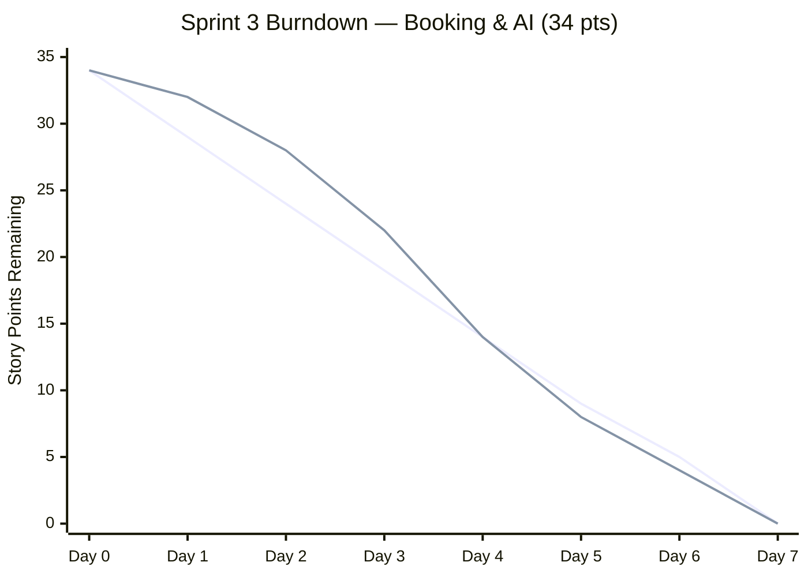

# Chapter 3 — §3.4 Scrum Artifacts (Complete)

**System:** Barangay Culiat Public Facilities Reservation System (CPRF)  
**Authors:** Joricho E. Azuela, Luis Miguel N. Follero, Hajar P. Gili, Daryll Parcia, Gilbert A. Tablac Jr.  
**Institution:** Bestlink College of the Philippines — BS Information Technology  
**Last updated:** July 2026  
**Status rule:** Items reflect **implemented** behavior unless marked *Planned* or *Partial*.

> **How to use in Word:** Copy each section and table into `CHAPTER-3-RESEARCH-2.docx` under **§3.4 Scrum Artifacts**, replacing placeholder rows. Renumber figures/tables to match your thesis. Cross-reference: `docs/USER_STORIES_AND_BACKLOG_COMPLETE.md`, `docs/MODULES_LIST.md`.

---

## 3.4 Scrum Artifacts

Scrum artifacts used in this capstone include the **Product Backlog** (functional and non-functional requirements), specialized **Enterprise Information System (EIS)** backlogs for security, standards, integration, and analytics, the **Sprint Backlog** with task breakdown, **burndown tracking**, and the **Increment** record of working software delivered each sprint. All items were prioritized by the Product Owner and validated against the production codebase at `cprf.infragovservices.com`.

**Definition of Done (DoD)** — applied to every increment:
1. Code merged to the main branch and routed in `index.php`
2. Role permissions declared in `config/permissions.php`
3. Manual smoke test passed (see `docs/DEPLOYMENT_SMOKE_TESTS.md`)
4. Related documentation updated in `docs/`
5. No critical security regressions (CSRF, auth, document access)

---

## 3.4.1 Product Backlog (User Stories)

The Product Backlog is the master list of features for the AI-Driven Facilities Reservation System with Predictive Scheduling Features for **Barangay Culiat**. Items are grouped into four modules (ten features each). Priority: **1 = highest**, **3 = lower**. Status reflects July 2026 implementation.

**Table 3. Product Backlog (User Stories)**

| User Story No. | Features / Task | User Stories | Priority | Status |
|----------------|-----------------|--------------|----------|--------|
| **MODULE 1 — Authentication & User Management** |
| F1 | Resident registration | As a **resident**, I can register with Barangay Culiat street address, contact details, and optional Valid ID so only eligible residents sign up. | 1 | Done |
| F2 | Email verification | As a **resident**, I must verify my email before full system access. | 1 | Done |
| F3 | Login with OTP | As a **resident**, I log in with email/password and complete email OTP verification. | 1 | Done |
| F4 | TOTP (Google Authenticator) | As a **resident**, I can enable TOTP for stronger login security and recover via email if device is lost. | 2 | Done |
| F5 | Password reset | As a **user**, I can reset my password through a secure emailed token. | 1 | Done |
| F6 | Session & abuse controls | As the **system**, I enforce CSRF protection, session timeout, login lockout, and registration rate limits. | 1 | Done |
| F7 | Profile management | As a **resident**, I can update profile, address, geocoordinates, photo, and notification preferences. | 2 | Done |
| F8 | User directory & approval | As **staff/admin**, I can search users and approve, deny, lock, or unlock accounts. | 1 | Done |
| F9 | ID verification queue | As **staff/admin**, I can verify uploaded Valid IDs from a dedicated queue tab. | 1 | Done |
| F10 | Data Privacy export | As a **resident**, I can export my personal data (RA 10173 JSON export). | 2 | Done |
| **MODULE 2 — Public Portal & Facility Management** |
| F11 | Public home page | As a **visitor**, I can view featured facilities and latest announcements on the landing page. | 1 | Done |
| F12 | Facilities listing | As a **visitor**, I can browse public facility listings with images. | 1 | Done |
| F13 | Facility details | As a **visitor**, I can view facility specs, hours, and calendar snapshot. | 1 | Done |
| F14 | Facility CRUD | As **staff/admin**, I can create, edit, and manage facility records. | 1 | Done |
| F15 | Images & citations | As **staff/admin**, I can upload facility images with attribution/citation. | 2 | Done |
| F16 | Hours & geocoding | As **staff/admin**, I can set operating hours and geocode facility location. | 2 | Done |
| F17 | Blackout dates | As **staff/admin**, I can block dates (single or range) to prevent bookings. | 1 | Done |
| F18 | Facility QR poster | As **staff/admin**, I can generate and print facility check-in QR posters. | 2 | Done |
| F19 | Announcements archive | As a **visitor**, I can read public announcements with search and categories. | 2 | Done |
| F20 | Contact inquiries | As a **visitor**, I can submit a contact form; staff manage inquiries in admin inbox. | 2 | Done |
| **MODULE 3 — Booking & Reservations** |
| F21 | Book a facility | As a **resident**, I can submit a reservation (date, time, purpose, attendees, documents). | 1 | Done |
| F22 | AI conflict detection | As a **resident**, I see real-time conflict warnings and alternative time slots. | 1 | Done |
| F23 | AI recommendations | As a **resident**, I receive facility recommendations with distance and purpose scoring. | 1 | Done |
| F24 | Auto-approval engine | As the **system**, I auto-approve bookings when all eight rule checks pass. | 1 | Done |
| F25 | Approval queue tabs | As **staff/admin**, I manage pending and approved reservations in separate tabs with filters. | 1 | Done |
| F26 | Staff decisions | As **staff/admin**, I can approve, deny, postpone, hold, modify, or cancel with reasons. | 1 | Done |
| F27 | My Reservations | As a **resident**, I view my bookings in calendar and list views. | 1 | Done |
| F28 | Reschedule / cancel | As a **resident**, I can reschedule or cancel per system rules (advance notice, limits). | 2 | Done |
| F29 | Walk-in booking | As **staff**, I can book on behalf of a resident at the barangay desk. | 2 | Done |
| F30 | Booking limits | As the **system**, I enforce ≤3 active/30 days, ≤60-day advance, ≤1 booking/day. | 1 | Done |
| **MODULE 4 — AI, Attendance, Reports, Integrations & Admin** |
| F31 | Manual check-in/out | As a **user**, I can manually check in and out with optional photo proof. | 1 | Done |
| F32 | QR check-in/out | As a **user**, I can scan the facility QR to check in/out for today's approved booking. | 1 | Done |
| F33 | Occupancy monitor | As **staff**, I see live occupancy status and can apply overrides. | 2 | Done |
| F34 | Smart Scheduler & chatbot | As a **user**, I use the Smart Scheduler and Gemini AI assistant (with ML fallback). | 1 | Done |
| F35 | Calendar & iCal | As a **user**, I view month/week/day calendar and export to iCal. | 2 | Done |
| F36 | Reports & export | As **staff/admin**, I view KPI charts and export CSV/PDF reports. | 1 | Done |
| F37 | CIMM maintenance sync | As **staff**, I sync CIMM schedules to facility status/blackouts; system auto-announces. | 1 | Done* |
| F38 | Integration dashboards | As **staff**, I view Infrastructure (Brgy Culiat) and UMAN utility integration pages. | 2 | Done* |
| F39 | Audit & documents | As **admin**, I manage audit trail, document retention, and archival cron. | 1 | Done |
| F40 | Notifications | As a **user**, I receive in-app, email, and SMS (opt-in) notifications on key events. | 1 | Done |

\* Requires API keys and/or cron on production (`CIMM_API_KEY`, `UMAN_API_KEY`).

**Future backlog (not in Table 3):** Filipino/Tagalog UI, PWA, bulk CSV user import, staff daily digest email, infrastructure auto-blackout — see `docs/USER_STORIES_AND_BACKLOG_COMPLETE.md` Part B.3.

---

## 3.4.2 Product Backlog for EIS Information Security

Security requirements align with LGU information-system standards, the Data Privacy Act (RA 10173), and OWASP-oriented web application practices implemented in CPRF.

**Table 4. Product Backlog for EIS Information Security**

| EIS No. | EIS User Stories | EIS IS Priority | Revision Priority | Status |
|---------|------------------|-----------------|-------------------|--------|
| IS-1 | As the **system**, I hash passwords with bcrypt and enforce password complexity on registration and reset. | 1 | 1 | Done |
| IS-2 | As the **system**, I validate CSRF tokens on all state-changing forms and API actions. | 1 | 1 | Done |
| IS-3 | As the **system**, I rate-limit login and registration attempts and lock accounts after repeated failures. | 1 | 1 | Done |
| IS-4 | As a **user**, I complete email OTP on login; I may enable TOTP (Google Authenticator) with email recovery. | 1 | 2 | Done |
| IS-5 | As the **system**, I present Cloudflare Turnstile captcha on registration when enabled. | 2 | 2 | Done |
| IS-6 | As the **system**, I store uploaded IDs and permits outside web root with role-based download access. | 1 | 1 | Done |
| IS-7 | As **admin**, I can query audit logs for user, reservation, and configuration actions. | 1 | 2 | Done |
| IS-8 | As a **resident**, I can export my personal data; registration requires Terms and Privacy acceptance. | 1 | 2 | Done |
| IS-9 | As the **system**, I regenerate session IDs, enforce timeout, and use secure cookie flags. | 1 | 1 | Done |
| IS-10 | As **admin**, I can lock users with documented reason and email notification. | 2 | 3 | Done |

---

## 3.4.3 Product Backlog for EIS Standards

Development and architecture standards ensure maintainability, deployability, and alignment with the capstone's modular monolith design (not containerized microservices).

**Table 5. Product Backlog for EIS Standards**

| EIS Standard No. | EIS Standard User Stories | EIS Standard Priority | Revision Priority | Status |
|------------------|---------------------------|----------------------|-------------------|--------|
| STD-1 | As a **developer**, I follow a single-entry modular monolith routed through `index.php` with views under `resources/views/`. | 1 | 1 | Done |
| STD-2 | As a **developer**, I use MySQL with normalized schema (`database/schema.sql`) and versioned migrations. | 1 | 1 | Done |
| STD-3 | As the **system**, I enforce role-based access (Resident, Staff, Admin) via `config/permissions.php`. | 1 | 1 | Done |
| STD-4 | As a **developer**, I configure secrets and integrations through `.env` (never committed). | 1 | 1 | Done |
| STD-5 | As a **developer**, I run PHPUnit smoke tests in GitHub Actions CI on push. | 2 | 2 | Done |
| STD-6 | As an **operator**, I run documented cron jobs for reminders, CIMM sync, archival, and auto-decline. | 2 | 2 | Done |

### 3.4.3.1 UI/UX (Icons, Color, etc…)

User interface standards support accessibility, mobile use, and consistent LGU branding across public and dashboard surfaces.

**Table 5.1. Product Backlog for EIS Standards — UI/UX**

| EIS Standard No. | EIS Standard User Stories | EIS Standard Priority | Revision Priority | Status |
|------------------|---------------------------|----------------------|-------------------|--------|
| UI-1 | As a **user**, I can use the system on mobile without horizontal scrolling on core booking flows. | 1 | 1 | Done |
| UI-2 | As a **user**, I see consistent status badges (pending, approved, denied, maintenance) with semantic colors. | 1 | 1 | Done |
| UI-3 | As a **user**, I can enable dark mode on dashboard pages. | 2 | 2 | Done |
| UI-4 | As a **user**, I confirm destructive actions (cancel, delete) through modal dialogs. | 1 | 2 | Done |
| UI-5 | As a **user**, I receive inline validation messages on forms (registration, booking, profile). | 1 | 1 | Done |
| UI-6 | As a **visitor**, I see a modern public landing design with high-contrast cards and facility imagery. | 2 | 3 | Done |
| UI-7 | As a **user**, I navigate grouped sidebar sections with collapsible state persistence. | 2 | 3 | Done |
| UI-8 | As a **visitor**, I see image citations/attribution on facility photos where required. | 3 | 3 | Done |
| UI-9 | As a **user**, I use the redesigned Reservations Management page with tabbed pending/approved queues. | 1 | 1 | Done |
| UI-10 | As a **resident**, I see upcoming CIMM maintenance chips on the booking calendar before maintenance starts. | 2 | 2 | Done |

**Not implemented UI standards (future):** Filipino/Tagalog language toggle (UI-11, planned); PWA install prompt (UI-12, planned).

---

## 3.4.4 Product Backlog for EIS Integration

Integration backlog items connect CPRF to Quezon City LGU systems and third-party services. Scope is **facilities only**; equipment reservation is out of scope.

**Table 6. Product Backlog for EIS Integration**

| EIS Integration No. | EIS Integration User Stories | EIS Integration Priority | Revision Priority | Status |
|---------------------|------------------------------|--------------------------|-------------------|--------|
| INT-1 | As **staff**, I pull CIMM maintenance schedules, update facility status/blackouts, and postpone conflicts. | 1 | 1 | Done* |
| INT-2 | As **staff**, I view QC Infrastructure planned construction reports filtered to **Barangay Culiat**. | 1 | 2 | Connected† |
| INT-3 | As **staff**, I assign UMAN utility assets to facilities when UMAN API is configured. | 2 | 2 | Done* |
| INT-4 | As the **system**, I use Google Gemini for chatbot replies and auto-written public maintenance/blackout announcements. | 1 | 1 | Done* |
| INT-5 | As a **resident**, I can pay via PayMongo when payments are enabled for a facility. | 3 | 3 | Optional‡ |
| INT-6 | As the **system**, I send transactional email (SMTP) and SMS (opt-in) for OTP, approvals, and reminders. | 1 | 1 | Done |
| INT-7 | As the **system**, I expose public availability API for guest assistant widget (`/api/public/availability`). | 2 | 2 | Done |
| INT-8 | As an **external system**, I POST to unified `/api/integrations/*` gateway. | 3 | 3 | Not implemented |

\* Requires `CIMM_API_KEY` / `UMAN_API_KEY` / `GEMINI_API_KEY` and cron where applicable.  
† **Connected (thesis):** dashboard receives barangay-scoped construction reports; live auto-blackout from infrastructure timelines is **not implemented**.  
‡ `PAYMENTS_ENABLED=false` by default for capstone (free facility use policy).

---

## 3.4.5 Product Backlog for Analytics

Analytics backlog covers operational reporting inside CPRF and enterprise-level insights for LGU decision-making.

### 3.4.5.1 Application System Analytics

In-application analytics help staff monitor reservations, occupancy, and facility utilization.

**Table 7. Product Backlog for Analytics — Application System Analytics**

| ASA No. | EIS Integration User Stories | EIS Integration Priority | Revision Priority | Status |
|---------|------------------------------|--------------------------|-------------------|--------|
| ASA-1 | As **staff/admin**, I view dashboard KPI charts with date-range filters. | 1 | 1 | Done |
| ASA-2 | As **staff/admin**, I generate reservation reports by status, facility, and date range. | 1 | 1 | Done |
| ASA-3 | As **staff/admin**, I export filtered report data to CSV. | 1 | 2 | Done |
| ASA-4 | As **staff/admin**, I print or save PDF views of reports. | 2 | 2 | Done |
| ASA-5 | As **staff**, I monitor live occupancy from check-in state on the occupancy dashboard. | 1 | 1 | Done |
| ASA-6 | As **staff/admin**, I view calendar aggregates (month/week/day) for booking density. | 2 | 2 | Done |
| ASA-7 | As **admin/dev**, I use AI Model Lab to test ML models and demo scenarios. | 3 | 3 | Done |
| ASA-8 | As **staff**, I see full demand-forecasting dashboard in Reports. | 2 | 2 | Partial |

### 3.4.5.2 EIS Analytics

Enterprise analytics support compliance, audit, and cross-system visibility.

**Table 8. EIS Analytics**

| EIS Analytics No. | EIS Analytics Stories | EIS Analytics Priority | Revision Priority | Status |
|-------------------|----------------------|------------------------|-------------------|--------|
| EA-1 | As **admin**, I query and export audit trail to PDF for compliance reviews. | 1 | 1 | Done |
| EA-2 | As **staff/admin**, I view per-user violation history for governance decisions. | 1 | 2 | Done |
| EA-3 | As **staff**, I infer facility utilization trends from reservation and check-in data. | 2 | 2 | Done |
| EA-4 | As **admin**, I view integration health and sync status on system settings pages. | 2 | 2 | Done |
| EA-5 | As **staff**, I track CIMM sync statistics (last run, records updated) on maintenance page. | 2 | 2 | Done |
| EA-6 | As **admin**, I use unified health-check endpoint (DB, mail, ML, CIMM). | 3 | 3 | Not implemented |

---

## 3.4.6 Sprint Backlog (User Stories)

Work was organized in **weekly sprints** (Agile Scrum) from November 2025 through July 2026. Each sprint task maps to Product Backlog or EIS items. Task phases: **PLANNING → DESIGN → CODE → DOCUMENTATION**.

**Table 9. Sprint Backlog (User Stories)**

| Task No. | User Story No. | User Stories | Tasks | Timeline | Responsible Team Member/s |
|----------|----------------|--------------|-------|----------|---------------------------|
| **SPRINT 1 — Dec 12–Dec 25, 2025 · Authentication & Security Foundation** |
| S1_1 | IS-1, IS-3, F6 | Enforce password policy, login lockout, and registration rate limits | PLANNING · DESIGN · CODE · DOCUMENTATION | Dec 12–18 | L. Follero, G. Tablac Jr. |
| S1_2 | F1, F2 | Resident registration with Barangay Culiat address and email verification | PLANNING · DESIGN · CODE · DOCUMENTATION | Dec 12–18 | L. Follero |
| S1_3 | F3, IS-4 | Email OTP login flow and OTP email templates | PLANNING · DESIGN · CODE · DOCUMENTATION | Dec 12–18 | L. Follero, G. Tablac Jr. |
| S1_4 | F5 | Forgot/reset password with secure token emails | PLANNING · DESIGN · CODE · DOCUMENTATION | Dec 19–25 | G. Tablac Jr. |
| S1_5 | IS-2, IS-9 | CSRF protection, session timeout, secure cookies | PLANNING · DESIGN · CODE · DOCUMENTATION | Dec 19–25 | L. Follero |
| **SPRINT 2 — Dec 26, 2025–Jan 8, 2026 · Profile, Documents & Facilities** |
| S2_1 | F7, IS-6 | Profile geocoding, document upload validation, secure storage | PLANNING · DESIGN · CODE · DOCUMENTATION | Dec 26–Jan 1 | L. Follero, G. Tablac Jr. |
| S2_2 | F8, F9 | User management directory, approval workflow, ID verification tab | PLANNING · DESIGN · CODE · DOCUMENTATION | Dec 26–Jan 1 | L. Follero |
| S2_3 | F11–F13 | Public home, facilities listing, facility details pages | PLANNING · DESIGN · CODE · DOCUMENTATION | Jan 2–8 | G. Tablac Jr., H. Gili |
| S2_4 | F14–F16 | Facility CRUD, images, hours, geocoding | PLANNING · DESIGN · CODE · DOCUMENTATION | Jan 2–8 | L. Follero |
| S2_5 | UI-1, UI-6 | Responsive public UI polish and landing design | PLANNING · DESIGN · CODE · DOCUMENTATION | Jan 2–8 | G. Tablac Jr., D. Parcia |
| **SPRINT 3 — Jan 9–Jan 22, 2026 · Booking, AI & Approvals** |
| S3_1 | F21, F30 | Core booking form, limits, and validation rules | PLANNING · DESIGN · CODE · DOCUMENTATION | Jan 9–14 | L. Follero |
| S3_2 | F22, F23 | AI conflict detection and facility recommendations APIs | PLANNING · DESIGN · CODE · DOCUMENTATION | Jan 9–14 | L. Follero, J. Azuela |
| S3_3 | F24 | Eight-condition auto-approval engine | PLANNING · DESIGN · CODE · DOCUMENTATION | Jan 9–14 | L. Follero |
| S3_4 | F25, F26 | Staff approval queue, pending/approved tabs, decision actions | PLANNING · DESIGN · CODE · DOCUMENTATION | Jan 15–22 | L. Follero, G. Tablac Jr. |
| S3_5 | F27, F28 | My Reservations, reschedule, cancel flows | PLANNING · DESIGN · CODE · DOCUMENTATION | Jan 15–22 | G. Tablac Jr. |
| **SPRINT 4 — Jan 23–Feb 28, 2026 · Attendance, Calendar & Reports** |
| S4_1 | F31, F32 | Manual and QR facility check-in/out | PLANNING · DESIGN · CODE · DOCUMENTATION | Jan 23–31 | L. Follero |
| S4_2 | F33 | Live occupancy monitor and no-show processing | PLANNING · DESIGN · CODE · DOCUMENTATION | Jan 23–31 | G. Tablac Jr. |
| S4_3 | F35 | Calendar views and iCal export | PLANNING · DESIGN · CODE · DOCUMENTATION | Feb 1–14 | G. Tablac Jr. |
| S4_4 | F36, ASA-1–ASA-4 | Reports page, KPI filters, CSV/PDF export | PLANNING · DESIGN · CODE · DOCUMENTATION | Feb 1–14 | L. Follero, D. Parcia |
| S4_5 | F34 | Smart Scheduler page and Python ML service integration | PLANNING · DESIGN · CODE · DOCUMENTATION | Feb 15–28 | L. Follero, J. Azuela |
| **SPRINT 5 — Mar–Jul 2026 · Integrations, Compliance & Polish** |
| S5_1 | INT-1, F37 | CIMM sync, blackout dates, Gemini auto-announcements | PLANNING · DESIGN · CODE · DOCUMENTATION | Mar–Apr | L. Follero |
| S5_2 | INT-4 | Gemini chatbot with ML/rules fallback and booking prefill | PLANNING · DESIGN · CODE · DOCUMENTATION | Apr–May | L. Follero |
| S5_3 | F39, EA-1 | Audit trail, document archival cron, DPA export (F10) | PLANNING · DESIGN · CODE · DOCUMENTATION | May | G. Tablac Jr., H. Gili |
| S5_4 | INT-2, INT-3, F38 | Infrastructure and UMAN integration dashboards | PLANNING · DESIGN · CODE · DOCUMENTATION | May–Jun | J. Azuela, D. Parcia |
| S5_5 | UI-9, UI-10, F17 | Reservations UI redesign, blackout announcements, maintenance calendar chips | PLANNING · DESIGN · CODE · DOCUMENTATION | Jun–Jul | L. Follero, G. Tablac Jr. |

**Research support (all sprints):** J. Azuela (PM/lead researcher), H. Gili and D. Parcia (requirements research, testing, documentation).

---

### 3.4.6.1 Sprint Burndown Chart

Story points were estimated per sprint using a modified Fibonacci scale (1, 2, 3, 5, 8). **Sprint 3** (booking + AI) is shown below as the representative burndown; similar charts were maintained for Sprints 1–5 during development.

**Sprint 3 summary:** 34 story points · 7-day sprint · Team velocity ≈ 34 points/sprint

**Table 10. Sprint 3 Burndown Data (Story Points Remaining)**

| Day | Date (approx.) | Ideal Remaining | Actual Remaining | Notes |
|-----|----------------|-----------------|------------------|-------|
| 0 | Jan 9 | 34 | 34 | Sprint planning — S3_1 to S3_5 committed |
| 1 | Jan 10 | 29 | 32 | Booking form scaffold; AI API design |
| 2 | Jan 11 | 24 | 28 | F21 validation; conflict API wired |
| 3 | Jan 12 | 19 | 22 | F22/F23 integrated on book page |
| 4 | Jan 13 | 14 | 14 | F24 auto-approval complete |
| 5 | Jan 14 | 9 | 8 | F25 tabbed approvals started |
| 6 | Jan 15 | 5 | 4 | F26 decision actions |
| 7 | Jan 16 | 0 | 0 | F27/F28 done; sprint review |

**Figure — Sprint 3 Burndown Chart (insert in Word)**

**Alternative for Word:** Export the chart from [Mermaid Live Editor](https://mermaid.live) as PNG, or recreate in Excel using Table 10 values (Ideal = linear burn from 34 to 0; Actual = column "Actual Remaining").

**Sprint point totals (reference):**

| Sprint | Theme | Committed Points | Status |
|--------|-------|------------------|--------|
| Sprint 1 | Auth & security | 28 | Completed |
| Sprint 2 | Profile, facilities, public UI | 30 | Completed |
| Sprint 3 | Booking, AI, approvals | 34 | Completed |
| Sprint 4 | Attendance, calendar, reports | 32 | Completed |
| Sprint 5 | Integrations, compliance, polish | 36 | Completed |

---

## 3.4.7 Increment

Each sprint produced a **potentially shippable increment** deployed to staging and, after review, to production (`cprf.infragovservices.com`).

**Table 11. Increment**

| Sprint No. | Increment / Feature Delivered | User Story / Backlog Reference | Definition of Done (DoD) Criteria | Status | Remarks |
|------------|------------------------------|----------------------------------|-----------------------------------|--------|---------|
| Sprint 1 | Secure registration and login module | F1–F3, F5–F6, IS-1–IS-4, IS-9 | Code complete · Unit/smoke tested · DB integrated · Docs updated | Done | OTP login and lockout working |
| Sprint 1 | Password reset and session hardening | F5, IS-2, IS-9 | Token emails delivered · CSRF on forms · Session timeout verified | Done | Production email via SMTP |
| Sprint 2 | User profile and document handling | F7, IS-6, F8 | Upload validation · Secure paths · Admin review in User Management | Done | PDF/JPG/PNG/WebP supported |
| Sprint 2 | Public portal and facility management | F11–F16, UI-1, UI-6 | Public pages live · Facility CRUD · Geocoding on map | Done | OpenStreetMap integration |
| Sprint 2 | ID verification queue | F9 | Dedicated tab · Verify/redo workflow · Booking gate for unverified IDs | Done | July 2026 enhancement |
| Sprint 3 | Booking and AI scheduling core | F21–F24, F30 | Book form · Conflict API · Recommendations · Auto-approval | Done | Python ML + PHP orchestration |
| Sprint 3 | Staff approval operations | F25–F28 | Pending/approved tabs · Approve/deny/modify · My Reservations | Done | Tabbed UI redesign Jul 2026 |
| Sprint 4 | Attendance and occupancy | F31–F33 | Manual + QR check-in · Occupancy strip · No-show violations | Done | Facility QR posters |
| Sprint 4 | Calendar and analytics | F35–F36, ASA-1–ASA-4 | iCal export · Reports CSV/PDF · Dashboard KPI filters | Done | Print-ready CSS |
| Sprint 4 | Smart Scheduler & chatbot foundation | F34 | Smart Scheduler page · ML risk/purpose · Chat widget shell | Done | Gemini added Sprint 5 |
| Sprint 5 | CIMM integration & auto-announcements | F37, INT-1, INT-4 | CIMM pull sync · Blackout sync · Gemini public posts | Done | Cron + manual sync page |
| Sprint 5 | CPRF blackout Gemini announcements | F17, INT-4 | Manual blackout → auto public notification with facility photo | Done | July 2026 |
| Sprint 5 | Infrastructure & UMAN dashboards | F38, INT-2, INT-3 | Integration pages · Brgy Culiat scope · UMAN asset assign | Connected† | Auto-blackout not implemented |
| Sprint 5 | Compliance and admin tools | F39, F10, EA-1 | Audit export · Document archival cron · DPA JSON export | Done | Retention policy in admin |
| Sprint 5 | Notifications and communications | F40, INT-6 | In-app · Email · SMS opt-in · Booking reminders cron | Done | Brevo/SMTP configurable |
| Sprint 5 | Optional PayMongo payments | INT-5 | Checkout session · Webhook · Payment return page | Optional | Disabled by default |
| — | Filipino UI / PWA / health endpoint | UI-11, UI-12, EA-6, INT-8 | — | Planned | Future backlog |

† Infrastructure: **connected** for barangay-scoped construction reports per thesis scope; technical connection mechanics not expanded in this chapter.

---

## Appendix — Traceability Quick Reference

| Thesis ID | Maps to User Story Doc |
|-----------|------------------------|
| F1–F10 | US-1.x, US-2.x (`USER_STORIES_AND_BACKLOG_COMPLETE.md`) |
| F11–F20 | US-3.x, US-4.x |
| F21–F30 | US-5.x |
| F31–F40 | US-6.x – US-11.x |
| IS-1–IS-10 | Security epic + `config/security.php` |
| INT-1–INT-8 | US-10.x integrations |
| ASA-1–ASA-8 | US-7.x, US-8.x analytics |
| EA-1–EA-6 | US-8.x, US-11.x compliance |

---

*End of §3.4 Scrum Artifacts — ready for Word paste.*
