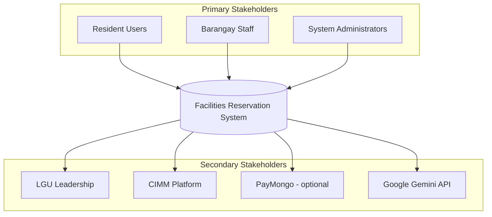
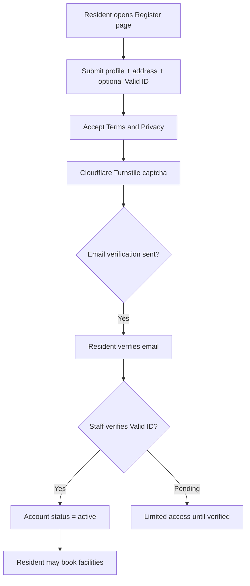
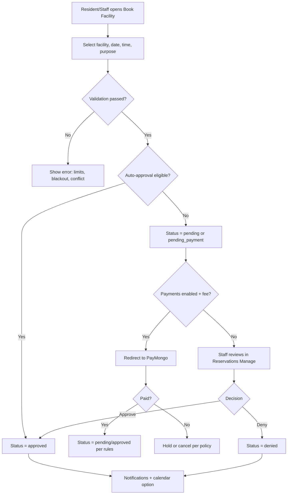
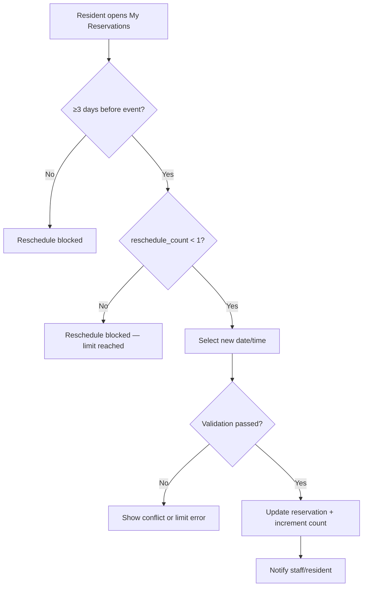
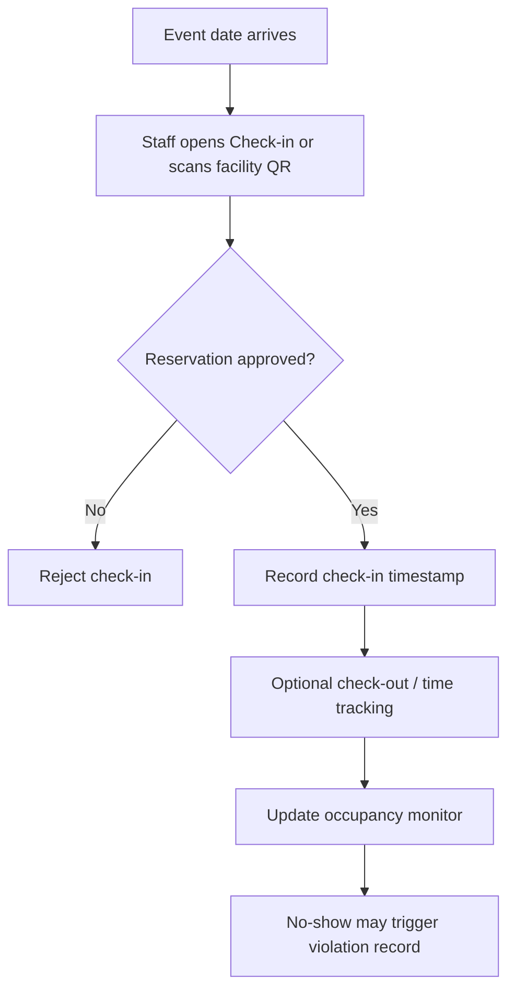
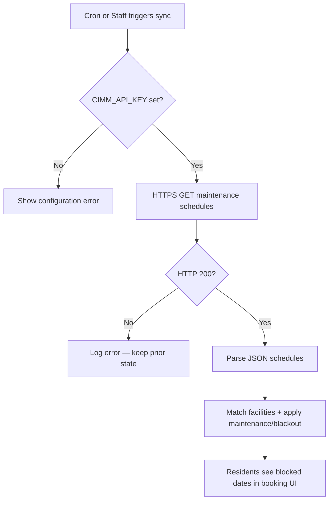
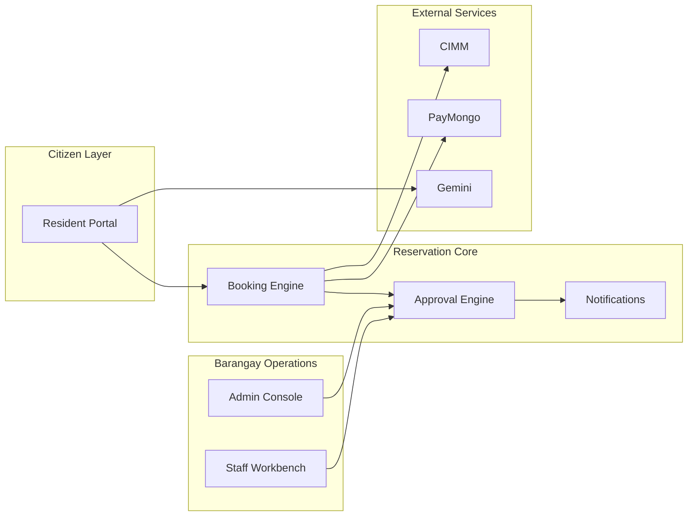

# Thesis Chapter Replacement Pack (Chapters 4–5)

**Project:** LOCAL GOVERNMENT UNIT 1: AI DRIVEN FACILITIES RESERVATION SYSTEM WITH PREDICTIVE SCHEDULING FEATURES  
**Barangay:** Culiat, Quezon City  
**Source of truth:** Source code, `database/schema.sql`, migrations, `index.php`, `docs/MODULES_LIST.md`  
**Use with:** `docs/Capstone-format-for-finals.docx` (format) and `docs/CHAPTER-3-RESEARCH-2.docx` (current draft)

**Note on school template numbering:** Per `Capstone-format-for-finals.docx`, **Chapter 4** is *Requirements Analysis* and **Chapter 5** is *Business Process Architecture*. Application Architecture, Data Architecture, and Technology Architecture follow as Chapters 6, 7, and 8 respectively. This pack covers Chapters 4 and 5 only.

---

## How to use this file

1. Open your thesis Word document after Chapters 1–3 are updated from `docs/THESIS_CHAPTER_REPLACEMENT_PACK.md`.
2. Insert or replace **Chapter 4** and **Chapter 5** using the text below.
3. Add the suggested **figures** (BPMN or flowcharts) in Word or draw.io; mermaid diagrams below are authoring guides only.
4. Cross-check §4.3 user stories against your existing Scrum Product Backlog in Chapter 3 — keep sprint dates and story points if already verified.
5. Do **not** claim equipment reservation, deployed microservices, or live infrastructure/utilities APIs unless you add them to the codebase first.

---

## Word formatting checklist

| Item | Rule |
|------|------|
| Section numbers | `4.1.`, `5.2.` — space after number |
| Chapter titles | Bold, per template (`CHAPTER 4`, `CHAPTER 5`) |
| Body font | Times New Roman, 12 pt |
| Line spacing | Double spacing for body (verify in template) |
| Tables | Number as Table 4.1, Table 5.1, etc. |
| Figures | `Figure 4. Stakeholder Map` — not `Figure no. 4Stakeholder` |
| Use case IDs | UC-01, UC-02, … for traceability |

---

## Verified facts (code-backed)

| Topic | Verified value | Source |
|-------|----------------|--------|
| User roles | Resident, Staff, Admin | `users.role` ENUM |
| Session timeout | 5 minutes (300 s) | `config/security.php` |
| Active booking cap | ≤3 pending/approved in 30-day rolling window | `book_facility.php` |
| Per-day limit | ≤1 booking per user per day | `book_facility.php` |
| Advance booking | ≤60 days ahead | `book_facility.php` |
| Reschedule | Once per reservation; ≥3 days before event | `reservations_hub_mine_tab.php` |
| Architecture | Modular monolith (single PHP app) | `index.php`, `docs/MICROSERVICES.md` |
| CIMM integration | Outbound HTTP sync when `CIMM_API_KEY` set | `services/cimm_api.php` |
| PayMongo | Optional (`PAYMENTS_ENABLED` env) | `config/payments.php` |
| Gemini chatbot | Implemented with rate limits + fallback | `chatbot_api.php`, `config/gemini_chatbot.php` |
| Infra/utilities | Preview/dashboard UI; `api/integrations` returns not implemented | `index.php`, integration pages |
| Equipment booking | **Not implemented** | No routes or tables |

---

# CHAPTER 4 — REQUIREMENTS ANALYSIS

## Chapter 4 introduction (paste before §4.1)

Chapter 4 presents the requirements analysis for the AI-Driven Facilities Reservation System with Predictive Scheduling Features for Barangay Culiat. It identifies stakeholders, describes how requirements were gathered and validated, documents user stories and use cases aligned with the implemented system, and specifies functional requirements for external integrations. All functional requirements in this chapter were traced to modules listed in the product catalog and verified against the application source code.

---

## 4.1. Stakeholder Identification

Stakeholders are individuals or groups who affect or are affected by the facility reservation system. For Barangay Culiat, the following stakeholders were identified.

### 4.1.1. Primary stakeholders

**Resident Users** are barangay constituents who register online, verify their accounts, and submit facility reservation requests. They interact with the public portal (`/facilities`, `/facility-details`), the authenticated dashboard (`/dashboard/book-facility`), notifications, and optional payment flows when enabled. Their needs include transparent availability, fair booking limits, timely approval status, and secure handling of personal documents.

**Barangay Staff** are LGU personnel who process reservations, manage facilities, record attendance, and respond to resident inquiries. Staff use dashboard modules such as Reservations Manage, Facility Management, Blackout Dates, Check-in, Contact Inquiries, and Reports. Staff may create walk-in bookings on behalf of residents when permitted.

**System Administrators** are authorized LGU or project personnel with full configuration access. Administrators manage users, role permissions, system settings, audit trails, document archival, integration keys, and security policies. The `role_permissions` table defines granular create/read/update/delete rights per module for Admin, Staff, and Resident roles.

### 4.1.2. Secondary stakeholders

**Barangay Officials and LGU Leadership** consume operational reports, occupancy data, and audit summaries to support policy decisions and resource allocation. They are indirect users of the Reports and Audit Trail modules.

**Community Infrastructure Maintenance Management (CIMM)** is an external system whose maintenance schedules can be synchronized into facility status and blackout dates when API credentials are configured.

**Payment provider (PayMongo)** is an optional external stakeholder when `PAYMENTS_ENABLED` is true, handling checkout and webhook confirmation for paid facility bookings.

**Google Gemini API** supports the dashboard AI chatbot and selected AI summary features when an API key is configured.

**Capstone advisers and panel members** evaluate whether the delivered system meets academic and operational requirements.

### 4.1.3. Stakeholder map

**Figure 4. Stakeholder Map** (create in Word/draw.io)

Suggested layout:

**Table 4.1. Stakeholder Summary**

| Stakeholder | Interest | System touchpoints |
|-------------|----------|-------------------|
| Resident | Book facilities fairly and track status | Public portal, Book Facility, My Reservations, Profile |
| Staff | Approve bookings, manage facilities | Reservations Manage, Facility Management, Check-in |
| Admin | Security, configuration, compliance | User Management, System Settings, Audit Trail |
| CIMM | Publish maintenance schedules | Maintenance Integration, cron sync |
| PayMongo | Collect fees (when enabled) | Pay Now, webhook, payment return |
| Gemini | AI-assisted responses | AI Chatbot, report summaries |

---

## 4.2. Requirements Gathering Techniques

Requirements for this capstone were gathered and refined through methods appropriate to an Agile Scrum project and an LGU operations context.

### 4.2.1. Document and process review

The team reviewed existing barangay facility reservation practices (walk-in requests, logbooks, informal messaging) and pain points described in Chapter 1. Operational rules—such as limiting concurrent bookings and requiring staff approval for certain events—were translated into enforceable system rules in PHP and MySQL.

### 4.2.2. Agile Scrum ceremonies

As documented in Chapter 3, the Product Owner maintained a Product Backlog of user stories. Backlog grooming, sprint planning, daily stand-ups, sprint reviews, and retrospectives allowed the team to refine requirements iteratively. Each sprint increment was validated against working software rather than paper specifications alone.

### 4.2.3. Stakeholder communication

The Product Owner and team members communicated with advisers and intended LGU users to clarify booking workflows, approval policies, and reporting needs. Feedback from sprint reviews informed reprioritization of backlog items (for example, auto-approval, attendance tracking, and AI-assisted recommendations).

### 4.2.4. Prototyping and implementation-driven validation

The system was built as a modular monolithic PHP application with incremental releases. Requirements were validated by executing flows in the running application: registration, email verification, booking with conflict detection, staff approval, reschedule limits, check-in, and report export. This approach ensured that Chapter 4 requirements match what is actually implemented.

### 4.2.5. Non-functional requirements elicitation

Security, privacy, and performance requirements were derived from the Philippine Data Privacy Act (RA 10173), LGU accountability needs, and industry practices:

- Session timeout of five minutes with keep-alive for active dashboard use
- CSRF tokens, bcrypt password hashing, login rate limiting, and optional OTP/TOTP
- Secure document storage with access-controlled downloads
- Audit logging of sensitive actions
- Indexed database queries for reporting and reservation search

---

## 4.3. User Stories and Use Cases

### 4.3.1. User stories (representative backlog)

The following user stories represent core backlog items implemented in the current codebase. Align wording with your Chapter 3 Product Backlog tables where story IDs and sprint assignments already exist.

**Table 4.2. Representative User Stories**

| ID | Role | User story | Acceptance criteria (summary) |
|----|------|------------|-------------------------------|
| US-01 | Resident | As a resident, I want to register with my barangay address so that I can book facilities online. | Registration form, Culiat street list, optional Valid ID upload, email verification |
| US-02 | Resident | As a resident, I want to log in securely so that only I can access my bookings. | Password login, optional email OTP or TOTP, account status checks |
| US-03 | Resident | As a resident, I want to browse facilities and see availability so that I can plan my event. | Public listing, facility details, calendar snapshot, smart hints API |
| US-04 | Resident | As a resident, I want to submit a reservation request so that barangay staff can approve it. | Date/time validation, conflict check, purpose and attendee fields |
| US-05 | Resident | As a resident, I want booking limits enforced so that facilities are shared fairly. | ≤3 active in 30 days, ≤1 per day, ≤60 days advance |
| US-06 | Resident | As a resident, I want to reschedule or cancel within policy so that I can adjust plans. | One reschedule, ≥3 days before event; cancel rules per status |
| US-07 | Staff | As staff, I want to approve or deny reservations so that the barangay controls facility use. | Reservations Manage, status history, notifications |
| US-08 | Staff | As staff, I want to record check-in and attendance so that usage is documented. | Manual check-in, facility QR scan, time tracking |
| US-09 | Staff | As staff, I want to manage facilities and blackout dates so that unavailable periods are blocked. | Facility CRUD, operating hours, blackout dates |
| US-10 | Admin | As an admin, I want to manage users and permissions so that access is appropriate per role. | User Management, role_permissions, lock/verify |
| US-11 | Admin | As an admin, I want an audit trail so that actions are accountable. | audit_log module, export |
| US-12 | Resident | As a resident, I want AI-assisted recommendations so that I can choose a suitable facility. | Facility recommendations, conflict check, booking smart hints |
| US-13 | Resident | As a resident, I want a chatbot helper so that I can ask booking questions in the dashboard. | Gemini chatbot API with fallback replies |
| US-14 | Staff | As staff, I want maintenance data from CIMM reflected locally so that facilities under maintenance cannot be booked. | CIMM sync, facility status, blackout creation |
| US-15 | Resident | As a resident, I want to pay online when required so that my booking is confirmed. | PayMongo checkout when PAYMENTS_ENABLED (optional deployment) |

**Out of scope (do not list as implemented):** equipment inventory or equipment reservation modules — the system handles **facilities only**.

### 4.3.2. Use case diagram (narrative)

**Figure 5. Use Case Diagram — Facilities Reservation System** (create in Word/UML tool)

Primary actors: **Resident**, **Staff**, **Admin**.  
Secondary actors: **CIMM API**, **PayMongo** (optional), **Gemini API** (optional), **Email/SMS gateways**.

Core use case groups:

1. **Account management** — Register, Verify Email, Login, Manage Profile, Export Personal Data  
2. **Facility discovery** — Browse Facilities, View Details, Get Recommendations  
3. **Reservation lifecycle** — Create Booking, Auto-Approve (conditional), Staff Approve/Deny, Reschedule, Cancel, Extend (when configured)  
4. **Operations** — Check-In, Record Violations, Manage Blackouts, Sync Maintenance  
5. **Administration** — Manage Users, Configure Settings, View Reports, Audit Trail  

### 4.3.3. Detailed use cases

**Table 4.3. Selected Use Case Specifications**

| Use case | UC-04: Create Facility Reservation |
|----------|-------------------------------------|
| Actor | Resident (Staff/Admin may book for walk-in resident) |
| Preconditions | User authenticated; status = active; valid ID verified when required; facility status = available |
| Main flow | 1. User opens Book Facility. 2. Selects facility, date, time slot, purpose, expected attendees. 3. System validates advance window, daily cap, active cap, operating hours, blackouts, conflicts. 4. System evaluates auto-approval rules. 5. Reservation saved; notifications sent. 6. If payments enabled and fee applies, status may be pending_payment until paid. |
| Alternate flows | 3a. Conflict detected → error with suggested slots. 4a. Auto-approval conditions met → status approved immediately. |
| Postconditions | Reservation record and history row created; audit entry optional |

| Use case | UC-07: Staff Approve or Deny Reservation |
|----------|------------------------------------------|
| Actor | Staff or Admin |
| Preconditions | Staff authenticated with reservations update permission |
| Main flow | 1. Open Reservations Manage. 2. Filter pending items. 3. Review purpose, attendees, conflicts. 4. Approve or deny with optional note. 5. System updates status, history, notifications. |
| Postconditions | Resident notified; audit log updated |

| Use case | UC-11: Reschedule Reservation |
|----------|-------------------------------|
| Actor | Resident (owner) |
| Preconditions | Status in pending/approved/postponed; reschedule_count < 1; ≥3 days before event; not started |
| Main flow | 1. User opens My Reservations. 2. Selects reschedule. 3. Chooses new date/time. 4. System re-validates limits and conflicts. 5. Updates reservation; increments reschedule_count. |
| Postconditions | Single reschedule consumed; history recorded |

| Use case | UC-14: Synchronize CIMM Maintenance |
|----------|--------------------------------------|
| Actor | System (cron or Staff-triggered sync) |
| Preconditions | `CIMM_API_KEY` configured |
| Main flow | 1. Fetch maintenance schedules via HTTPS. 2. Map external facility identifiers to local facilities. 3. Update facility status and/or blackout dates. |
| Alternate flows | API unreachable → error logged; last known state retained |
| Postconditions | Residents cannot book blocked maintenance windows |

---

## 4.4. Functional Requirements for Integration

Integration requirements describe how the facilities reservation system exchanges data with external services. The application is a **modular monolith**: integrations are implemented as PHP service modules and HTTP endpoints within the same deployment, not as separate microservice containers.

### 4.4.1. Integration overview

**Table 4.4. Integration Summary**

| Integration | Direction | Protocol | Status in codebase | Configuration |
|-------------|-----------|----------|-------------------|---------------|
| CIMM maintenance schedules | Inbound (pull) | HTTPS + API key | Implemented | `CIMM_API_KEY`, `services/cimm_api.php`, `scripts/sync_cimm_maintenance.php` |
| PayMongo payments | Outbound + webhook inbound | HTTPS REST | Optional feature | `PAYMENTS_ENABLED`, PayMongo keys in env |
| Google Gemini | Outbound | HTTPS REST | Implemented when key set | `GEMINI_API_KEY` |
| Public availability API | Inbound | HTTP JSON | Implemented | `/api/public/availability` |
| Email (SMTP) | Outbound | SMTP | Implemented | Mail config in env |
| SMS | Outbound | Provider API | Implemented (opt-in) | SMS settings |
| Infrastructure projects | — | — | Preview UI only | Dashboard page; no live API |
| Utilities billing | — | — | Preview UI only | Dashboard page; no live API |
| Generic integrations API | — | HTTP | Returns not implemented | `/api/integrations/*` |

### 4.4.2. CIMM maintenance integration (FR-INT-01 to FR-INT-05)

| ID | Requirement |
|----|-------------|
| FR-INT-01 | The system shall retrieve maintenance schedules from the CIMM LGU portal API over HTTPS. |
| FR-INT-02 | The system shall authenticate requests using a configured API key (`CIMM_API_KEY`). |
| FR-INT-03 | The system shall map CIMM schedule entries to local `facilities` records and apply `maintenance` status or `facility_blackout_dates` as appropriate. |
| FR-INT-04 | The system shall log sync errors and preserve the last known good facility availability when the API is unreachable. |
| FR-INT-05 | Staff shall view sync status and manual sync controls on the Maintenance Integration dashboard page. |

### 4.4.3. PayMongo payment integration (FR-INT-06 to FR-INT-10) — optional

| ID | Requirement |
|----|-------------|
| FR-INT-06 | When `PAYMENTS_ENABLED` is true, the system shall create a PayMongo checkout session for applicable reservations. |
| FR-INT-07 | The system shall record payment attempts in the `payments` table linked to `reservations`. |
| FR-INT-08 | The system shall process PayMongo webhooks at `/paymongo-webhook` to update payment and reservation status. |
| FR-INT-09 | The system shall redirect users to `/payment-return` after checkout completion. |
| FR-INT-10 | When payments are disabled in configuration, booking shall proceed without payment gating regardless of migration schema support. |

*Thesis note:* State clearly whether your **deployment** for capstone demonstration disables payments (`PAYMENTS_ENABLED=false`) even though the code supports PayMongo.

### 4.4.4. Google Gemini AI integration (FR-INT-11 to FR-INT-14)

| ID | Requirement |
|----|-------------|
| FR-INT-11 | The dashboard chatbot shall send contextual prompts to the Gemini API when a valid API key is configured. |
| FR-INT-12 | The system shall enforce per-user and per-IP rate limits on chat and report-summary endpoints. |
| FR-INT-13 | When the API is unavailable or rate-limited, the system shall return deterministic fallback responses so the UI remains usable. |
| FR-INT-14 | AI conflict check and recommendation endpoints shall use reservation and facility data from the local database without bypassing booking validation rules. |

### 4.4.5. Public availability API (FR-INT-15 to FR-INT-17)

| ID | Requirement |
|----|-------------|
| FR-INT-15 | The system shall expose `/api/public/availability` for unauthenticated availability queries used by the guest facility assistant widget. |
| FR-INT-16 | Responses shall be JSON and shall not expose personal data of other residents. |
| FR-INT-17 | The endpoint shall respect facility status, blackouts, and existing reservations for the queried date range. |

### 4.4.6. Communications integration (FR-INT-18 to FR-INT-20)

| ID | Requirement |
|----|-------------|
| FR-INT-18 | The system shall send transactional email for verification, password reset, and booking status changes when SMTP is configured. |
| FR-INT-19 | The system shall create in-app `notifications` records for booking and system events. |
| FR-INT-20 | SMS notifications shall be sent only according to user notification preferences and admin SMS configuration. |

### 4.4.7. Planned / preview integrations (document as non-functional in production)

| ID | Requirement | Actual status |
|----|-------------|---------------|
| FR-INT-21 | Infrastructure project tracking integration | Preview dashboard UI only; `api/integrations` not implemented |
| FR-INT-22 | Utilities billing integration | Preview dashboard UI only |
| FR-INT-23 | Equipment reservation sync | **Not in scope** — no module exists |

### 4.4.8. Chapter 4 summary

Chapter 4 identified residents, staff, and administrators as primary stakeholders and external platforms (CIMM, PayMongo, Gemini) as integration stakeholders. Requirements were gathered through Scrum backlog management, stakeholder feedback, and implementation validation. User stories and use cases cover the full facility reservation lifecycle implemented in the codebase. Integration requirements distinguish **implemented** connectors (CIMM, Gemini, public API, email/SMS) from **optional** (PayMongo) and **preview-only** (infrastructure, utilities) modules.

---

# CHAPTER 5 — BUSINESS PROCESS ARCHITECTURE

## Chapter 5 introduction (paste before §5.1)

Chapter 5 describes the business process architecture of the Barangay Culiat Facilities Reservation System. It identifies as-is and to-be processes, presents process diagrams for major workflows, explains how the integrated system aligns with barangay operations, and summarizes process improvements achieved by digitization. Process descriptions reflect the implemented PHP/MySQL application and do not include equipment rental workflows.

---

## 5.1. Identification of Business Processes

### 5.1.1. As-is (manual) processes

Before system deployment, Barangay Culiat facility scheduling typically followed informal steps:

1. **Inquiry** — Resident visits or messages barangay staff to ask about facility availability.  
2. **Manual log** — Staff checks a paper logbook or personal notes for conflicts.  
3. **Request submission** — Resident completes handwritten forms or verbal requests.  
4. **Approval** — Barangay official approves informally; approval may not be recorded consistently.  
5. **Use and monitoring** — Attendance and actual usage are rarely tracked digitally.  
6. **Reporting** — Summary reports require manual compilation from logbooks.

Pain points include double bookings, slow response, limited resident visibility, and weak audit trails.

### 5.1.2. To-be (system-supported) processes

The to-be model centralizes workflows in the Facilities Reservation System:

| Process ID | Process name | Owner | System module |
|------------|--------------|-------|---------------|
| BP-01 | Resident onboarding and verification | Admin/Staff | Registration, User Management |
| BP-02 | Facility catalog management | Staff | Facility Management |
| BP-03 | Reservation request and validation | Resident/Staff | Book Facility |
| BP-04 | Approval and denial | Staff/Admin | Reservations Manage |
| BP-05 | Auto-approval (conditional) | System | `config/auto_approval.php` |
| BP-06 | Payment collection (optional) | Resident/System | Pay Now, PayMongo webhook |
| BP-07 | Reschedule and cancellation | Resident/Staff | My Reservations, Reservations Manage |
| BP-08 | Event day check-in and attendance | Staff | Check-in, Time Tracking, QR scan |
| BP-09 | Maintenance alignment | System/Staff | CIMM sync, blackouts |
| BP-10 | Violation recording | Staff/Admin | User violations |
| BP-11 | Reporting and audit | Admin | Reports, Audit Trail |
| BP-12 | Resident support and inquiries | Staff | Contact Inquiries, AI Chatbot |

### 5.1.3. Process boundaries

The system boundary includes all web modules served by `index.php` under public and `/dashboard` routes. Outside the boundary remain external systems (CIMM, PayMongo, Gemini, SMTP/SMS providers) and manual barangay activities not digitized (e.g., physical facility keys, on-site security).

---

## 5.2. Business Process Diagrams

Create formal BPMN or flowchart figures in Word for submission. Below are authoritative process flows for figure authoring.

### 5.2.1. BP-01: Resident onboarding

**Figure 6. Business Process — Resident Registration and Verification**

### 5.2.2. BP-03 to BP-05: Reservation and approval

**Figure 7. Business Process — Facility Reservation and Approval**

**Auto-approval conditions (implemented):** facility `auto_approve` enabled; user has no disqualifying violations; not commercial (when restricted); within capacity threshold and max duration; no conflicts; not on blackout date; within booking limits.

### 5.2.3. BP-07: Reschedule

**Figure 8. Business Process — Reservation Reschedule**

### 5.2.4. BP-08: Check-in and attendance

**Figure 9. Business Process — Event Day Check-In**

### 5.2.5. BP-09: CIMM maintenance sync

**Figure 10. Business Process — Maintenance Schedule Synchronization**

### 5.2.6. End-to-end process architecture

**Figure 11. Business Process Architecture (High Level)**

---

## 5.3. Alignment of Integrated System with Business Processes

### 5.3.1. Process-to-module alignment

**Table 5.1. Business Process Alignment Matrix**

| Business process | Manual step replaced | System capability | Integration touchpoint |
|------------------|---------------------|-------------------|------------------------|
| Availability inquiry | Phone/walk-in checks | Public facility pages + availability API | Guest assistant widget |
| Booking request | Paper form | Book Facility with live validation | Local MySQL |
| Conflict detection | Staff memory | SQL overlap checks + AI conflict hints | Gemini optional |
| Approval routing | Verbal chain | Reservations Manage + notifications | Email/SMS |
| Fee collection | Cash at office | Pay Now checkout | PayMongo optional |
| Maintenance blocks | Posted notices | CIMM sync + blackouts | CIMM API |
| Attendance proof | Sign-in sheet | Check-in module + QR | Local DB |
| Management reporting | Manual tallies | Reports + export | AI summary optional |

### 5.3.2. Role alignment

- **Residents** execute BP-03, BP-07, and self-service profile management without staff intervention for standard requests.  
- **Staff** execute BP-04, BP-08, BP-09 (manual sync), and BP-12 using dashboard tools gated by `role_permissions`.  
- **Admins** oversee BP-01, BP-10, BP-11, and system configuration including integration keys and payment toggles.

### 5.3.3. Data alignment

Each business process writes to normalized tables: `users`, `facilities`, `reservations`, `reservation_history`, `notifications`, `audit_log`, `facility_blackout_dates`, `user_violations`, and optional `payments`. This ensures that process state is recoverable for audits and reports.

### 5.3.4. Policy alignment

System-enforced rules implement barangay fair-use policy:

- Maximum three active reservations per 30-day rolling window  
- Maximum one booking per calendar day per user  
- Maximum 60-day advance booking horizon  
- Single reschedule at least three days before the event  

These rules operate at application layer in `book_facility.php` and related helpers, so they apply consistently regardless of which staff member is on duty.

---

## 5.4. Business Process Improvements

### 5.4.1. Efficiency improvements

| Area | Before | After |
|------|--------|-------|
| Availability checks | Minutes to hours (staff-dependent) | Immediate via web calendar and API |
| Approval cycle | Paper queue | Digital queue with filters and bulk actions |
| Conflict resolution | Reactive (day-of discovery) | Proactive validation at booking time |
| Maintenance communication | Ad hoc notices | Automated blackout sync from CIMM when configured |

### 5.4.2. Transparency and fairness

Residents receive in-app and email notifications when reservation status changes. Booking limits prevent resource hoarding. Reservation history and audit logs provide traceability for disputes.

### 5.4.3. Accountability and compliance

Staff actions on approvals, user verification, and violation recording are attributable to logged-in accounts. Document uploads use secure storage with download authorization. Residents may export personal data per Data Privacy Act expectations.

### 5.4.4. Decision support

Reports aggregate utilization, status breakdowns, and attendance. AI-assisted recommendations and conflict risk hints help residents choose feasible schedules; administrators may use Gemini-generated summaries on reports when enabled.

### 5.4.5. Remaining manual steps

The following activities remain outside full automation and should be acknowledged in defense:

- Physical facility access (keys, security personnel)  
- Cash payments when PayMongo is disabled  
- Live infrastructure/utilities data — preview modules only  
- CIMM sync depends on external API availability and correct facility mapping  
- Equipment rental — not part of this system  

### 5.4.6. Chapter 5 summary

Chapter 5 mapped barangay facility reservation from manual logbook-based practices to digitized workflows spanning onboarding, booking, approval, optional payment, attendance, maintenance sync, and reporting. Process diagrams illustrate decision points that match implemented validation and status rules. The integrated system aligns business roles with dashboard modules and enforces consistent policies. Measurable improvements include faster availability visibility, proactive conflict prevention, and auditable approval trails, while recognizing boundaries where manual or external processes still apply.

---

## Change log (Chapters 4–5)

| Item | Action | Reason |
|------|--------|--------|
| Equipment stakeholders/processes | Omitted | Not in codebase |
| Microservices integration topology | Omitted | Modular monolith |
| Session 30 minutes | Not stated | Code uses 5 minutes |
| Chatbot “planned” | Described as implemented | `chatbot_api.php` exists |
| Infra/utilities integrations | Marked preview only | No live API |
| PayMongo | Marked optional | `PAYMENTS_ENABLED` |
| CIMM | Described as implemented when keyed | `services/cimm_api.php` |

---

## Open questions for authors

1. **Payments narrative:** Will capstone demo use `PAYMENTS_ENABLED=false`? Adjust §4.4.3 and §5.2.2 narrative accordingly.  
2. **CIMM deployment:** Is `CIMM_API_KEY` configured in your demo environment? If not, state “implemented but not activated in deployment.”  
3. **Stakeholder interviews:** If you conducted formal interviews, add count, dates, and instruments to §4.2 — do not invent numbers.  
4. **Next chapters:** Draft Chapters 6 (Application Architecture) and 7 (Data Architecture) from `docs/MICROSERVICES.md`, `STRUCTURE.md`, and `database/schema.sql` when ready.

---

## Suggested figures checklist for Word

| Figure no. | Title |
|------------|-------|
| Figure 4 | Stakeholder Map |
| Figure 5 | Use Case Diagram |
| Figure 6 | Business Process — Resident Registration |
| Figure 7 | Business Process — Reservation and Approval |
| Figure 8 | Business Process — Reschedule |
| Figure 9 | Business Process — Check-In |
| Figure 10 | Business Process — CIMM Sync |
| Figure 11 | Business Process Architecture (High Level) |

Renumber figures to continue from your Chapter 3 figure sequence if numbers already exist in the draft.
