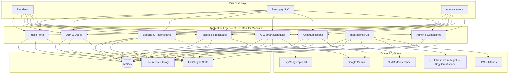
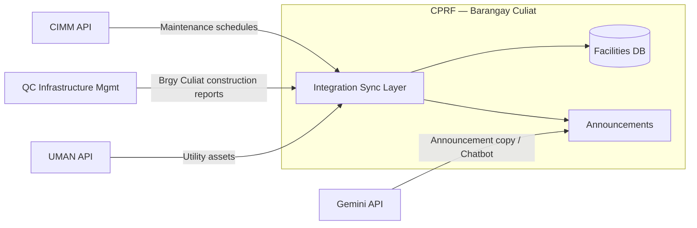

# LOCAL GOVERNMENT UNIT 1: AI-DRIVEN FACILITIES RESERVATION SYSTEM WITH PREDICTIVE SCHEDULING FEATURES

## Complete Thesis Draft — Chapters 1 to 3 (Code-Verified, July 2026)

**Authors:** Joricho E. Azuela, Luis Miguel N. Follero, Hajar P. Gili, Daryll Parcia, Gilbert A. Tablac Jr.  
**Institution:** Bestlink College of the Philippines — Bachelor of Science in Information Technology  
**Deployment context:** Barangay Culiat, Quezon City (barangay-level LGU)  
**System URL (production):** CPRF — Community Public Reservation Facilities (`cprf.infragovservices.com`)

> **Documentation note:** This draft reflects the **implemented** codebase as of July 2026. Equipment inventory is **not** implemented; scope is **facility reservation** only. Online payments exist but are **optional** (`PAYMENTS_ENABLED`, off by default). Native mobile app is **not implemented** (responsive web only).

---

# CHAPTER 1 — INTRODUCTION

## 1.1 Background of the Capstone Project

Barangays in the Philippines serve as the smallest administrative units responsible for delivering basic public services and managing shared community resources. Among these responsibilities is the proper scheduling and allocation of public facilities such as covered courts, multipurpose halls, plazas, and barangay-owned venues. Despite the importance of these services, many barangays continue to rely on manual and informal processes for managing reservations.

In **Barangay Culiat, Quezon City**, facility reservations were historically handled through personal visits to the barangay hall, phone calls, or informal social media messages. These methods often result in delayed responses, overlooked requests, unclear scheduling, and frequent conflicts due to the absence of a centralized reservation system. Manual record-keeping increases the risk of inaccurate data and inefficient coordination among barangay personnel.

To address these challenges, the researchers developed the **AI-Driven Facilities Reservation System with Predictive Scheduling Features** — a web-based platform that enables residents to browse facilities, submit reservation requests online, receive notifications, and benefit from AI-assisted conflict detection and facility recommendations. Barangay staff and administrators use the same platform to approve requests, manage facilities, monitor occupancy, publish announcements, and integrate with other LGU information systems.

## 1.2 Context and Scope

### 1.2.1 Geographic and organizational context

The system is deployed at **barangay level** for **Barangay Culiat** residents and LGU personnel. It does not replace city-wide systems; rather, it operates as the barangay’s facility reservation module within the broader Quezon City LGU digital ecosystem.

### 1.2.2 Implemented functional scope

| Area | Implemented capabilities |
|------|-------------------------|
| **Public portal** | Home, facilities browse, facility details, announcements, FAQ, contact, legal pages |
| **Authentication** | Registration, email verification, login, email OTP, Google Authenticator (TOTP), forgot/reset password, TOTP email recovery |
| **User management** | Approve/deny/lock users, ID verification queue, create accounts, violations, role management (Admin) |
| **Facilities** | CRUD, images, citations, operating hours, geocoding, status, blackout dates, facility QR check-in |
| **Reservations** | Book, limits, auto-approval, staff approvals (pending/approved tabs), reschedule, cancel, extensions, walk-in booking |
| **Attendance** | Manual check-in/out, facility QR scan, live occupancy monitor, no-show violations |
| **AI** | Conflict detection, recommendations, risk scoring, purpose classification, Smart Scheduler, Gemini chatbot |
| **Calendar & reports** | Month/week/day views, iCal export, dashboard KPIs, CSV/PDF reports |
| **Communications** | In-app, email, SMS (opt-in), announcements (manual + Gemini auto for CIMM/CPRF blackouts) |
| **Administration** | Audit trail, document management/archival, system settings, Data Privacy Act export |
| **Payments** | PayMongo integration (**optional**, disabled by default) |

### 1.2.3 External integrations (current status)

| Integration | Status in system | Barangay scope note |
|-------------|------------------|---------------------|
| **CIMM (Community Infrastructure Maintenance Management)** | **Connected** — outbound pull sync of maintenance schedules; updates facility status and blackout dates; optional Gemini auto-announcements | Facility-level maintenance for Barangay Culiat venues |
| **Infrastructure Management (Quezon City)** | **Connected** — receives **planned construction reports** for facilities **within Barangay Culiat only** | City-wide infrastructure system; CPRF ingests barangay-scoped project reports |
| **UMAN Utilities** | **Connected** when `UMAN_API_KEY` configured — asset catalog and equipment assignment to facilities | Optional; equipment assignment in Facility Management |
| **Google Gemini** | **Connected** when `GEMINI_API_KEY` configured — chatbot, maintenance/blackout announcement copy | — |
| **PayMongo** | **Optional** — payment checkout when enabled | — |
| **Integrations API gateway** (`/api/integrations/*`) | **Not implemented** — returns HTTP 501 | — |

> **Infrastructure integration (thesis narrative):** The Quezon City Infrastructure Management System covers projects across the entire city. CPRF is connected to this system and receives **construction planning reports filtered to Barangay Culiat**. The technical details of payload formats and bidirectional workflows are outside the current documentation scope; the connection is established for barangay-level facility planning awareness.

### 1.2.4 Out of scope (not implemented)

- Native Android/iOS mobile application  
- Equipment inventory / standalone equipment reservation module  
- Full demand-forecasting dashboard UI  
- Filipino/Tagalog UI (i18n)  
- Live bidirectional Infrastructure API automation beyond connected report ingestion (as documented in product backlog)

## 1.3 Problem Statement

### 1.3.1 Main problem

Barangay Culiat experiences inefficiencies in managing and scheduling community **facilities** due to reliance on manual and informal reservation procedures, resulting in delayed communication, inaccurate records, scheduling conflicts, and limited accessibility for residents.

### 1.3.2 Specific problems

1. Lack of a centralized system for real-time monitoring of facility availability  
2. Frequent double bookings and scheduling conflicts  
3. Delayed or overlooked requests from manual and unorganized methods  
4. Inconvenient reservation process requiring physical visits or social media  
5. Limited transparency on maintenance, construction, and blackout periods affecting bookings  
6. Difficulty producing audit trails and usage reports for LGU decision-making  

## 1.4 Objectives and Goals

### 1.4.1 General objective

To develop an AI-driven facility reservation and scheduling system that improves efficiency, accuracy, and accessibility of public facility management in Barangay Culiat.

### 1.4.2 Specific objectives

1. Develop a digital platform for real-time viewing and reservation of barangay **facilities**  
2. Implement AI-based conflict detection, risk scoring, and facility recommendations to minimize scheduling conflicts  
3. Provide secure authentication, role-based access, and resident verification (ID upload and staff review)  
4. Integrate with **CIMM** for maintenance-driven availability and **Infrastructure Management** for barangay-scoped construction reports  
5. Enable staff workflows for approval, attendance, occupancy monitoring, announcements, and reporting  
6. Support Data Privacy Act compliance through secure document handling and user data export  

### 1.4.3 Goal

Modernize Barangay Culiat’s facility management through a centralized, automated, and intelligent reservation system that increases transparency, convenience, and operational efficiency.

### 1.4.4 Users and beneficiaries

| Role | Description |
|------|-------------|
| **Resident** | Registers, books facilities, manages reservations, checks in/out |
| **Staff** | Approves reservations, manages facilities/blackouts, communications, integrations (read) |
| **Admin** | Full system governance, user management, audit, document retention, system settings |

**Beneficiaries:** Barangay Culiat residents and LGU personnel; the community benefits from fairer access, fewer conflicts, and timely public advisories.

## 1.5 Significance and Relevance

The system demonstrates how a barangay-level LGU can adopt digital and AI-assisted tools without a full city-wide ERP replacement. Integration with maintenance and infrastructure systems shows interoperability within Quezon City’s LGU ecosystem while keeping operational control at barangay level.

## 1.6 Structure of the Document

- **Chapter 1** — Introduction, scope, problems, objectives  
- **Chapter 2** — Related literature, architecture, integrations  
- **Chapter 3** — Methodology, Scrum artifacts, diagrams overview, implementation alignment  
- **Chapters 4–5** — See `docs/THESIS_CH4_CH5_REDO_FULL.md` and replacement packs  

---

# CHAPTER 2 — REVIEW OF RELATED LITERATURE AND TECHNICAL FOUNDATION

## 2.1 Agile Scrum Methodology

Agile Scrum guided iterative delivery: sprint planning, backlog grooming, incremental releases, and stakeholder feedback from barangay personnel. Sprints delivered authentication, booking, AI modules, integrations, and compliance features in priority order documented in `docs/BACKLOG.md` and `docs/SPRINT.md`.

## 2.2 Enterprise Architecture

Enterprise Architecture (EA) aligns business processes (reservation lifecycle, verification, maintenance coordination) with application modules and data stores. CPRF’s EA layers:

## 2.3 System Architecture — Modular Monolith with Logical Service Boundaries

**Runtime deployment:** Single PHP application (`index.php` front controller), shared MySQL database, optional Python ML subprocesses. This is a **modular monolith** — logically decomposed like microservices but deployed as one unit for barangay hosting practicality.

**Logical services (implemented):**

| Logical service | Primary files / routes |
|-----------------|----------------------|
| Auth & Session | `config/security.php`, `resources/views/pages/auth/*` |
| User & Profile | `user_management.php`, `profile.php` |
| Facilities | `facility_management.php`, `blackout_dates.php` |
| Reservations | `book_facility.php`, `reservations_manage.php` |
| Attendance & Occupancy | `time_tracking.php`, `occupancy_monitor.php` |
| AI & ML | `config/ai_ml_integration.php`, `ai/api/*.py`, `gemini_chatbot.php` |
| Notifications & Announcements | `config/notifications.php`, `announcements_manage.php` |
| Reports & Audit | `reports.php`, `audit_trail.php` |
| Integrations | `services/cimm_api.php`, `infrastructure_projects_integration.php`, `utilities_integration.php` |

## 2.4 DevOps and CI/CD

- **Version control:** Git / GitHub  
- **CI:** GitHub Actions — PHPUnit smoke tests (`tests/`, `.github/workflows/ci.yml`)  
- **Deployment:** cPanel / SSH (`docs/DEPLOYMENT_CPANEL.md`)  
- **Cron jobs:** Maintenance sync, reminders, archival, auto-decline (`scripts/`)  
- **Environment config:** `.env` / `~/private/cprf.env`  

## 2.5 Integration of Information Systems

### 2.5.1 CIMM (Maintenance Management) — Connected

- **Direction:** Outbound pull (`fetchCIMMMaintenanceSchedules`, `syncFacilitiesFromCIMM`)  
- **Effects:** Facility `maintenance` status when work is active; `facility_blackout_dates` with `CIMM Sync:` prefix for future dates; Gemini auto-announcements when enabled  
- **Schedule:** Cron `scripts/sync_cimm_maintenance.php` (recommended every 15 minutes)  
- **UI:** `/dashboard/maintenance-integration`  

### 2.5.2 Infrastructure Management (Quezon City) — Connected

- **Scope:** **Barangay Culiat only** — planned construction reports from the city-wide Infrastructure Management System  
- **Purpose:** Awareness of upcoming construction that may affect barangay public facilities  
- **UI:** `/dashboard/infrastructure-projects`  
- **Note:** Connection is established at LGU integration layer; detailed workflow specifications are deferred to future integration documentation.

### 2.5.3 UMAN Utilities — Connected (when configured)

- Asset catalog pull, facility equipment assignment  
- **UI:** `/dashboard/utilities-integration`  

### 2.5.4 Google Gemini — Connected (when configured)

- AI chatbot (`/dashboard/chatbot-api`)  
- Auto-generated public announcements for CIMM maintenance and CPRF blackout dates  

## 2.6 Relevant Studies

Digital government and e-governance literature supports web-based service delivery at local government level. Facility booking systems in education and municipal contexts demonstrate reduced conflict rates and improved auditability when centralized calendars and role-based approvals are introduced. AI-assisted scheduling literature supports hybrid approaches: rule-based guardrails with ML risk scoring and LLM assistance for user support — matching CPRF’s implemented design.

## 2.7 Security, Privacy, and Ethics

- **Data Privacy Act (RA 10173):** Consent at registration, privacy policy, user data export  
- **Security:** CSRF, rate limiting, bcrypt passwords, OTP/TOTP, secure document storage, audit logging  
- **Responsible AI:** Gemini assists residents; staff retain approval authority; auto-approval uses explicit rule sets  

---

# CHAPTER 3 — METHODOLOGY

## 3.1 Research and Development Approach

**Mixed methods (planned):** Qualitative stakeholder input and quantitative usability metrics. **Interview/survey instruments** are prepared but **not yet administered** — see journal draft (`docs/JOURNAL_FRS.md`).

**Development model:** Agile Scrum with 1–2 week sprints, product backlog in `docs/BACKLOG.md`, module catalog in `docs/MODULES_LIST.md`.

## 3.2 Scrum Roles

| Role | Responsibility |
|------|----------------|
| Product Owner | Prioritize backlog, accept stories, liaison to barangay stakeholders |
| Scrum Master | Facilitate ceremonies, remove blockers |
| Development Team | PHP/MySQL/JS implementation, Python ML, testing, deployment |
| Adviser | Academic guidance, documentation review |

## 3.3 Sprint Cycles (summary)

Full §3.3 sprint boards (**To Do | In Progress | Done** per sprint, plus system-wide snapshot) are in:

**`docs/THESIS_CH3_SECTION_3.3_SPRINT_CYCLES.md`**

| Sprint theme | Deliverables |
|--------------|--------------|
| Foundation | Auth, registration, facilities CRUD, basic booking |
| Operations | Approvals, blackout dates, notifications, audit |
| AI phase | Conflict API, recommendations, auto-approval, Smart Scheduler |
| Attendance | Check-in/out, QR, occupancy, violations |
| Integrations | CIMM sync, integration dashboards, Gemini chatbot |
| Compliance | Document archival, DPA export, security hardening |
| Polish | Responsive UI, announcements redesign, approval tabs, ID verification queue, auto-announcements |
| UX hardening (Jul 2026) | Auth redesign, walk-in search, live occupancy slideshow, blackouts mobile |

## 3.4 Scrum Artifacts

Full §3.4.1–3.4.7 content (Product Backlog F1–F40, EIS Security/Standards/Integration/Analytics, Sprint Backlog, Burndown, Increment tables) is in:

**`docs/THESIS_CH3_SECTION_3.4_SCRUM_ARTIFACTS_COMPLETE.md`**

Supporting references:
- **User stories (epic format):** `docs/USER_STORIES_AND_BACKLOG_COMPLETE.md`  
- **Module catalog:** `docs/MODULES_LIST.md`  
- **Sprint board notes:** `docs/SCRUM_BOARD.md`  
- **Definition of Done:** Code merged, routed in `index.php`, role permissions in `config/permissions.php`, smoke-tested  

## 3.5 Tools and Technologies

| Category | Tools |
|----------|-------|
| Languages | PHP 8.1+, JavaScript, Python 3 (ML APIs), SQL |
| Database | MySQL 8 / MariaDB |
| Frontend | HTML, CSS, Tailwind (public pages), Bootstrap (dashboard) |
| AI | Google Gemini API, scikit-learn models (`ai/models/`) |
| Email/SMS | SMTP (Gmail/Brevo), IPROG/Philsms SMS |
| Maps | OpenStreetMap Nominatim, optional Mapbox |
| Security | Cloudflare Turnstile (registration captcha) |
| DevOps | Git, GitHub Actions, cPanel, cron |
| IDE | Visual Studio Code / Cursor |

## 3.6 Integration Approach

**Sync principles:**
1. External systems do not bypass CPRF authorization — all bookings flow through CPRF  
2. Maintenance and blackouts block dates on the booking calendar  
3. Barangay-scoped infrastructure reports inform staff via integration dashboard  
4. Auto-announcements publish to public `notifications` (system-wide, `user_id IS NULL`)  

## 3.7 TOGAF Alignment (Four Domains)

| Domain | CPRF alignment |
|--------|----------------|
| **Business** | Reservation lifecycle, verification, maintenance coordination, public advisories |
| **Data** | MySQL schema (`database/schema.sql` + migrations), secure uploads, audit log |
| **Application** | Modular PHP views, service classes (`services/`), config helpers |
| **Technology** | LAMP stack on cPanel, cron, optional Python ML, external APIs |

## 3.8 Testing Methodology

| Level | Method |
|-------|--------|
| Unit | PHPUnit smoke tests (`tests/`) |
| Integration | Manual + `docs/DEPLOYMENT_SMOKE_TESTS.md` checklist |
| UAT | Barangay staff walkthroughs (planned) |
| Security | CSRF/rate-limit verification, document access controls |

## 3.9 Diagram Reference

Full **DFD (L0–L2), WFD, BPA (L1–L3), and BPMN** for all modules are in:

**`docs/SYSTEM_DIAGRAMS_MASTER_COMPLETE.md`**

## 3.10 Methodology–Implementation Alignment Notes

When writing defense narrative:

- Describe architecture as **modular monolith** with **logical microservice boundaries**  
- **CIMM** and **Infrastructure** are **connected** integrations; **API gateway stub** is **not implemented**  
- **Facilities only** — do not claim equipment reservation module  
- **Payments optional** — state policy decision for capstone  
- **Surveys/interviews** — instruments prepared; data collection pending  

---

*End of Chapters 1–3 complete draft. Update when major features ship.*
